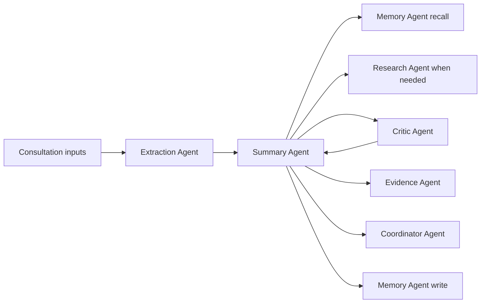
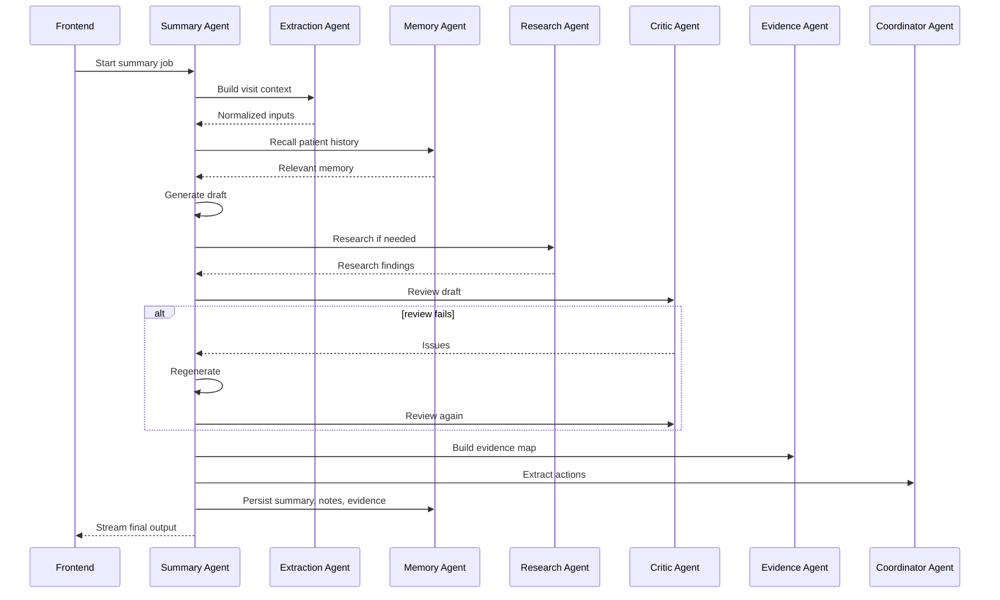

# Agentic Architecture Documentation

This document explains the agentic design of `healthcare-saas-aws` as it exists today. It focuses on the reasoning model, agent responsibilities, and how agent behavior now fits into the deployed AWS persistence model.

This document is narrower than the full architecture guide. The goal here is to explain how the agents think, coordinate, and persist work.

## 1. Agentic design goals

The system is not built around a single prompt call. It is built around a controlled agent graph intended to solve four problems at the same time:

- handle multimodal clinical input
- produce grounded summaries rather than free-form guesses
- catch errors before they become long-term patient memory
- preserve useful clinical context across visits

Those goals lead directly to the current multi-agent design.

## 2. Core agentic pattern

The backend uses a hub-and-spoke model:

- one orchestrator owns the consultation workflow
- specialized worker agents own narrow reasoning or tool domains
- persistence happens after quality review rather than before it

The orchestrator is the Summary Agent. The worker agents are:

- Extraction Agent
- Research Agent
- Critic Agent
- Evidence Agent
- Memory Agent
- Coordinator Agent
- Email Agent
- Chat Agent

## 3. Agent graph

This graph is intentionally not symmetrical. The Critic Agent can force the Summary Agent back into regeneration, while the Memory Agent should only write after the output has passed the quality gate.

## 4. Summary Agent: the orchestrator

File:

- [summary_agent.py](/home/repos/healthcare-saas-aws/api/agent/summary_agent.py)

The Summary Agent is the main controller. It owns:

- job startup and resumability
- visit context assembly
- patient-history injection
- tool-routing decisions
- summary generation
- critic loop entry
- evidence mapping trigger
- action extraction trigger
- persistence trigger
- streaming output to the UI

### 4.1 Why this agent is not just “generate summary”

The Summary Agent exists because the problem is not only generation. The actual problem is orchestration under constraints:

- some context comes from files
- some context comes from history
- some facts need research
- the first answer may not be good enough
- the final result must be persisted for later recall

Without an orchestrator, those steps become brittle ad hoc glue instead of an explainable workflow.

## 5. Extraction Agent: multimodal normalization

File:

- [extraction_agent.py](/home/repos/healthcare-saas-aws/api/agent/extraction_agent.py)

The Extraction Agent is the “senses” layer. It turns heterogeneous inputs into a unified context:

- notes
- PDFs, DOCX, TXT, Markdown
- audio via Whisper
- prescription images via a vision model

This agent exists so the rest of the pipeline reasons over a consistent representation rather than raw upload formats.

## 6. Research Agent: controlled external retrieval

File:

- [research_agent.py](/home/repos/healthcare-saas-aws/api/agent/research_agent.py)

The Research Agent performs controlled web retrieval for:

- drug interactions
- guideline lookups
- clinically relevant external references

The reason it is separate from the Summary Agent is architectural discipline. The system should not let the main summarizer perform unconstrained external search as part of the same prompt. External retrieval belongs to a tool-owning specialist agent.

## 7. Critic Agent: reflection and self-correction

File:

- [critic_agent.py](/home/repos/healthcare-saas-aws/api/agent/critic_agent.py)

The Critic Agent is the main reflection layer. It checks:

- hallucinations
- omissions
- contradictions
- safety gaps

If the review fails, the Summary Agent regenerates. This is the central self-correction loop in the system.

### 7.1 Why the critic matters operationally

Without the critic, low-quality summaries could become persisted patient memory. The critic is what separates “LLM output” from “candidate clinical artifact”.

## 8. Evidence Agent: explainability by grounding

File:

- [evidence_agent.py](/home/repos/healthcare-saas-aws/api/agent/evidence_agent.py)

The Evidence Agent makes the system inspectable. It maps summary sentences back to:

- notes
- uploads
- prior history
- research or guideline output

That is what enables the UI to show evidence snippets rather than forcing the user to trust a summary with no provenance.

## 9. Memory Agent: long-term context across visits

File:

- [memory_agent.py](/home/repos/healthcare-saas-aws/api/agent/memory_agent.py)

The Memory Agent is the long-term continuity layer. It handles:

- persisting summaries, notes, and evidence
- retrieving prior context by semantic search
- patient list and visit list derivation
- rename, soft delete, and restore behavior

### 9.1 Current persistence boundary

The deployed memory system is now DynamoDB-backed. The memory agent no longer treats local JSON storage as the deployed persistence model.

That means the agentic design now assumes:

- long-term memory survives App Runner redeploys
- patient history can be retrieved by the chat assistant and the next consultation
- persistence failures should be treated as first-class operational incidents

## 10. Coordinator Agent: from text to action

File:

- [coordinator_agent.py](/home/repos/healthcare-saas-aws/api/agent/coordinator_agent.py)

The Coordinator Agent extracts structured next actions from the generated summary. This is where the system starts to move from “documentation assistant” toward “workflow assistant”.

## 11. Chat Agent: grounded co-pilot

File:

- [chat_agent.py](/home/repos/healthcare-saas-aws/api/agent/chat_agent.py)

The Chat Agent is the interactive co-pilot. It combines:

- conversation history
- current consultation context
- current summary state
- recalled patient history

This means the assistant is not stateless. It is grounded in both the current task and the persisted clinical timeline.

## 12. Email Agent: autonomous routing, not just send

File:

- [email_agent.py](/home/repos/healthcare-saas-aws/api/agent/email_agent.py)

The Email Agent is a smaller but important example of agentic routing. It chooses whether the request is:

- direct send
- translation then send

That is a narrow but real planning decision rather than a static branch in the frontend.

## 13. Current end-to-end reasoning flow

## 14. What changed from the earlier architecture

The major changes from the earlier milestone versions are:

- memory is now durable outside the container via DynamoDB
- runtime secrets are now part of the deployed architecture through Secrets Manager
- patient-history retrieval is no longer conceptually “best effort local memory”
- deploy automation now assumes agent outputs must survive infrastructure rollouts

That means the agentic architecture is no longer just a local application pattern. It is now part of a real deployed system with persistent infrastructure boundaries.

## 15. Why this architecture is defensible

The system is designed this way because the clinical use case requires more than fluent generation.

The design is defensible because it gives the app:

- controlled multimodal ingestion
- explicit external retrieval boundaries
- a reflection layer before persistence
- evidence grounding
- cross-visit continuity
- a deploy-safe persistence model

That is the difference between “an LLM app that writes summaries” and “an agentic clinical documentation system that can be operated in production.”

