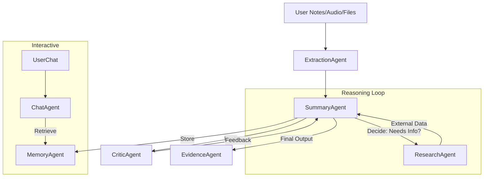

# Agentic Architecture Documentation

This document outlines the multi-agent architecture implemented in the `api/agent` module. The system is designed to provide robust, clinically accurate, and verifiable medical summaries by leveraging specialized autonomous agents, tool use, and reflection loops.

## 1. Architectural Overview

The system follows a **Hub-and-Spoke** agentic pattern, where a central orchestration pipeline (`summary_agent.py`) coordinates specialized worker agents. It incorporates advanced patterns such as **Reflection (Critic Loop)**, **Retrieval-Augmented Generation (RAG)**, and **Autonomous Routing**.

### Core Components

*   **Coordinator/Orchestrator:** `Summary Agent`
*   **Worker Agents:**
    *   `Extraction Agent` (Input processing)
    *   `Research Agent` (External knowledge retrieval)
    *   `Critic Agent` (Quality Assurance & Reflection)
    *   `Evidence Agent` (Fact-checking & Source mapping)
    *   `Memory Agent` (Long-term persistence)
    *   `Email Agent` (Action & Routing)
    *   `Chat Agent` (Interactive Co-pilot)

---

## 2. Agent Details

### A. Summary Agent (The Orchestrator)
*   **Role:** The primary driver that manages the lifecycle of a patient visit summary.
*   **Agentic Pattern:** **ReAct (Reason + Act)** and **Tool Use**.
*   **Workflow:**
    1.  **Context Assembly:** Aggregates inputs from the Extraction Agent and Memory Agent.
    2.  **Autonomous Reasoning:** Evaluates the clinical notes to decide if external information is needed.
    3.  **Tool Execution:**
        *   If multiple medications are detected $\rightarrow$ Calls `check_drug_interactions` (Research Agent).
        *   If specific conditions are noted $\rightarrow$ Calls `search_medical_guidelines` (Research Agent).
    4.  **Draft Generation:** synthesizes the summary using the augmented context.
    5.  **Reflection Loop:** Submits the draft to the Critic Agent and enters a regeneration loop if the quality score is below threshold.

### B. Critic Agent (The Reflector)
*   **Role:** Ensures clinical safety, factual accuracy, and completeness.
*   **Agentic Pattern:** **Reflection / Self-Correction**.
*   **Function:**
    *   Compares the generated summary against the source ground truth (notes + transcripts).
    *   Identifies hallucinations, missing critical info, or safety risks.
    *   Returns a structured score and a list of issues.
    *   *Crucially:* If the summary fails review, the Summary Agent uses this feedback to "self-correct" and regenerate the output.

### C. Research Agent (The Tool User)
*   **Role:** Fetches external medical data to validate safety and provide guidelines.
*   **Agentic Pattern:** **Tool Abstraction** via **MCP (Model Context Protocol)**.
*   **Function:**
    *   Uses MCP servers (standardized tool interfaces) to perform live web searches.
    *   Returns structured findings (Drug Interactions, Clinical Guidelines) with verifiable URLs.

### D. Evidence Agent (The Fact-Checker)
*   **Role:** Provides explainability and trust ("Why did the AI say this?").
*   **Agentic Pattern:** **Semantic Mapping**.
*   **Function:**
    *   Deconstructs the final summary into sentences.
    *   Uses an LLM to semantically map each sentence back to specific "chunks" of the source data (Notes, Audio Transcripts, or Research URLs).
    *   Generates the "Citations" and "Evidence Links" used in the UI.

### E. Email Agent (The Autonomous Router)
*   **Role:** Handles patient communication delivery.
*   **Agentic Pattern:** **Router / Chain of Thought**.
*   **Function:**
    *   Instead of hardcoded logic, it receives a high-level goal: "Send this email."
    *   It **observes** the request parameters (e.g., target language).
    *   It **reasons** about the necessary steps: "The user asked for Spanish, but the text is English. I must translate first."
    *   It **acts** by calling the `translate_email` tool, then the `send_email_final` tool.

### F. Memory Agent (The Long-Term Store)
*   **Role:** Provides persistence across sessions.
*   **Agentic Pattern:** **RAG (Retrieval-Augmented Generation)**.
*   **Function:**
    *   **Write:** Vectorizes and stores summaries and notes after every visit.
    *   **Read:** Semantically searches past history when a new visit starts or during Chat interactions, injecting relevant past context into the agent's working memory.

---

## 3. Data Flow Diagram

## 4. Key Implementation Highlights

*   **Hybrid Control Flow:** The system balances autonomous LLM decision-making (for tools and research) with deterministic code (forcing the Critic review step) to ensure safety compliance in a healthcare setting.
*   **Model Fallbacks:** All agents utilize a `generate_with_fallback` utility, allowing them to degrade gracefully from high-intelligence models (e.g., GPT-4o/Gemini 1.5 Pro) to faster/cheaper models if errors or rate limits occur.
*   **Guardrails:** System prompts act as "Constitutional AI" guardrails, enforcing strict formatting and prohibition of non-medical advice.
