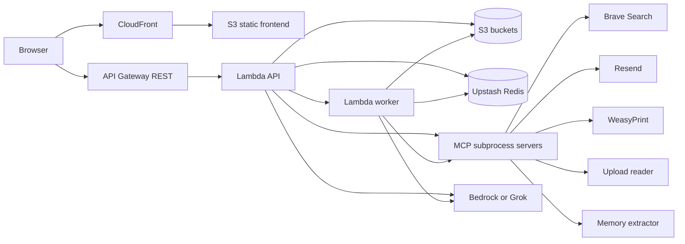

# Twin Architecture

This document is the implementation-level explanation of how Twin works today. It is intentionally not a quick overview and it is not meant to be skimmable onboarding material. The goal here is to explain the system as it actually behaves in code: how a request enters the system, how the backend decides whether a tool-capable run is required, how tool output is normalized into evidence, how artifacts are stored, how memory is extracted and enforced, how async execution changes the request path, and how Terraform wires the deployed shape together.

If `README.md` is the guided map, this document is the deep reference. The intended use is that someone can read this file and come away with a working mental model of the runtime, storage, deployment, and the main engineering tradeoffs, without having to infer everything from file names.

Related documents:

- `README.md` explains what the product is, how to run it locally, how deployment works at a high level, and which document to read next.
- `OPERATIONS.md` is the better reference for KPIs, logging conventions, trace hygiene, QA expectations, and production hardening defaults.
- `DEPLOYMENT_TERRAFORM.md` and `DEPLOYMENT_GITHUB_ACTIONS.md` go deeper into deployment and CI/CD specifics.

## 1. What kind of system this is

Twin is a persona-specific digital assistant. The repo is not structured like a generic chatbot platform with accounts, teams, arbitrary assistants, and pluggable tenants. Instead, the code is oriented around a single assistant persona whose behavior is shaped by curated prompt assets in `backend/data/`. Those assets include factual material, summary material, style instructions, and profile content. At runtime the backend assembles those resources into the system prompt and treats them as the canonical identity of the assistant.

That design choice drives most of the architecture. The frontend is intentionally simple because it does not need rich account management or multiple product surfaces. The backend is serverless because the request model is mostly chat turns plus occasional tool-heavy actions. The storage model is object-based because the dominant persistence need is "keep a bounded amount of per-user conversational state", not "support complex relational queries". The runtime is split into low-risk and high-risk execution paths because the product needs to distinguish between a normal prose answer and an answer that claims a real side effect such as generating a PDF, reading an uploaded file, performing a search, or sending an email.

The most important architectural concept in the entire repo is that high-risk outputs are not trusted just because the model wrote convincing text. The backend tries to force those outputs to be grounded in tool execution and then runs them through a canonicalization and validation pipeline before returning them to the user. That is the core design center of the backend.

## 2. Topology and deployed shape

In production the application is split into a static frontend and a serverless backend. The frontend is a Next.js app built as a static export and hosted from S3 behind CloudFront. The backend is a FastAPI application packaged as a Lambda container image. In async mode there is also a second Lambda function, using the same image, that runs as a worker. Upstash Redis is used for ephemeral job state and truth-gate state. S3 is used for durable conversation and memory storage, and also for uploads and generated PDFs when S3-backed storage is enabled.

At a high level, the deployed path looks like this:



What matters here is not just that these boxes exist, but why they are separated the way they are.

The frontend is static because the UI does not require server-side rendering or edge personalization. The only dynamic behavior is in the browser after the page has loaded. That lets the repo deploy the frontend as a static export with a single runtime variable, `NEXT_PUBLIC_API_URL`, injected at build time.

The backend is split between an API Lambda and a worker Lambda because tool-heavy requests can exceed what is comfortable for a synchronous API Gateway request cycle. The API Lambda handles short inline requests and job enqueueing. The worker Lambda handles long-running chat flows, especially those that involve MCP subprocess startup, search, PDF rendering, and email delivery. The important detail is that the worker is not a second independent service. It calls back into the same orchestration path as the API runtime. The difference is transport and timeout behavior, not business logic.

S3 is used because the system mostly needs blob-like persistence: conversation transcripts, memory JSON documents, uploads, and generated PDF artifacts. Upstash is used because the application needs a fast, transient coordination layer for async job status, cancellation, progress updates, and truth-gate context snapshots. The system is intentionally not using a relational database because the current product does not need relational querying strongly enough to justify the additional complexity.

## 3. Repository structure and why it looks this way

The top-level repo has four directories that matter most for architecture:

- `frontend/` contains the Next.js UI. The main chat behavior lives in `frontend/components/twin.tsx`.
- `backend/` contains the FastAPI application, Lambda handlers, provider-specific runtime code, MCP server code, persistence services, and tests.
- `terraform/` contains the infrastructure definition for the deployed AWS topology.
- `scripts/` contains the operational deployment script that ties Docker, Terraform, AWS CLI, and the frontend build together.

Within `backend/`, the architectural seams are more important than the folder names alone.

`backend/server.py` is still the primary orchestration file. Even though the routes are registered through router modules in `backend/api/routers/`, the real behavior of the application still lives in `server.py`. That file controls chat flow, quota flow, async job creation, persistence, risk routing, and the dispatch into provider-specific execution.

`backend/services/chat_runtime/` is the provider execution seam. That package isolates Grok execution, Bedrock execution, result typing, and the shared high-risk finalization flow. This matters because the system wants provider choice to be a configuration decision, while still acknowledging that Bedrock and Grok do not have identical execution mechanics.

`backend/services/output_truth_gate.py` and `backend/services/canonical_renderer.py` form the core of the evidence-based output system. That is where raw tool outputs are normalized into artifacts, outcomes, and sources, and where the final user-facing response is shaped and validated.

`backend/mcp_tools/` contains subprocess-based tools. This is a meaningful design decision: tools are not just helper functions imported into the request path. They are started as MCP servers, which gives the runtime a standard tool interface and lets the tool layer participate in trace propagation and bounded subprocess lifecycles.

## 4. Frontend runtime behavior

The frontend is deliberately lightweight, but it is not trivial. It does several important pieces of state coordination that shape the backend model.

When the page loads, the frontend generates or restores a sync code from `localStorage`. That sync code becomes the backend `user_id`. There is no login screen, session cookie, OAuth exchange, or JWT validation. The system’s notion of user identity is simply "whatever sync code the browser presents". That is why the backend validates `user_id` format carefully, but it is also why this architecture should be understood as lightweight identity isolation rather than hardened multi-tenant authentication.

The frontend also maintains a current `session_id`, remembers the last session used for a given sync code, and loads the user’s recent sessions. This means the browser is responsible for reattaching to prior conversations after reloads. The backend stores the source data, but the browser decides which conversation is currently active.

The main UI component bootstraps three kinds of state at startup: history, memory, and quota. Those calls are independent. That makes the initial page interactive quickly, but it also means the frontend is designed around separate backend capabilities rather than around one large "session bootstrap" endpoint.

The message-send path in the frontend is more interesting than it first appears. When the user submits a prompt, the frontend builds an optimistic user message and then decides whether a file is involved. If there is an attachment, the preferred path in AWS is `POST /uploads/presign`, followed by a browser-side `PUT` to S3 using the returned presigned URL. That exists because API Gateway plus Lambda is a poor place to route arbitrary binary bodies when a simpler direct-to-S3 upload path is available. There is still a direct `POST /uploads` fallback path for local work and non-S3 scenarios, but it is not the preferred deployment shape.

Once the frontend has a `file_id` if needed, it sends `POST /chat`. If the response comes back inline, the assistant message is appended immediately. If the response is `202 Accepted`, the frontend stores the `job_id` and enters a polling loop against `GET /jobs/{job_id}`. The backend can update a human-readable progress label and a progress percentage during execution, and the frontend surfaces those values directly. The frontend therefore reflects real backend phase changes rather than using a fake spinner with generic messages.

## 5. API surface and route semantics

The backend exposes a compact but meaningful API surface.

The root and health routes are simple capability and liveness probes. They expose the active provider, storage mode, and whether MCP search is enabled. These endpoints are operationally useful because the deployed environment can differ materially based on `AI_PROVIDER`, `USE_S3`, and search configuration.

The chat endpoints are the core runtime interface. `POST /chat` accepts the message payload and decides whether the request should run synchronously or asynchronously. `GET /jobs/{job_id}` exposes worker progress and final results in async mode. `POST /jobs/{job_id}/cancel` lets the frontend stop polling and mark a job canceled from the user’s perspective, which the worker checks during execution.

The conversation endpoints exist because the frontend is stateful across sessions. `GET /conversations` returns a bounded list of recent sessions, while `GET /conversation/{session_id}` returns the stored message list for a specific session.

The memory endpoints expose the candidate approval model. Pending memories can be listed, approved, rejected, or cleared. Approved memory can be listed and deleted. This is significant architecturally because memory is not purely backend-owned state; the product exposes memory review as a user-facing control surface.

The file endpoints support the upload and artifact flows. `POST /uploads` handles direct upload, `POST /uploads/presign` supports browser-to-S3 upload, and `GET /downloads/{filename}` serves local-mode PDF artifacts. In deployed S3-backed mode, generated PDFs are more often surfaced through S3 presigned URLs than through the local-style download route.

## 6. Request entry, trace setup, and common orchestration

The real runtime begins in `backend/server.py`. Every request passes through `trace_id_middleware`, which either accepts an incoming `x-request-id` or generates a new trace ID. That trace ID is attached to the response and injected into the active span context. This matters because the code is structured around correlating API spans, worker spans, MCP spans, and tool-specific spans through a shared trace identity.

The Lambda entrypoint in `backend/lambda_handler.py` wraps Mangum with one more tracing decision. It checks whether the current HTTP path should be traced. Poll-heavy routes such as `/quota`, `/jobs/*`, and `/memory*` are excluded by default through the OpenTelemetry path exclusion mechanism. The reason is practical: if those high-frequency low-value routes are traced like everything else, they flood the trace surface and make it harder to inspect the actual interesting path, which is the `/chat` request and the worker or tool spans hanging off it.

From there, chat execution converges into `_run_chat_flow`. This is one of the most important facts about the architecture: there is one shared orchestration path for sync and async execution. The API route can call it directly, or the worker Lambda can call it after dequeuing job state, but the inner business flow remains the same.

At the start of `_run_chat_flow`, the system loads the current conversation for the `user_id` and `session_id`, attaches context attributes to the current span, checks whether a worker job has been canceled, and reads the current quota snapshot. This is where the request picks up the historical state that makes a conversation a conversation rather than an isolated prompt.

The current implementation stores the full session transcript as a JSON array, so loading conversation context means reading the whole session file. The orchestration code then later compresses the active model input by taking only recent messages when building the immediate user-facing conversation string. The architecture therefore preserves full session history in storage but does not necessarily send the full transcript back to the model on each turn.

## 7. Risk routing: why the backend splits the world into low risk and high risk

The risk router in `backend/services/risk_router.py` is heuristic by design. It is not asking another model to classify whether a request is risky. Instead it uses explicit signals in the message and recent context to decide whether the request can be treated as prose-only or whether it needs the tool-capable, evidence-checked path.

The code routes a request to high risk when the message contains action-like or evidence-like signals such as asking for a PDF, a report, an email, an upload, a search, sources, citations, or recent-action follow-up language. A file attachment also forces high risk immediately. Raw email addresses are treated as a strong signal that the user wants an actual send action, not just advice about email.

That design choice is conservative, and it is meant to be. The consequence of misclassifying a genuinely high-risk request as low risk is much worse than the consequence of occasionally routing a benign message through the more expensive path. A low-risk path can safely say "here is how I would do that" but must not pretend it actually performed the action. A high-risk path can use tools and then try to prove the action happened.

The same module computes `required_tool_sequence`, which is the backend’s mechanism for defining a minimal execution contract. If the user asks for a PDF, the backend does not merely hope the model will decide to call `generate_pdf_from_text`; it records that tool as required. If the user is trying to send an email, the backend records `send_resend_email` as required. This sequence is later enforced during high-risk finalization, which is how the system closes the gap between "the model said it did the thing" and "the tool trace shows the thing actually ran".

## 8. Low-risk execution path

If the router marks the request as low risk, the system takes the prose-only path. The core idea is that normal conversational assistance should be fast and cheap, and it should not have access to tools when tools are unnecessary.

For Grok, the backend uses `run_grok_once` in `backend/services/chat_runtime/grok_runner.py`. For Bedrock, it uses `run_bedrock_prose` in `backend/services/chat_runtime/bedrock_runner.py`. In both cases the prompt is augmented with an explicit low-risk contract telling the model not to call tools, not to claim actions were executed, and not to fabricate download links or email confirmations.

Even that prompt-level constraint is not considered sufficient. After the provider returns, the response is run through `apply_low_risk_prose_guard`. The point of the prose guard is to catch cases where the model still slips into action-shaped language. The backend treats that as a policy problem and sanitizes or blocks it before the user sees it.

Architecturally, the low-risk path exists so the system does not pay the startup and validation cost of the full MCP-plus-truth-gate pipeline on every casual turn. It is the "safe normal chat" lane.

## 9. High-risk execution path

If the router marks the request as high risk, the system takes a much more complex path. This is where Twin is meaningfully different from a basic chat wrapper.

The backend first builds the full instruction set. That instruction set is a composition of several layers: the persona prompt from `backend/context.py`, approved memory if any exists for the user, and tool instructions built by `build_tool_instructions()`. If the risk router determined that a concrete tool contract is required, the backend adds explicit instructions saying that certain tools must be executed before the final answer is written.

The backend also builds the user-facing conversation payload by compressing recent history into a single text block and appending the current user message. If a file is attached, `build_agent_message` includes the `file_id` marker in the user message so the model can call the file-reading tool against it.

After this point, execution becomes provider-specific, but the backend expects both providers to produce the same logical output shape: a model draft, a stream or list of tool events, and a total token count.

## 10. Grok path in detail

The Grok path uses the OpenAI-compatible client plus the `openai-agents` runtime. This is implemented in `backend/services/chat_runtime/grok_runner.py` and orchestrated from `call_grok_with_mcp` in `backend/server.py`.

The execution model is:

1. Create an async OpenAI client using `GROK_API_KEY` and `GROK_API_URL`.
2. Convert each MCP server spec into an `MCPServerStdio` instance.
3. Start those MCP servers inside an `AsyncExitStack`, optionally with startup timeouts.
4. Construct an `Agent` with the system instructions, the target model, and the MCP servers.
5. Run the agent with the user input, optionally under an overall runner timeout.
6. Convert the returned event stream into normalized tool events and token usage.

This execution style delegates tool decision-making to the model runtime itself. The model can decide when to call tools, in what order, and with what arguments. That gives the system flexibility, but it also introduces the risk that the model may skip a required tool or narrate a result without having run the required action. That is why the later finalization stage performs explicit required-tool checks. In the Grok path, the backend accepts a more permissive generation phase and compensates with stricter validation after the fact.

The Grok path also supports reruns with fix instructions. That rerun mechanism is used when approved memory is violated, when PDF input needs a targeted retry, or when the truth-gate fix loop wants the model to repair a final answer without inventing unsupported evidence.

## 11. Bedrock path in detail

The Bedrock path is more manually controlled. It is implemented by `run_bedrock_chat` in `backend/services/chat_runtime/bedrock_runner.py`, which delegates to `run_bedrock_with_tools` in `backend/services/bedrock_tools.py`.

This code does not use the `openai-agents` runtime. Instead it implements its own Bedrock tool loop around the `converse` API. That is a significant architectural divergence between providers, even though the higher-level orchestration tries to keep the rest of the pipeline provider-neutral.

The flow works like this. First, the backend builds a list of candidate model IDs. If the configured `BEDROCK_MODEL_ID` is a base model name rather than a full inference profile ARN or prefixed ID, the code derives region-prefixed alternatives such as `apac.<model>`, `us.<model>`, and `eu.<model>`. This is a practical workaround for Bedrock’s region-specific access patterns and inference profile conventions.

Next, the runtime starts MCP sessions for each server, lists their available tools, and converts those tools into Bedrock tool specs. Then it enters a loop:

1. Call Bedrock `converse` with the current message state and tool configuration.
2. If the backend knows a specific required tool should run next, set `toolChoice` to that tool.
3. Parse any returned `toolUse` blocks from the assistant response.
4. Execute those tool uses through the corresponding MCP session.
5. Append the tool results back into the conversation and continue the loop.
6. Stop only when Bedrock returns text with no more tool requests, or fail if the loop exceeds its configured maximum rounds.

This path is more constrained than the Grok path because the backend can actively force the next required tool during generation. That does not remove the need for final validation, but it reduces one class of drift by controlling tool order up front rather than merely auditing it later.

## 12. MCP subprocess model and tool environment propagation

The MCP layer is worth understanding as its own subsystem. The backend does not directly import a `search()` or `send_email()` function and call it inline. Instead it constructs a set of subprocess server specs in `backend/mcp_tools/mcp_servers.py`, then starts those subprocesses as MCP servers when needed.

There are three primary tool families in the standard spec list.

The Brave MCP server exposes search capabilities, but only if search is enabled and a Brave API key is present. This is a conditional capability. The rest of the system can run without it, but source-backed search flows become limited.

The core MCP server exposes the action tools: PDF generation, file reading, email sending, and related helpers. This server is where most high-risk artifact production happens.

The memory MCP server handles memory candidate extraction. Even though memory extraction is conceptually distinct from chat execution, it still uses the MCP mechanism so the backend can treat it like a tool service with a consistent subprocess boundary.

The backend passes more than just tool arguments into these subprocesses. It also propagates Python path, AWS region, provider env vars, Upstash job context, and OpenTelemetry settings. That means the subprocesses inherit enough state to perform real work and to emit coherent traces and logs. This is one of the reasons the MCP layer is architecturally meaningful instead of being a thin wrapper around helper functions.

## 13. High-risk finalization: the real heart of the system

The most important single function in the repo is `finalize_high_risk_response` in `backend/services/chat_runtime/high_risk_flow.py`. This is where a raw high-risk model run becomes a user-visible answer. The function exists because the system explicitly does not trust raw high-risk model prose.

The function begins with the provider result, which contains a draft output, a list of tool events, and token usage. It then applies several progressively stricter stages.

The first stage is approved-memory validation. If the user has approved memory items, the backend calls a memory validator model through `backend/validator_agent.py`. The validator is asked to judge whether the assistant response complies with approved memory and to return JSON indicating compliance status, a reason, and fix instructions if necessary. If the result is non-compliant, the original provider is rerun with those fix instructions. This means approved memory is not merely "prepended to the prompt and hoped for"; it is backed by an explicit post-generation compliance check.

The second stage is targeted PDF error recovery. If a `generate_pdf_from_text` tool call failed with a `PDF_INPUT_INVALID` code, the backend assumes the problem may be formatting or schema rather than semantic intent. It triggers one controlled retry with instructions telling the model to preserve the requested content while repairing only formatting or JSON structure. If that retry still fails, the system returns an explicit structured error instead of pretending the PDF exists.

The third stage is required-tool enforcement. The backend inspects the tool event list and verifies that each required tool actually ran and that the tools appeared in the required order. This is the mechanism that prevents execution bluffing. If the user asked for a PDF and email send, but the model only produced text about those actions without actually invoking the relevant tools, the response is rejected.

The fourth stage is truth-context normalization. Tool outputs are messy: they can be nested JSON, model-specific wrapper objects, inline strings that happen to contain JSON, or MCP response structures. `normalize_truth_context` in `backend/services/output_truth_gate.py` unwraps those formats and extracts three kinds of evidence: artifacts such as generated PDFs, action outcomes such as email delivery status, and normalized search results.

The fifth stage is canonical rendering. `render_high_risk_output` in `backend/services/canonical_renderer.py` takes the raw model text and the normalized evidence and produces the answer the user should actually see. This is not cosmetic formatting. It is evidence-constrained response shaping. If a PDF exists, the renderer can attach the verified download URL. If an email send succeeded, the renderer can confirm that success and include the email ID. If the model mentions links that are not part of the canonical evidence set, the renderer strips or rewrites them. If sources are required, the renderer builds the source list from the normalized search results rather than from the model’s raw prose.

The sixth stage is truth-gate validation. `apply_truth_gate` checks whether the rendered output is consistent with the truth context. The exact issue codes live in `backend/services/output_truth_gate.py`, but the important architectural point is simple: the rendered answer must not claim more than the tool evidence supports. If the output contains unverifiable links, cites sources that were never returned by the search tool, or claims an action result inconsistent with the recorded tool outcome, the truth gate blocks it.

The final stage is the truth-fix loop. If the truth gate blocks the output with issue codes the backend considers auto-fixable, the system builds targeted fix instructions and reruns the provider. The rerun output is merged back into the accumulated truth context and rendered again. This loop is bounded by `TRUTH_FIX_MAX_ATTEMPTS` and is meant to repair presentation or unsupported phrasing, not to invite open-ended re-generation.

This layered finalization flow is the architectural core of Twin. It is the reason the system can support high-risk actions without reducing correctness to "trust the model".

## 14. Truth context: what the backend treats as evidence

The truth context is the backend’s internal evidence model for high-risk runs. It is constructed from tool events and has three principal sections: `artifacts`, `outcomes`, and `search_results`.

Artifacts are things the system created, most notably PDFs. A normalized PDF artifact includes enough information for later stages to know that a PDF exists, what its filename is, how large it is, and where it can be downloaded.

Outcomes are action results. The most important current example is email send status. A normalized email outcome records whether the email send appears successful, the email ID if one exists, and a message describing the result.

Search results are normalized source URLs and titles. They come primarily from the Brave MCP server, but the normalization code is permissive enough to extract search-like rows from other tool payloads if necessary. URLs are normalized through `normalize_url()` so that volatile tracking parameters do not explode the evidence set into duplicates.

The backend persists the truth context to Upstash under `truth_gate:{trace_id}` when Upstash is configured. This matters for two reasons. First, it gives developers a durable debugging snapshot of what the tool run actually produced. Second, the quota layer can later derive action counts from that stored truth context instead of guessing from prompt intent.

## 15. Persistence model

The persistence layer is intentionally simple, but it has several distinct domains that should not be mentally collapsed into one.

### 15.1 Conversation persistence

Conversation transcripts are stored one session per JSON file. The key shape is:

```text
{user_id}/{session_id}.json
```

In local mode those files live under the local memory directory. In deployed S3-backed mode they live as S3 objects in the configured memory bucket.

When a chat turn finishes, `_persist_chat_turn` appends the user message and assistant message, writes the updated transcript, and then prunes older sessions so that only the five most recent sessions remain for the user. This pruning is done at the session level, not the message level. The architecture is therefore optimized for recent-session continuity, not long-term transcript archiving.

The frontend conversation list is built from these stored session files. `list_conversations()` reads or enumerates the session objects, sorts them by last-modified time, loads the last message to derive a title, and returns a bounded recent-session list.

### 15.2 Memory candidate persistence

Memory is not just another field attached to the conversation object. It has its own storage model.

Each user has:

- `memory/{user_id}/memory_candidates.json`
- `memory/{user_id}/memory_approved.json`
- `memory/{user_id}/memory_last_extracted.json`

Candidate memory is generated automatically after a turn, but it is not fed back into the assistant automatically. The memory extraction flow builds a snippet from recent user turns, calls the memory MCP extractor, deduplicates the returned candidates against both pending and approved memory, and stores new candidates with category, TTL, source excerpt, and session provenance.

Approved memory is the only memory that becomes active in future chat runs. When approved memory is loaded, the storage layer also enforces expiration by removing expired items. That means expiration is lazily applied on read rather than through a dedicated cleanup worker.

### 15.3 Upload persistence

Uploads follow a separate storage path. Whether the file was uploaded directly through the API or via a presigned S3 URL, the logical object shape is:

```text
uploads/{file_id}/{safe_filename}
```

In local mode the backend stores the file in `UPLOADS_DIR`, naming the local file with the generated `file_id`. In S3 mode the object goes into the uploads bucket or the main bucket fallback. The `file_id` is what the chat request carries forward into later tool use. The assistant never receives the raw binary file itself; it receives the stable file identifier and must use the `read_uploaded_file` tool to inspect content.

### 15.4 PDF persistence

PDFs generated by the core MCP server have their own artifact lifecycle. After rendering the PDF, the tool stores it differently depending on environment.

In S3-backed mode the tool uploads the PDF into the downloads bucket and returns a presigned `get_object` URL. That URL becomes part of the artifact evidence and is what the canonical renderer later exposes.

In local mode the tool moves the generated file into `DOWNLOADS_DIR` and may build a `/downloads/{filename}` URL if a public base URL is configured. The backend’s `GET /downloads/{filename}` route only serves local files. That means production and local mode genuinely differ here: the same conceptual artifact is exposed through different URL models depending on runtime configuration.

### 15.5 Async job persistence

Async job state is stored in Upstash under `job:{job_id}`. The payload includes the job status, timestamps, user and session IDs, trace ID, optional progress metadata, and either the final response or an error message.

This state is transient but important. It is what allows the browser to poll for long-running work without holding an API Gateway connection open, and it is what allows the worker to surface phase-aware progress back to the user.

### 15.6 Quota persistence

Quota is persisted separately from conversation and memory state. It is tracked per user per UTC day. The logical day key shape is `quota:{user_id}:{YYYYMMDD}`.

The quota code supports several backends because the repo is trying to stay operational across local development, deployed S3-backed mode, and environments where Upstash may or may not be available. It can read from Upstash, persist durable daily usage through S3 JSON objects with optimistic concurrency semantics, and fall back to local files in development.

The tracked metrics are tokens, PDF actions, and email actions. Token usage is derived from provider-reported token counts. PDF and email usage are not charged based on the user’s wording alone; they are derived from the truth context so that the system accounts for actions that actually happened.

## 16. Artifact lifecycle in detail

Artifacts are central to the high-risk side of the product, so it is worth tracing them from creation to user-visible output.

### 16.1 Uploaded file lifecycle

An uploaded file begins in the browser. The browser either uploads directly to S3 through a presigned URL or posts the file to the API directly. In either case, the backend returns a `file_id`. The chat message then references that `file_id`. During the tool-capable run, the model can call `read_uploaded_file`, which causes the core MCP server to locate the file by `file_id`, download or open it, and attempt text extraction.

PDF extraction is text-based through `pypdf`. DOCX extraction is paragraph-based through `python-docx`. Plain text-like formats are read directly. If the file is corrupt or has no extractable text, the tool returns structured errors such as `FILE_UNREADABLE` or `FILE_NO_TEXT`. Those structured errors are important because they let the backend’s later stages distinguish tool failure from successful file understanding.

### 16.2 PDF lifecycle

When the assistant needs to produce a PDF, the model calls `generate_pdf_from_text`. The input can be simple markdown-like content or a structured JSON block payload. The tool first validates that content exists and is within configured size bounds. If the input looks like JSON, it attempts to parse it and verify that it contains a renderable block structure. If not, it converts the input from markdown to HTML.

The tool then builds final HTML and asks WeasyPrint to generate a PDF. After generation it enforces output size limits and stores the PDF to S3 or local downloads storage. The returned tool payload includes status, storage type, download location, filename, and size. That payload is later normalized into an artifact entry in the truth context.

If the PDF tool fails because the input JSON or block payload is malformed, it returns a `PDF_INPUT_INVALID` code. That specific code is what enables the high-risk finalizer to perform one controlled semantic-preserving retry rather than immediately giving up.

### 16.3 Email lifecycle

When the assistant needs to send an email, the model calls `send_resend_email`. The tool computes an idempotency key from the recipient and subject, checks whether the same send already happened within the request-scoped result store, validates that Resend is configured, renders HTML from the body, and then calls Resend.

If the send succeeds, the tool returns a structured payload containing an `email_id` and a success status. If it fails, it returns a structured error payload. Later, the truth-context normalizer converts this payload into an action outcome. The canonical renderer then decides what to tell the user. That is why the final answer can say "Email sent successfully. ID: ..." only when the evidence says so, and why it can instead say "I couldn't verify that the email was sent" when the evidence is missing or ambiguous.

The idempotency key is a subtle but important piece of the architecture. LLM tool planning is not guaranteed to be single-shot. Without idempotency, a model that repeats a send call inside the same turn could cause duplicate emails even when the user asked for one. The tool layer protects against that class of failure.

### 16.4 Search and citation lifecycle

When search is available and the model uses it, the Brave MCP server returns rows containing URLs and titles. The truth-context layer normalizes those URLs and deduplicates them. If the user’s request or wording indicates that sources are required, the canonical renderer builds the final sources section strictly from that normalized search-result set.

This is an important philosophical point in the architecture. Sources are not trusted because the model typed plausible-looking links into a paragraph. Sources are trusted because a search tool returned them and the truth context recorded them.

## 17. Memory extraction, approval, and enforcement

Memory in Twin is intentionally approval-gated. The system does not silently mine every user message and inject the result back into the prompt as ground truth. Instead it uses a staged memory lifecycle.

After a turn is persisted, the backend calls `extract_and_store_memory`. That function finds the newest user timestamp, checks whether memory extraction has already run for that point in the conversation, loads pending and approved memory, and builds a recent-user-message snippet. It then invokes the memory MCP server with that snippet and the current memory inventory.

The extractor returns candidate memories. The backend normalizes their text, deduplicates them against pending and approved memory, assigns TTL based on configured memory layers, and stores them as pending candidates.

At that point nothing changes in the live assistant behavior yet. The memory candidates are just reviewable suggestions. Only after approval does a memory item move into `memory_approved.json`, at which point two things happen in future turns.

First, the approved memory is injected into the system instructions as a high-priority memory section. Second, the high-risk finalizer uses the validator agent to check whether a generated answer complied with approved memory. This two-part design is stronger than plain prompt injection alone. It still depends on a model-based validator, so it is not a formal guarantee, but it materially raises the bar compared with simply prepending memory text and hoping the main model obeys it.

One operational detail is worth noting. Memory extraction may run asynchronously in normal API mode, but in worker mode the backend forces memory extraction to run synchronously. That is because fire-and-forget tasks are unreliable at the end of a Lambda worker lifecycle. The code explicitly accounts for that difference.

## 18. Async mode and worker lifecycle

Async mode exists because the synchronous HTTP request path is the wrong place to hold open a connection while models, MCP servers, PDF generation, search, and email actions all complete. When `ASYNC_CHAT_ENABLED=true`, the backend changes the shape of `POST /chat`.

Instead of doing the whole run inline, the API route validates the request, allocates a `job_id` and `trace_id`, writes a queued job record to Upstash, and invokes the worker Lambda asynchronously with the relevant payload. It then returns `202 Accepted` with a status URL and a retry interval hint.

The worker Lambda receives that payload in `backend/worker_handler.py`. It restores trace context, marks the job as running, creates a worker span, and executes `_run_chat_flow` under `asyncio.wait_for` using the configured `WORKER_MAX_SECONDS`. During execution it can update job status messages such as "Starting tools", "Generating response", and "Finalizing response". If the user cancels the job through the API, the worker notices by re-reading Upstash and aborts with a cancellation error.

On completion the worker writes the final response back into the Upstash job record. On failure it writes an error. On timeout it marks the job failed and logs a `worker.timeout` event. The browser-side polling loop simply reflects that state machine.

The architecture here is intentionally simple: the queue is not a durable many-consumer job bus, and there is no separate job database. It is direct Lambda invocation plus transient Upstash status. That is enough for the current product shape.

## 19. Observability model

OpenTelemetry is built into the backend and propagated into the MCP subprocess layer. This is not incidental instrumentation added after the architecture was already decided. The execution model depends on being able to correlate an incoming request with a worker span, then with MCP spans, and finally with inner tool spans such as PDF generation or email sending.

The API Lambda creates a top-level request span when the path is traceable. The worker creates its own `worker.process_job` span. The Bedrock tool loop wraps tool execution in spans such as `tool.<tool_name>`. The core MCP server creates more specific spans such as `core.pdf.generate` and `core.email.send`. Because the MCP subprocesses inherit OTEL exporter settings and trace context, these spans can form a coherent chain.

The logging model follows the same philosophy. Stable event keys such as `classify`, `execute.run_start`, `execute.tool_failure`, `render.canonical`, `validate.pass`, `validate.blocked`, `fix_loop.attempt`, and `worker.completed` exist so that operational tooling can reason about the request lifecycle deterministically. `OPERATIONS.md` goes further into the metrics and dashboards side, but architecturally the key point is that observability is built around the actual stage boundaries of the high-risk pipeline.

## 20. Terraform and AWS wiring

Terraform in `terraform/main.tf` defines the deployed AWS shape. The file creates the S3 buckets, ECR repository, API Lambda, worker Lambda, API Gateway REST API, CloudFront distribution, IAM role attachments, and optional custom-domain infrastructure.

The conversation memory bucket is private. The frontend bucket is configured for website hosting and made publicly readable because CloudFront points at the website endpoint. This is an explicit choice; the stack does not use a private S3 origin plus origin access control pattern for the frontend bucket. Instead it uses S3 website hosting plus CloudFront, which is simpler for a static SPA.

The Lambda functions both use the same ECR image. The API Lambda uses the default image command, which resolves to the FastAPI/Mangum entrypoint. The worker Lambda overrides the command to `worker_handler.handler`. This is a very practical pattern for a codebase like this because it keeps the runtime artifacts unified while still letting Terraform expose two separate operational roles.

API Gateway is configured with root and proxy resources, both in Lambda proxy mode. Mock `OPTIONS` resources exist for CORS handling. API Gateway throttling settings are also applied at the stage level.

CloudFront is configured with the S3 website endpoint as origin, redirects HTTP to HTTPS, and rewrites 404s to `index.html` so that deep links in the SPA still land on the frontend shell. When a custom domain is enabled, Terraform adds ACM resources and aliases, and may create a CloudFront Function to enforce the canonical host.

The deployment script in `scripts/deploy.sh` ties everything together operationally. It initializes Terraform, selects the correct workspace, ensures ECR exists, builds the backend container image, pushes it, applies Terraform, resolves the final image digest, forces both Lambda functions to refresh to that digest, builds the frontend static export with the deployed API URL, syncs the frontend to S3, and invalidates CloudFront. The explicit post-apply Lambda image update by digest exists because mutable tags are not by themselves a reliable guarantee that Lambda will pick up the new image bytes.

The GitHub Actions integration in Terraform is intentionally partial. `terraform/github_actions.tf` can attach ECR power-user permissions to an existing GitHub Actions role, but it does not fully stand up the trust relationship and all CI/CD concerns by itself. That reflects the repo’s current operational boundary rather than an oversight in this document.

## 21. Constraints, tradeoffs, and current gaps

Several constraints shape the current implementation and are worth stating plainly.

The first is identity. The app uses a browser-stored sync code as `user_id` instead of formal authentication. That keeps onboarding friction low and simplifies the product, but it is not a hardened multi-user security model. Anyone with the sync code can act as that user from the backend’s perspective.

The second is persistence. Using S3 and JSON documents makes the system easy to inspect and cheap to run, but it means conversation writes replace full session blobs, retention rules are coarse, and there is no relational query layer. This is appropriate for the current product, but it is not the right design for a large-scale analytics-heavy system.

The third is correctness versus fluency. The truth gate, required-tool checks, canonical renderer, and fix loop are intentionally willing to block a polished-looking answer if the evidence is weak or contradictory. This can make the assistant feel stricter and less smooth than a naive chat wrapper, but that is a deliberate tradeoff in favor of action verifiability.

The fourth is provider abstraction. The higher-level orchestration tries to be provider-neutral, but the actual execution mechanics are not. Grok uses the `openai-agents` runtime. Bedrock uses a custom tool loop. That is an acceptable compromise, but anyone modifying the provider layer should assume provider-specific behavior differences are real.

The fifth is environment asymmetry. Local mode and production mode differ in important ways: storage backend, download URL shape, async behavior defaults, and sometimes even artifact serving semantics. The code tries to hide those differences behind common handlers, but they remain meaningful for debugging and for documentation.

The sixth is memory enforcement. Approved memory is significantly better protected than raw prompt text because the system both injects it into the prompt and validates answers against it afterward. But the validator itself is still another model call, so this is still a probabilistic compliance system rather than a formal rule engine.

## 22. How to read the code after reading this document

If you want to validate the architecture against code, the most effective reading order is:

1. `backend/server.py` to see how requests are routed and how the common orchestration path works.
2. `backend/services/risk_router.py` to understand why a turn becomes low risk or high risk.
3. `backend/services/chat_runtime/grok_runner.py` and `backend/services/bedrock_tools.py` to see how provider execution diverges.
4. `backend/services/chat_runtime/high_risk_flow.py` to see how raw high-risk runs become user-facing outputs.
5. `backend/services/output_truth_gate.py` and `backend/services/canonical_renderer.py` to understand the evidence model and final response shaping.
6. `backend/services/storage.py`, `backend/services/memory.py`, and `backend/services/quota.py` to understand state persistence and operational limits.
7. `terraform/main.tf` and `scripts/deploy.sh` to connect the runtime model back to the deployed AWS shape.

That order mirrors the architecture itself: request entry, classification, execution, evidence normalization, persistence, and deployment.

## 23. Generated Reference Facts

This section is where the repo keeps the most drift-prone technical facts that should not be manually duplicated across documents. The prose sections above explain how the system works. The generated block below captures the exact current route inventory, runtime defaults, Bedrock candidate resolution summary, and required-tool contract rules straight from source files and is checked in CI.

<!-- BEGIN GENERATED FACTS: AUTO -->
> This block is generated from `backend/api/routers/*.py`, `backend/config.py`, `backend/server.py`, `backend/mcp_tools/core_mcp_server.py`, `backend/services/quota.py`, `backend/services/chat_runtime/bedrock_runner.py`, and `backend/services/risk_router.py`.
> Do not hand-edit the contents between these markers; run `python scripts/render_architecture_facts.py --write` instead.

### Generated Route Inventory

| Method | Path | Router function | Source file |
| --- | --- | --- | --- |
| `GET` | `/` | `root` | `backend/api/routers/core.py` |
| `GET` | `/health` | `health_check` | `backend/api/routers/core.py` |
| `GET` | `/quota` | `get_quota` | `backend/api/routers/chat.py` |
| `POST` | `/chat` | `chat` | `backend/api/routers/chat.py` |
| `GET` | `/jobs/{job_id}` | `get_job_status` | `backend/api/routers/chat.py` |
| `POST` | `/jobs/{job_id}/cancel` | `cancel_job` | `backend/api/routers/chat.py` |
| `GET` | `/conversation/{session_id}` | `get_conversation` | `backend/api/routers/chat.py` |
| `GET` | `/conversations` | `get_conversations` | `backend/api/routers/chat.py` |
| `GET` | `/memory/candidates` | `get_memory_candidates` | `backend/api/routers/memory.py` |
| `GET` | `/memory` | `get_memory` | `backend/api/routers/memory.py` |
| `POST` | `/memory/candidates/{candidate_id}/approve` | `approve_memory_candidate` | `backend/api/routers/memory.py` |
| `POST` | `/memory/candidates/{candidate_id}/reject` | `reject_memory_candidate` | `backend/api/routers/memory.py` |
| `POST` | `/memory/candidates/clear` | `clear_memory_candidates` | `backend/api/routers/memory.py` |
| `POST` | `/memory/approved/{memory_id}/delete` | `delete_approved_memory` | `backend/api/routers/memory.py` |
| `GET` | `/downloads/{filename}` | `download_file` | `backend/api/routers/files.py` |
| `POST` | `/uploads` | `upload_file` | `backend/api/routers/files.py` |
| `POST` | `/uploads/presign` | `presign_upload` | `backend/api/routers/files.py` |

### Generated Runtime Defaults

| Setting | Default | Meaning |
| --- | --- | --- |
| `AI_PROVIDER` | `bedrock` | Default provider selection |
| `BEDROCK_MODEL_ID` | `amazon.nova-lite-v1:0` | Default Bedrock model identifier |
| `DEFAULT_AWS_REGION` | `us-east-1` | Default AWS region used by runtime clients |
| `GROK_MODEL_ID` | `grok-4-1-fast` | Default Grok model identifier |
| `GROK_API_URL` | `https://api.x.ai/v1` | Default Grok base URL |
| `ENABLE_MCP_SEARCH` | `true` | Default search-tool toggle |
| `ASYNC_CHAT_ENABLED` | `false` | Default chat transport mode |
| `UPLOAD_ALLOWED_EXTS` | `pdf,docx,txt,md` | Default direct upload extension allowlist |

### Generated Quota Defaults

| Setting | Default | Meaning |
| --- | --- | --- |
| `DAILY_TOKEN_LIMIT` | `100000` | Per-user daily token limit |
| `DAILY_PDF_LIMIT` | `10` | Per-user daily PDF action limit |
| `DAILY_EMAIL_LIMIT` | `10` | Per-user daily email action limit |
| `QUOTA_LOCAL_FALLBACK` | `true` | Enable local quota fallback when remote quota backends are absent |
| `QUOTA_LOCAL_DIR` | `/tmp/quota` | Local quota file directory |
| `S3_QUOTA_MAX_RETRIES` | `6` | Max optimistic-concurrency retries for S3 quota writes |

### Generated Upload And Artifact Defaults

| Setting | Default | Meaning |
| --- | --- | --- |
| `UPLOADS_DIR` | `/tmp/uploads` | Local upload directory used by the API and upload-reader fallback path |
| `DOWNLOADS_DIR` | `/tmp/downloads` | Local directory used for serving generated downloads |
| `UPLOAD_PRESIGN_EXPIRES_SECONDS` | `900` | Default presigned upload URL lifetime |
| `PDF_MAX_MB` | `50` | Max generated PDF size in MB |
| `PDF_MAX_CHARS` | `200000` | Max text input size for PDF generation |
| `PDF_URL_EXPIRES_SECONDS` | `86400` | Default S3 presigned PDF download lifetime |

### Generated Upload And Artifact Behavior Summary

- Direct uploads and presigned uploads both use the object-key shape `uploads/{file_id}/{safe_name}` when S3-backed storage is active.
- The direct `POST /uploads` route stores files in S3 when `USE_S3=true`; otherwise it writes local files under `UPLOADS_DIR` as `{file_id}.{ext}`.
- The `POST /uploads/presign` route is only valid in S3 mode and fails fast when `USE_S3` is disabled.
- The `GET /downloads/{filename}` route only serves local artifacts from `DOWNLOADS_DIR`; it does not proxy S3 PDFs.
- Generated PDFs use `DOWNLOADS_BUCKET` when set, otherwise they fall back to `S3_BUCKET` in S3 mode.
- In local PDF mode, the core MCP server only emits a browser-download URL when one of `PUBLIC_BASE_URL`, `API_PUBLIC_URL`, or `BASE_URL` is configured.

### Generated Memory Storage Defaults

| Setting | Default | Meaning |
| --- | --- | --- |
| `MEMORY_DIR` | `../memory` | Local filesystem root for conversation and memory JSON files when `USE_S3=false` |
| `MEMORY_EXTRACT_SYNC` | `false` | Global toggle for forcing memory extraction to run synchronously |
| `MEMORY_CANDIDATES_MAX` | `50` | Max stored pending memory candidates per user |
| `MEMORY_APPROVED_MAX` | `200` | Max stored approved memory items per user |

### Generated Memory Storage Behavior Summary

- Pending memory candidates are stored per user at `memory/{user_id}/memory_candidates.json`.
- Approved memory is stored per user at `memory/{user_id}/memory_approved.json`.
- The last successful extraction timestamp is stored per user at `memory/{user_id}/memory_last_extracted.json`.
- Pending candidate writes are truncated to `MEMORY_CANDIDATES_MAX` items.
- Approved-memory writes are truncated to `MEMORY_APPROVED_MAX` items.
- Automatic memory extraction currently examines up to the six most recent user turns in a session.
- Memory extraction is forced synchronous when `MEMORY_EXTRACT_SYNC=true` or when the run is executing inside a worker job.

### Generated Async Worker Defaults

| Setting | Default | Meaning |
| --- | --- | --- |
| `ASYNC_CHAT_ENABLED` | `false` | Whether `POST /chat` uses queue-and-worker execution by default |
| `ASYNC_JOB_TTL_SECONDS` | `3600` | TTL for async job records in Upstash |
| `ASYNC_WORKER_FUNCTION_NAME` | `` | Lambda function name used for async dispatch |
| `LLM_TIMEOUT_SECONDS` | `` | Provider request timeout passed into Grok runtime configuration |
| `MCP_STARTUP_TIMEOUT_SECONDS` | `` | MCP subprocess startup timeout used by the Grok runtime |
| `RUNNER_TIMEOUT_SECONDS` | `` | Overall Grok agent runner timeout |
| `WORKER_MAX_SECONDS` | `240` | Hard timeout enforced around the shared chat flow in the worker handler |

### Generated Async Worker Behavior Summary

- When `ASYNC_CHAT_ENABLED=true`, `POST /chat` enqueues a worker job and returns `202 Accepted` instead of running the turn inline.
- Async chat dispatch uses the Lambda function named by `ASYNC_WORKER_FUNCTION_NAME`.
- The worker enforces a hard job timeout using `WORKER_MAX_SECONDS`, currently defaulting to `240` seconds in the worker handler.
- Job records are written back to Upstash with the shared `ASYNC_JOB_TTL_SECONDS` TTL on queue, progress, completion, cancellation, and failure transitions.
- The worker wraps the shared chat flow in `asyncio.wait_for`, so timeout behavior is enforced outside the provider-specific execution code.

### Generated Bedrock Candidate Resolution

If the configured Bedrock model identifier does not already carry a dotted prefix in its leading segment, the runner tries the base identifier first and then derives region-prefixed candidates. For a `us-*` default region the current prefix order is `us`, `eu`, then `apac`; for an `eu-*` region it is `eu`, `us`, then `apac`; otherwise it is `apac`, `us`, then `eu`. If the configured model identifier already contains a dotted prefix or is an ARN-like path, the runner keeps it as-is and does not derive additional prefixed candidates.

For the current defaults, the candidate chain is: `amazon.nova-lite-v1:0`.

### Generated Required-Tool Contract Summary

The current `required_tool_sequence(message, conversation)` implementation appends required tools in this order:

1. `generate_pdf_from_text` when the current message matches `_PDF_ACTION_RE`, currently ``.
2. `send_resend_email` when `requires_email_tool_action(message, conversation)` returns `True`.

Because the list is built in that order, the enforced combined contract for a request that needs both actions is:

`generate_pdf_from_text` -> `send_resend_email`

The current email-action detector returns `True` when any of these conditions holds:

- the current message matches `_EMAIL_ADDRESS_RE`, currently `\b[A-Z0-9._%+-]+@[A-Z0-9.-]+\.[A-Z]{2,}\b`
- the current message matches `_EMAIL_ACTION_RE`, currently ``
- the current message matches `_FOLLOWUP_ACTION_RE`, currently ``, and recent conversation text matches `_PRIOR_ACTION_CONTEXT_RE`, currently ``

The current high-risk keyword patterns are:

- `\b(pdf|download|export|report)\b`
- `\b(email|mail|send)\b`
- `\b(upload|file|attachment|attach)\b`
- `\b(search|web|news|latest|research|paper|papers|survey|benchmark|eval|evaluation|cite|citation|source|sources)\b`
- `\b(link|url|presign|presigned)\b`
- `\b(generate|create)\s+(a\s+)?(pdf|report|email)\b`
<!-- END GENERATED FACTS: AUTO -->
