# Digital Assistant Architecture (Detailed)

This document describes the **current implemented architecture** of this
repository. It focuses on the runtime behavior, data flow, storage, and
infrastructure of the Digital Assistant app.

Ops and QA artifacts:
- Objectives and KPIs: `OPERATIONS.md`
- Golden-set regression harness: `backend/evals/`

-------------------------------------------------------------------------------

## 0) Summary (what this system is)

This project is a web-based digital assistant with:
- a **static Next.js frontend** (deployed to S3 + CloudFront)
- a **FastAPI backend** on AWS Lambda (**API** + **worker** functions)
- **LLM providers** (Grok or Bedrock) for responses
- **conversation memory** stored in S3 (or local files in dev)
- **async job queue** (Upstash Redis) when async mode is enabled
- **MCP tool servers** for web search, PDFs, email, file upload, and memory extraction
- **PDF rendering via HTML → WeasyPrint** (Markdown supported)
- **memory candidate approval** and **validator enforcement** based on approved memory

The system is designed for a single conversational assistant that represents
a specific person based on curated facts and style files in `backend/data/`.

-------------------------------------------------------------------------------

## 1) High-level architecture

```mermaid
flowchart LR
  U[User Browser] --> CF[CloudFront CDN]
  CF --> S3F[S3 Frontend Bucket]
  U --> APIGW[API Gateway (REST)]
  APIGW --> L[LAMBDA: FastAPI API]
  L --> W[LAMBDA: Worker]
  L --> R[Upstash Redis]
  L --> AI[Grok or Bedrock]
  L --> S3M[S3 Memory Bucket]
  L --> DATA[Prompt Data Files]
  L --> MCP[MCP Tool Servers (stdio)]
  MCP --> BR[Brave Search]
  MCP --> RS[Resend Email]
  MCP --> PDF[PDF Generator]
  MCP --> UP[File Upload Reader]
  MCP --> MEMX[Memory Extractor]
```

Key points:
- The frontend is **static** and served by CloudFront.
- The backend runs **serverless** on Lambda.
- Conversation history is persisted in **S3** (or local files in dev).
- The prompt is assembled from `backend/data/*` at runtime.
- Tooling is implemented as **MCP servers** invoked by the backend.
- Approved memory is **injected** into the system prompt with highest priority.

-------------------------------------------------------------------------------

## 2) Runtime components

### 2.1 Frontend (Next.js static export)

Location:
- `frontend/`

What it does:
- Renders the chat UI (the “Digital Assistant”)
- Calls backend endpoints for:
  - sending messages (`POST /chat`)
  - loading history (`GET /conversations`)
  - loading a conversation (`GET /conversation/{id}`)

Key implementation:
- `frontend/components/twin.tsx`
  - generates a local **sync code** stored in `localStorage`
  - uses it as `user_id` for memory isolation
  - retains last session per user
  - requests the last 5 sessions

Frontend runtime config:
- `NEXT_PUBLIC_API_URL` (set during deploy)

### 2.2 Backend (FastAPI on Lambda)

Location:
- `backend/server.py`

Framework:
- FastAPI + Mangum (Lambda adapter)
- CORS enabled for browser access

Endpoints:
- `GET /` – API info (provider + storage)
- `GET /health` – health check
- `POST /chat` – main chat endpoint
- `GET /jobs/{job_id}` – async job status (when async enabled)
- `GET /conversations` – list recent sessions (max 5)
- `GET /conversation/{session_id}` – fetch session messages
- `GET /memory/candidates` – pending memory candidates
- `POST /memory/candidates/{id}/approve` – approve memory candidate
- `POST /memory/candidates/{id}/reject` – reject memory candidate
- `GET /memory` – approved memory list
- `POST /memory/approved/{id}/delete` – remove approved memory
- `POST /uploads` – upload file via API (legacy; local dev or fallback)
- `POST /uploads/presign` – get a presigned S3 URL for direct browser upload (recommended in AWS)
- `GET /downloads/{filename}` – download generated PDFs (local)

### 2.2 Backend endpoints → handlers (code map)

All handlers live in `backend/server.py` unless stated otherwise.

| Endpoint | Handler | Purpose |
|---|---|---|
| `GET /` | `root()` | Basic API info (provider, storage, MCP search flag) |
| `GET /health` | `health_check()` | Health status + provider info |
| `POST /chat` | `chat()` | Main chat request (non‑streaming) |
| `GET /jobs/{job_id}` | `get_job_status()` | Async job status (requires user_id) |
| `GET /conversations` | `get_conversations()` | List recent sessions (max 5) |
| `GET /conversation/{session_id}` | `get_conversation()` | Load full session messages |
| `GET /memory/candidates` | `get_memory_candidates()` | List pending memory candidates |
| `POST /memory/candidates/{id}/approve` | `approve_memory_candidate()` | Approve candidate → conflict check → store |
| `POST /memory/candidates/{id}/reject` | `reject_memory_candidate()` | Reject candidate (remove pending) |
| `GET /memory` | `get_memory()` | List approved memory |
| `POST /memory/approved/{id}/delete` | `delete_approved_memory()` | Remove approved memory item |
| `POST /uploads` | `upload_file()` | Upload file (local or S3) |
| `POST /uploads/presign` | `presign_upload()` | Presign direct-to-S3 upload (avoids binary corruption through API Gateway/Lambda) |
| `GET /downloads/{filename}` | `download_file()` | Download generated PDF |

### 2.3 Prompt assembly and persona context

Location:
- `backend/context.py`
- `backend/resources.py`
- `backend/data/`

Prompt data:
- `facts.json` – factual profile data
- `summary.txt` – summary notes
- `style.txt` – communication style
- `linkedin.pdf` – extracted profile text

The backend builds a **system prompt** using these files at runtime.

### 2.4 AI providers

The backend supports two providers:

1) **Grok** (xAI)
   - Client: `openai.OpenAI` with `base_url=GROK_API_URL`
   - Model: `GROK_MODEL_ID`

2) **AWS Bedrock**
   - Client: `boto3.client("bedrock-runtime")`
   - Model: `BEDROCK_MODEL_ID` (tries regional prefixes)

Provider selection is controlled by:
- `AI_PROVIDER` env var (`grok` or `bedrock`)

### 2.5 Memory storage

Memory is stored per user and session:
```
{user_id}/{session_id}.json
```

Two modes:
- **S3** (prod): controlled by `USE_S3=true`
- **Local** (dev): stored under `../memory/`

Retention:
- only **5 most recent sessions** per user
- only **last 50 messages** are used for LLM context

Additional memory files (per user):
```
memory/{user_id}/memory_candidates.json
memory/{user_id}/memory_approved.json
```

Candidate → Approved flow:
- Candidates are extracted after each assistant response (sync or async depending on mode).
- User approves/rejects in the UI.
- Approved memory is injected into the system prompt with highest priority.

### 2.6 Tooling via MCP servers

The backend launches MCP tool servers (stdio processes):
- **Brave Search** (web search)
- **PDF** generator
- **Resend email**
- **File upload reader**
- **Memory extractor**

The MCP servers are configured in:
- `backend/mcp_tools/mcp_servers.py`

Each MCP server is a standalone Python file:
- `backend/mcp_tools/brave_mcp_server.py`
- `backend/mcp_tools/pdf_mcp_server.py`
- `backend/mcp_tools/resend_mcp_server.py`
- `backend/mcp_tools/file_mcp_server.py`
- `backend/mcp_tools/memory_mcp_server.py`
- PDF generation uses HTML rendering via WeasyPrint (Markdown supported).

-------------------------------------------------------------------------------

## 3) Data flow (end-to-end)

### 3.1 New chat message flow

1) User types message in UI.
2) Frontend calls `POST /chat` with:
   - message
   - session_id (optional)
   - user_id (sync code)
3) Backend loads conversation history (S3/local).
4) Backend routes based on `ASYNC_CHAT_ENABLED`:
   - **Async**: enqueue job in Upstash + invoke worker Lambda (202 response).
   - **Sync**: call AI provider directly and return response.
5) Worker (async) or API (sync) appends user + assistant messages to storage.
6) Backend prunes to 5 recent sessions for that user.
7) Frontend updates the message list and refreshes history.

Memory extraction (post-response):
- Backend sends the last 6 messages to the **Memory MCP server**.
- Memory MCP returns candidates.
- Candidates are stored as pending for user approval.

### 3.2 Load history flow

1) Frontend calls `GET /conversations?user_id=...&limit=5`.
2) Backend lists sessions under `{user_id}/`.
3) Backend returns the most recent 5 with title + updated_at.

### 3.3 Load a specific conversation

1) Frontend calls `GET /conversation/{session_id}?user_id=...`.
2) Backend loads JSON file from storage.
3) Messages are returned to the UI.

### 3.4 Memory approval flow

1) Frontend opens Memory tab.
2) Backend returns:
   - pending candidates
   - approved memory
3) User clicks Approve/Reject.
4) Backend:
   - On Approve → runs conflict check (LLM), then stores to approved memory.
   - On Reject → removes candidate.
5) Approved memory is injected into system prompt for future calls.

### 3.5 Validator flow (memory enforcement)

If approved memory exists:
1) Primary model generates response.
2) Validator LLM checks compliance vs Approved Memory.
3) If non‑compliant → one retry with fix instructions.
4) If compliant → response is returned as‑is.

-------------------------------------------------------------------------------

## 4) Infrastructure (Terraform mapping)

Provisioned by Terraform:

- **S3 frontend bucket**
  - static site hosting
  - public read policy

- **S3 memory bucket**
  - private storage for conversations

- **Lambda functions**
  - API: FastAPI app packaged as a container image (`backend/Dockerfile`)
  - Worker: async job runner (invoked via `Invoke` from API Lambda)
  - both use container images from ECR

- **API Gateway (REST API)**
  - routes `/`, `/chat`, `/health`, `/jobs/{job_id}`, `/memory/*`, `/uploads*`, `/downloads/*`
  - direct-to-S3 uploads use `POST /uploads/presign` then browser `PUT` to S3

- **CloudFront distribution**
  - serves frontend globally
  - optional custom domain support

- **IAM roles + policies**
  - Lambda execution role

- **Upstash Redis (external)**
  - async job queue + status storage

- **ACM certificate + Route53 (optional)**
  - custom domain `project_name.root_domain`

-------------------------------------------------------------------------------

## 5) Configuration (runtime)

### 5.1 Backend environment variables

Common:
- `AI_PROVIDER` = `grok` or `bedrock`
- `GROK_API_KEY`
- `GROK_API_URL`
- `GROK_MODEL_ID`
- `BEDROCK_MODEL_ID`
- `DEFAULT_AWS_REGION`
- `ASYNC_CHAT_ENABLED`
- `ASYNC_WORKER_FUNCTION_NAME`
- `ASYNC_JOB_TTL_SECONDS`
- `UPSTASH_REDIS_REST_URL`
- `UPSTASH_REDIS_REST_TOKEN`
- `WORKER_MAX_SECONDS`
- `WORKER_LLM_TIMEOUT_SECONDS`
- `WORKER_MCP_STARTUP_TIMEOUT_SECONDS`
- `WORKER_RUNNER_TIMEOUT_SECONDS`
- `PDF_MAX_MB`
- `PDF_MAX_CHARS`

Memory:
- `USE_S3` = `true` or `false`
- `S3_BUCKET` (memory bucket name)
- `MEMORY_DIR` (local path)

CORS:
- `CORS_ORIGINS` (comma-separated)

Uploads (direct-to-S3):
- `UPLOAD_PRESIGN_EXPIRES_SECONDS` (default `900`): presigned `PUT` URL validity window for browser uploads

### 5.2 Frontend environment variables

- `NEXT_PUBLIC_API_URL`

This is injected during deployment from Terraform outputs.

-------------------------------------------------------------------------------

## 6) Security and isolation

- No authentication is implemented.
- User separation is **client-side** via `user_id` (sync code).
- CORS is configurable via env var.
- S3 memory bucket is private in prod.

Implication:
This is not multi-tenant secure without an auth layer.

-------------------------------------------------------------------------------

## 7) Scaling and performance

- CloudFront provides global caching for frontend.
- Lambda scales with concurrent requests.
- API Gateway throttles are configurable via Terraform variables.
- S3 storage scales automatically.

-------------------------------------------------------------------------------

## 8) Observability

- Lambda logs are in CloudWatch.
- `/health` endpoint provides a basic status check.

No structured tracing or metrics are configured by default.

-------------------------------------------------------------------------------

## 9) Local development architecture

Local dev setup:
- Backend: `uvicorn backend/server.py` on `localhost:8000`
- Frontend: `next dev` on `localhost:3000`
- Memory: local filesystem under `../memory/`

Local flow:
Browser -> Next.js dev server -> FastAPI -> Grok/Bedrock -> local memory
                                         -> MCP servers (search/pdf/email/upload/memory)

-------------------------------------------------------------------------------

## 10) Known limitations

- No user authentication.
- Memory retention limited to 5 sessions.
- Only last 50 messages are sent to the model.
- Bedrock access depends on model availability and region.
- Memory enforcement requires validator LLM and may add latency/cost.

-------------------------------------------------------------------------------

## 11) File map (architecture-relevant)

Backend:
- `backend/server.py` – FastAPI app
- `backend/context.py` – system prompt builder
- `backend/resources.py` – loads data sources
- `backend/data/*` – persona facts, summary, style, linkedin
- `backend/Dockerfile` – Lambda container image build
- `backend/lambda_handler.py` – Mangum entrypoint
- `backend/worker_handler.py` – async worker entrypoint

Frontend:
- `frontend/components/twin.tsx` – chat UI + history logic
- `frontend/app/page.tsx` – page layout

Infrastructure:
- `terraform/main.tf` – AWS resources
- `terraform/variables.tf` – inputs
- `terraform/outputs.tf` – outputs

-------------------------------------------------------------------------------

## 12) Sequence diagrams (per endpoint)

These show the runtime call flow for each API endpoint.

### 12.1 POST /chat
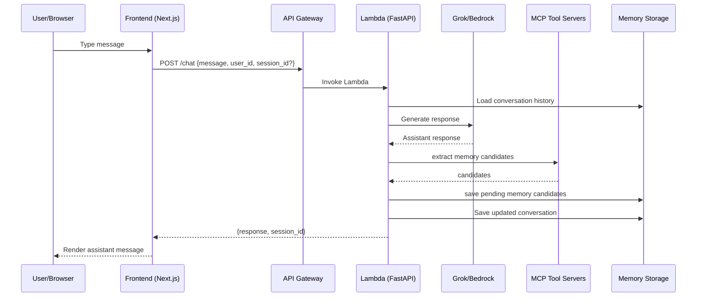

### 12.6 Memory approval
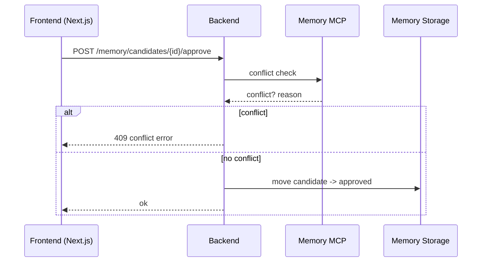

### 12.2 GET /conversations
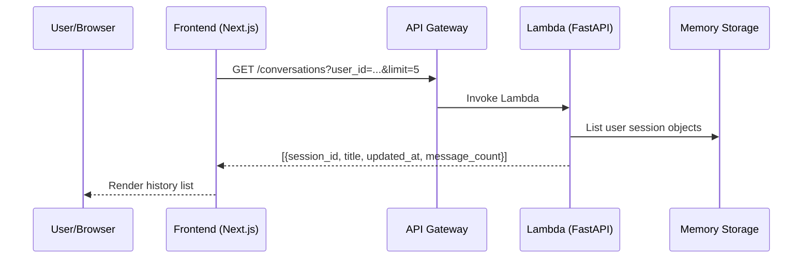

### 12.3 GET /conversation/{session_id}
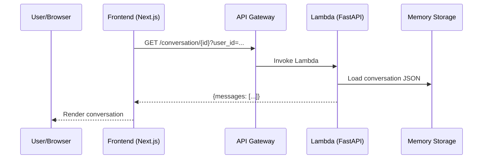

### 12.4 GET /health
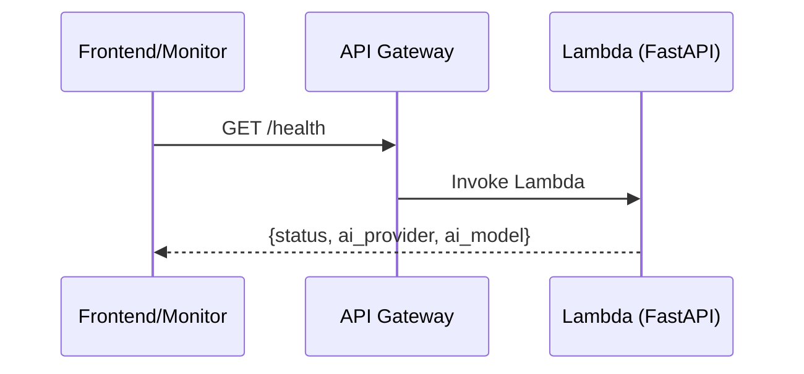

### 12.5 GET /
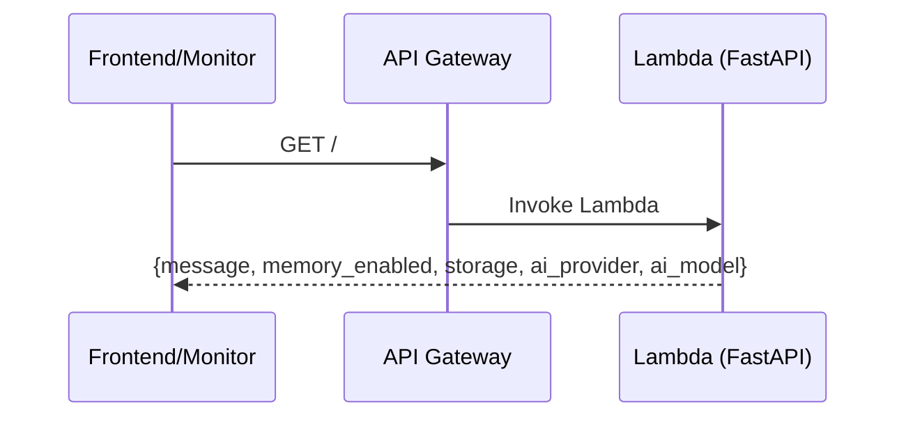

-------------------------------------------------------------------------------

## 13) Internal flow diagrams (deeper)

These diagrams go one layer deeper into key internal behaviors.

### 13.1 Prompt assembly
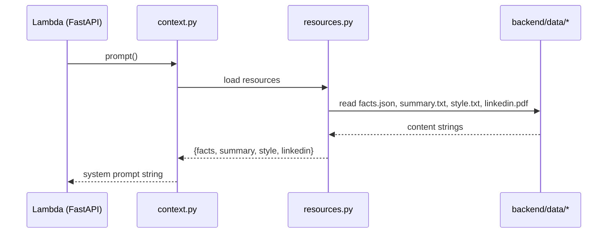

### 13.2 Model selection + fallback (Bedrock)
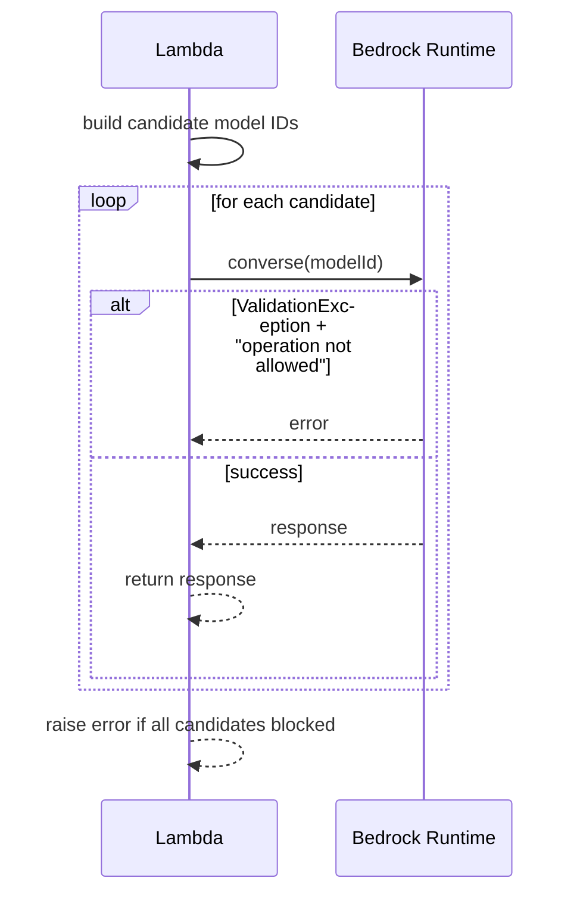

### 13.3 Memory pruning (keep 5 sessions)
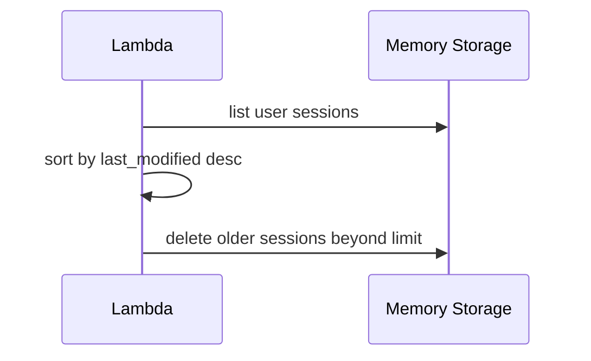

### 13.4 Grok call flow
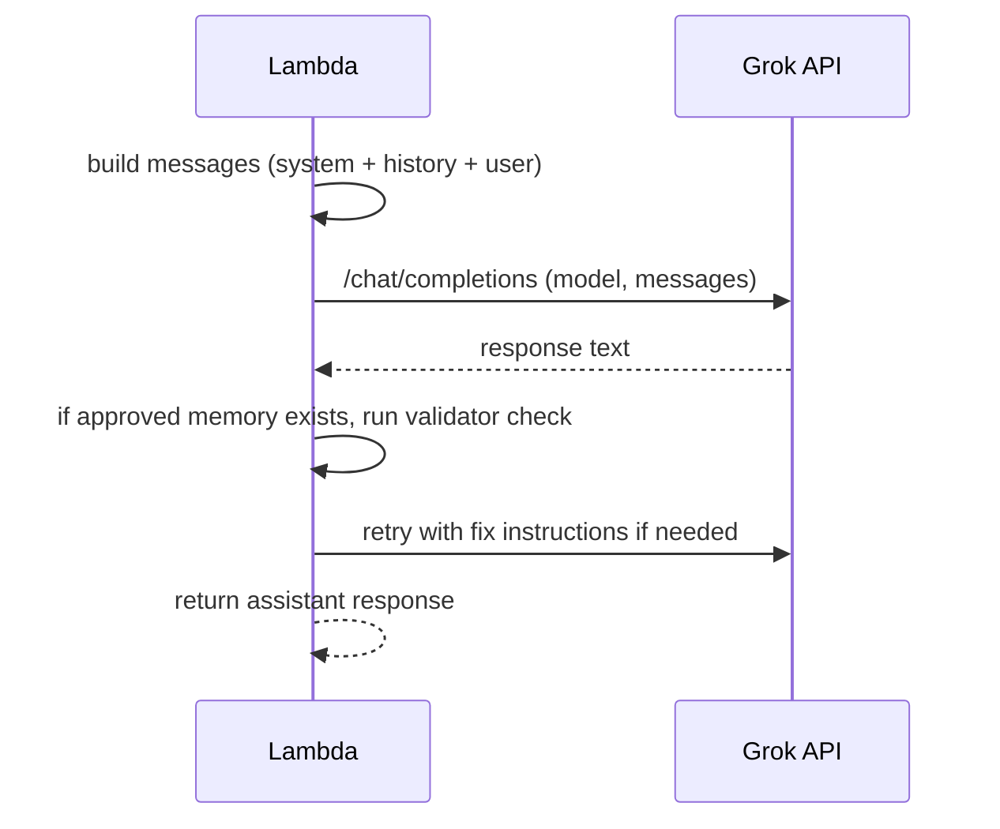

### 13.5 History auto-restore (frontend)
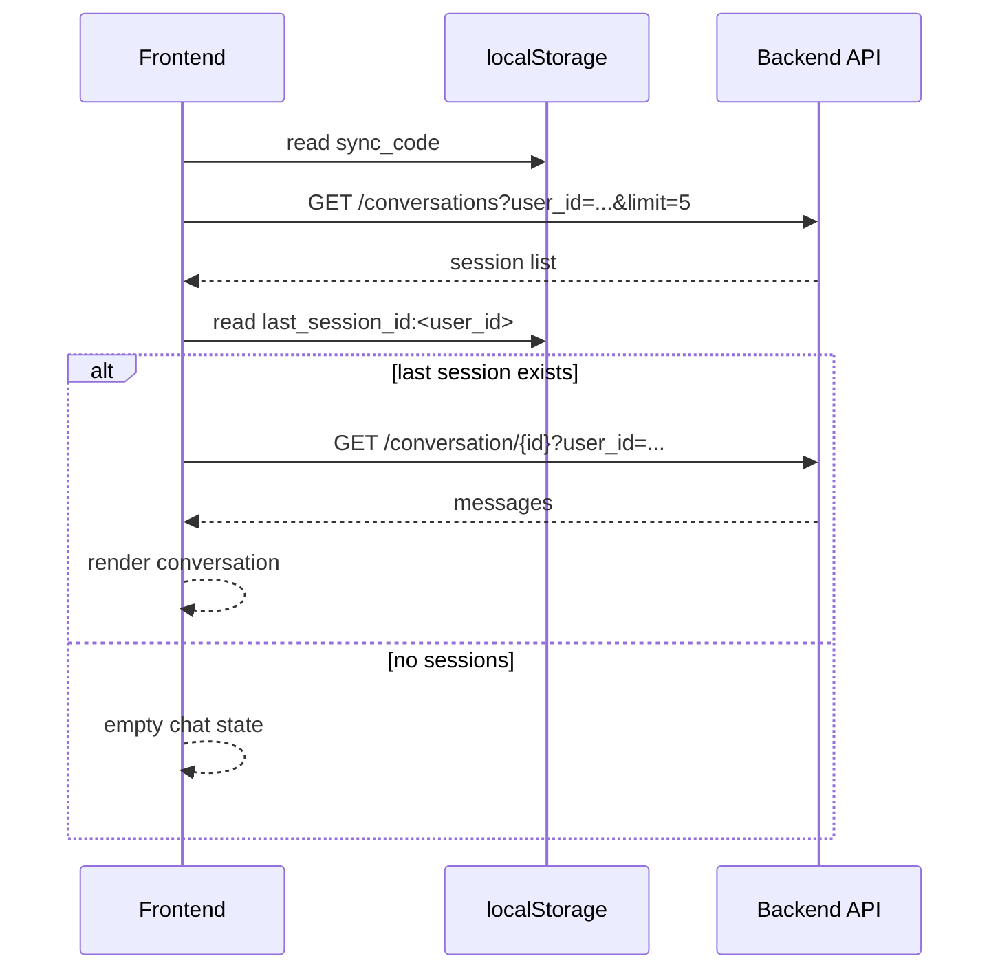

### 13.6 CORS handling flow
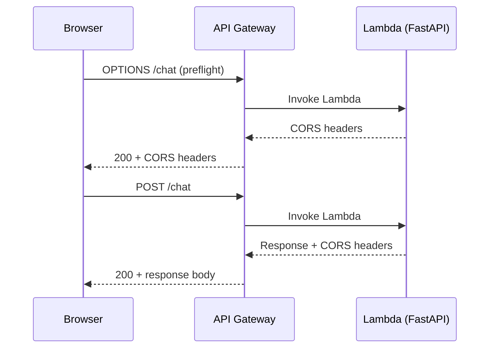

### 13.7 Session creation flow
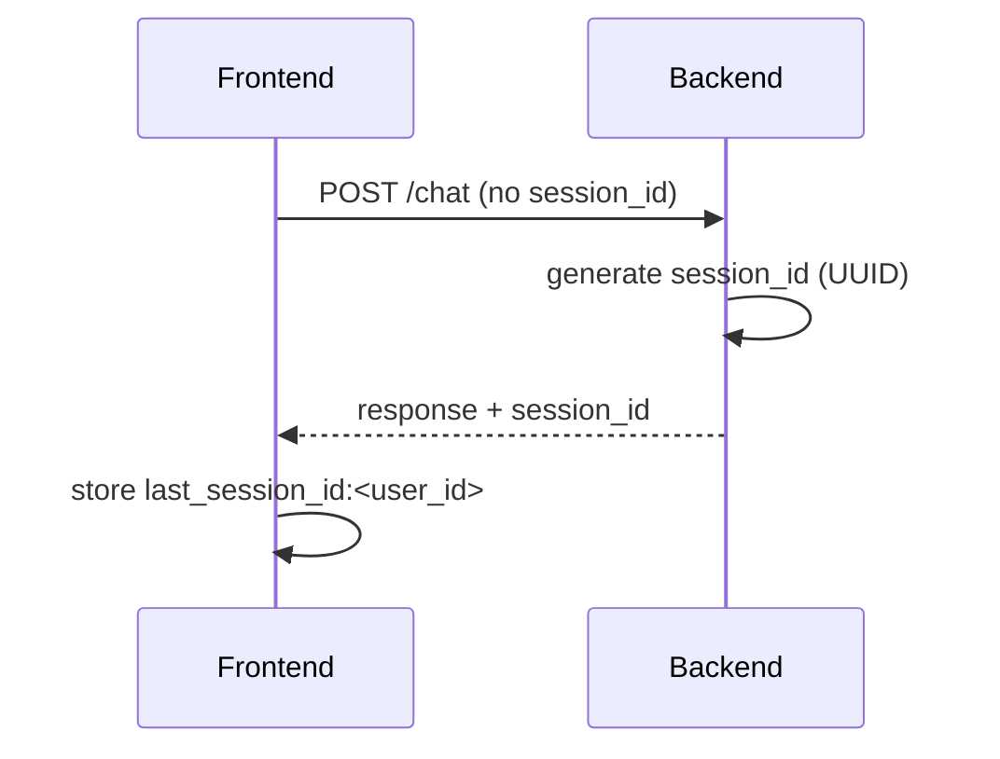

### 13.8 Error handling + fallback
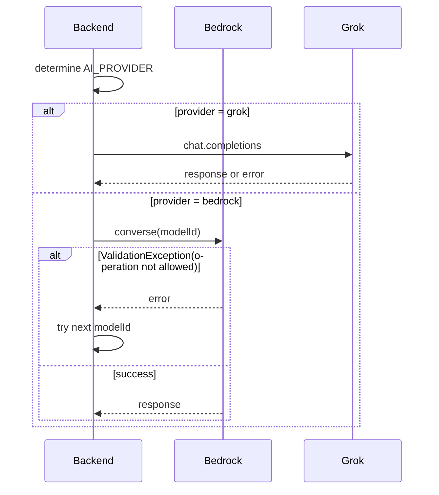

### 13.9 Frontend refresh + history reload
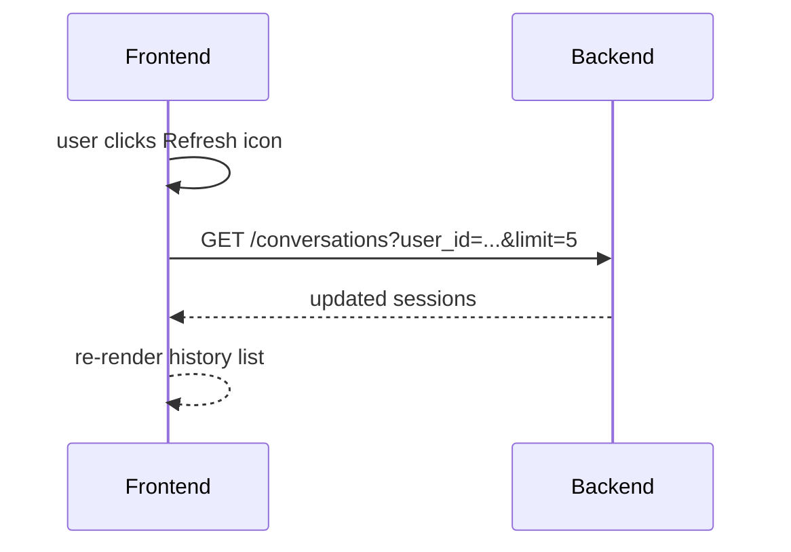

### 13.10 Memory storage mode (local vs S3)
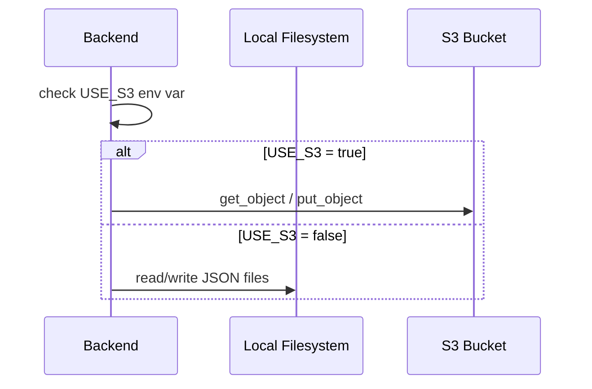

### 13.11 How USE_S3 is set (local vs deployed)

Local development:
- `USE_S3` defaults to `false` in `backend/server.py`.
- Memory is stored under `../memory/` on disk.
- You can override with `USE_S3=true` if you want to test S3 locally.

Deployed (Lambda):
- Terraform sets `USE_S3=true` in Lambda environment variables.
- Terraform sets `S3_BUCKET` to the memory bucket name.
- All sessions are stored as S3 objects at `{user_id}/{session_id}.json`.

### 13.12 Local vs production configuration (quick table)

| Setting | Local dev | Production (Lambda) |
|---|---|---|
| `USE_S3` | `false` (default) | `true` (set by Terraform) |
| `S3_BUCKET` | empty | memory bucket name |
| Memory path | `../memory/` | `s3://<memory-bucket>/{user_id}/{session_id}.json` |
| API URL | `http://localhost:8000` | API Gateway URL |
| Frontend | Next dev server | S3 + CloudFront |

-------------------------------------------------------------------------------

## 14) AWS resource table (infra inventory)

This table maps Terraform resources to their runtime role.

| Terraform resource | AWS service | Purpose | Key inputs | Outputs / used by |
|---|---|---|---|---|
| `aws_s3_bucket.frontend` | S3 | Hosts static frontend files | `project_name`, `environment` | `s3_frontend_bucket` output |
| `aws_s3_bucket_policy.frontend` | S3 | Public read access for frontend | bucket ARN | CloudFront origin access |
| `aws_s3_bucket_website_configuration.frontend` | S3 | Static hosting endpoint | bucket id | CloudFront origin |
| `aws_s3_bucket.memory` | S3 | Stores conversation history | `project_name`, `environment` | `s3_memory_bucket` output |
| `aws_ecr_repository.lambda` | ECR | Stores Lambda container images | `project_name`, `environment` | `ecr_repository_url` output |
| `aws_lambda_function.api` | Lambda | Runs FastAPI backend (API) | Container image, env vars | API Gateway integration |
| `aws_lambda_function.worker` | Lambda | Runs async worker | Container image, env vars | Invoked by API Lambda |
| `aws_api_gateway_rest_api.main` | API Gateway | REST API entrypoint | name | `api_gateway_url` output |
| `aws_api_gateway_resource.*` | API Gateway | Resources (proxy/root) | API id | Connects API -> Lambda |
| `aws_api_gateway_method.*` | API Gateway | Methods (ANY/OPTIONS) | resource id | Connects API -> Lambda |
| `aws_api_gateway_integration.*` | API Gateway | Lambda integration | Lambda invoke arn | Routes target |
| `aws_api_gateway_method_settings.main` | API Gateway | Throttling/logging settings | stage name | API tuning |
| `aws_iam_role.lambda_role` | IAM | Lambda execution role | trust policy | Lambda role ARN |
| `aws_iam_role_policy_attachment.*` | IAM | Attach execution policies | policy ARNs | Lambda permissions |
| `aws_cloudfront_distribution.main` | CloudFront | CDN for frontend | S3 website endpoint | `cloudfront_url` output |
| `aws_acm_certificate.site` | ACM | TLS cert for custom domain | `root_domain` | CloudFront SSL |
| `aws_route53_record.*` | Route53 | DNS validation + aliases | ACM records | Custom domain routing |

-------------------------------------------------------------------------------

## 15) Architecture change checklist

Before changing architecture:
- Identify which component is affected (frontend, backend, infra).
- Update Terraform if new AWS resources are needed.
- Update env vars in deploy pipeline if new config is required.
- Update this document to reflect new flows.
