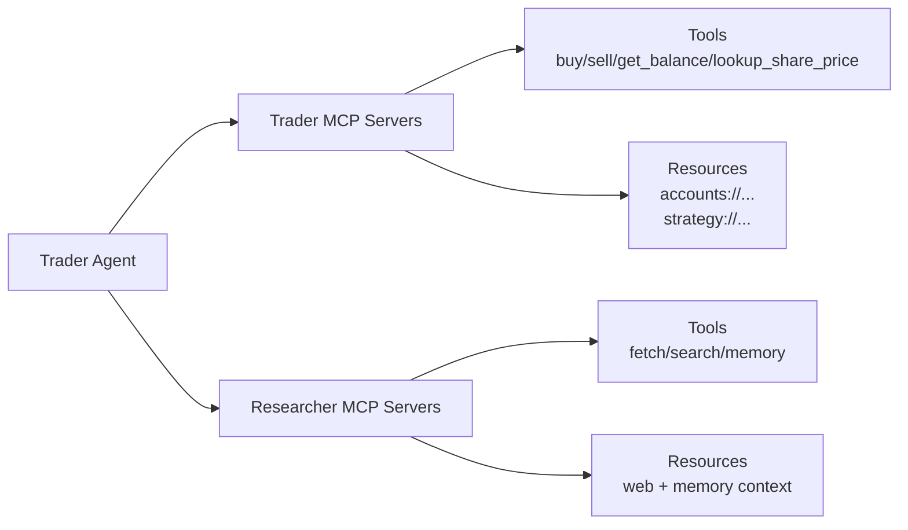
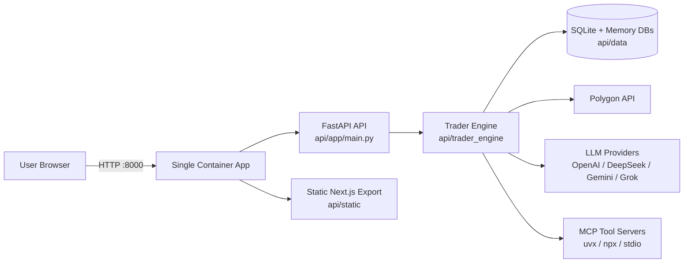
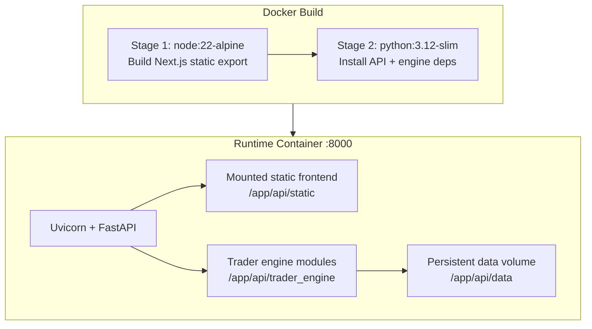
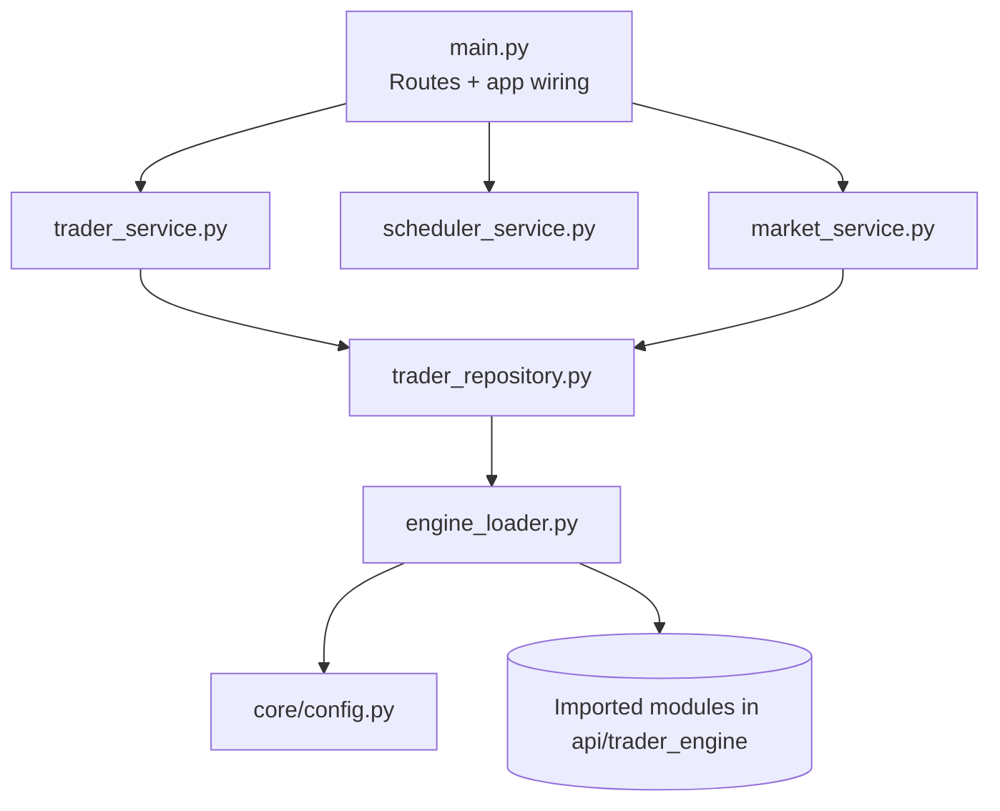
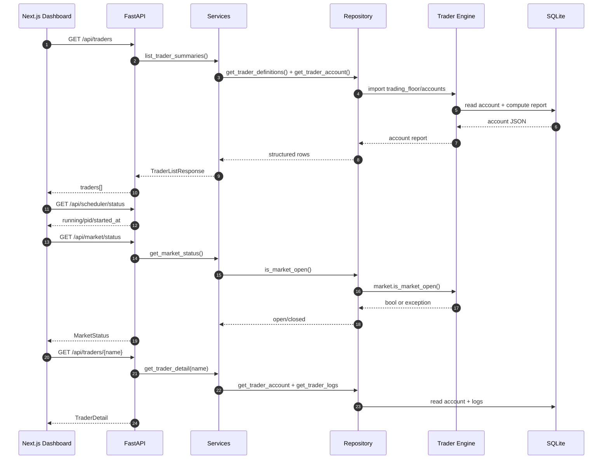
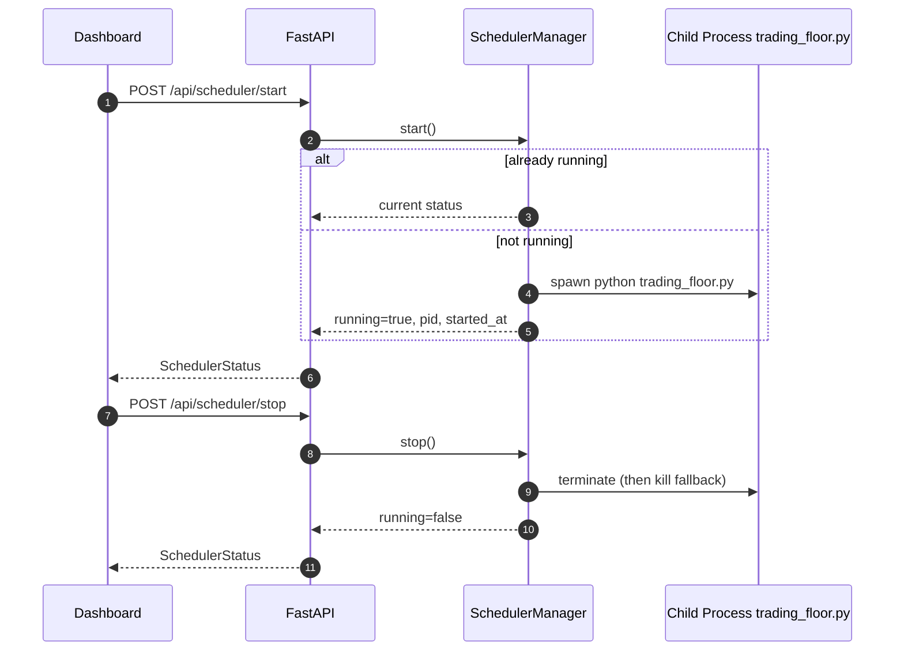
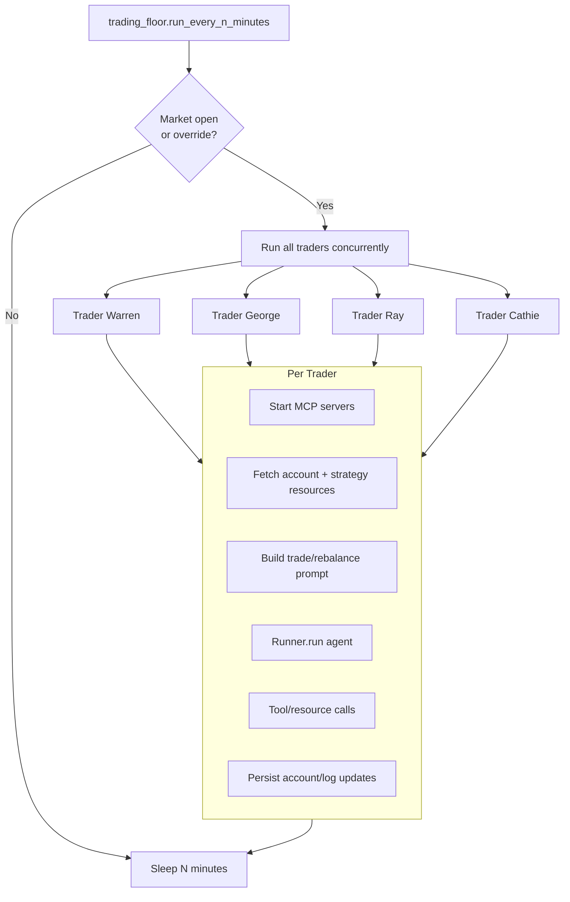
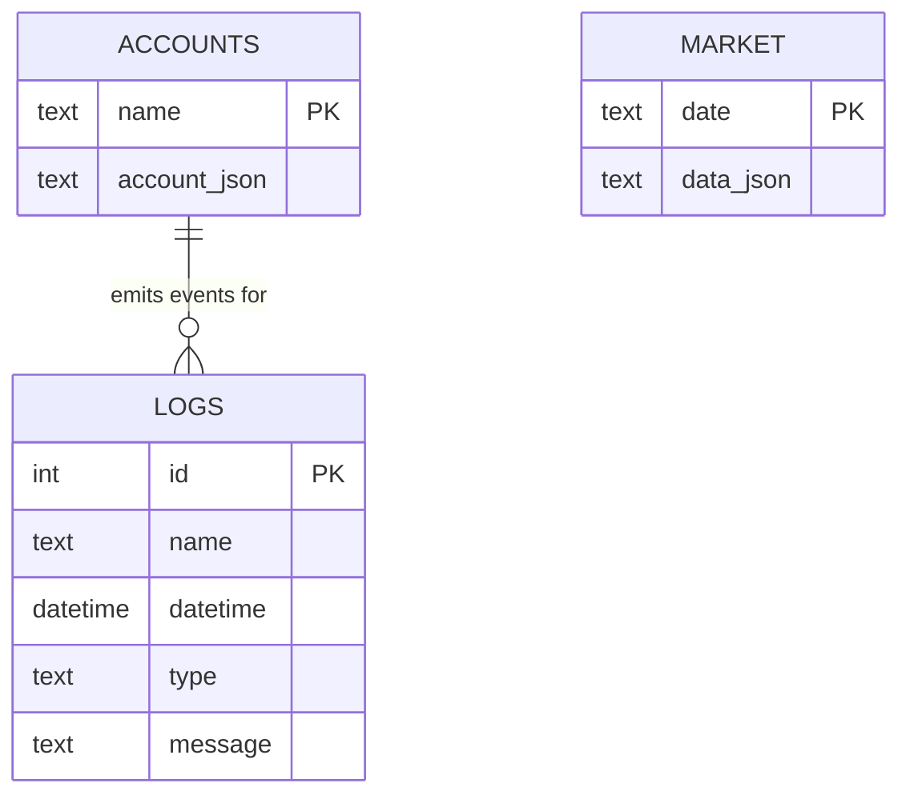
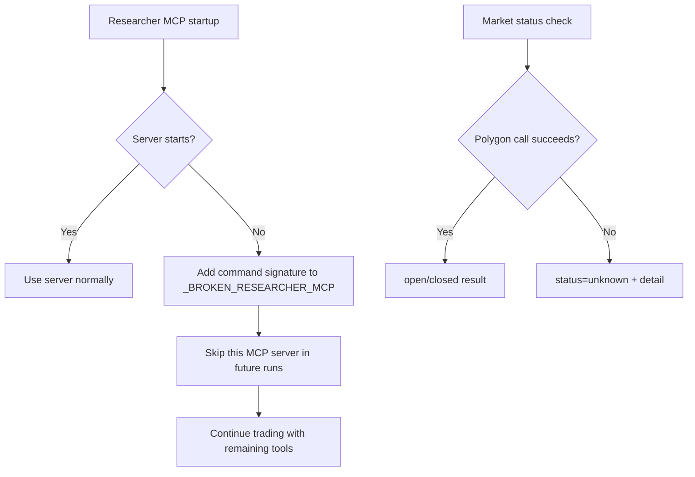

# Autonomous Trader Architecture

This document describes the **current implemented architecture** of this repository: a single-container FastAPI + Next.js application with an embedded autonomous trading engine.

## 0) Agentic Framework Architecture (Implemented)

This section describes the **agentic runtime design** used by the trading engine in `api/trader_engine/`, including the exact agent graph, tool topology, control-plane boundaries, and function-level execution path.

### 0.1 Core Framework and Primitives

The implementation is built on the OpenAI Agents SDK primitives used directly in `api/trader_engine/traders.py`:

- `Agent` for both trader and researcher roles
- `Runner.run(...)` for bounded multi-turn execution (`MAX_TURNS = 30`)
- `trace(...)` and a custom `TracingProcessor` (`LogTracer`) for observability
- `MCPServerStdio` for tool/resource connectivity over stdio MCP transports

The runtime composes LLM backends through `OpenAIChatCompletionsModel` with provider-specific `AsyncOpenAI` clients (OpenAI, DeepSeek, Gemini, Grok), selected by `get_model(model_name)`.

### 0.2 Agent Topology (Per Trader)

Each named persona (`Warren`, `George`, `Ray`, `Cathie`) is represented by one `Trader` instance (`trading_floor.create_traders()`), and each run builds a two-layer agent setup:

1. **Primary Trader Agent**
   - Created by `Trader.create_agent(...)`
   - Uses `trader_instructions(name)` from `templates.py`
   - Connected to trader MCP servers (accounts + market)
   - Receives one extra callable tool: `Researcher`

2. **Researcher Sub-Agent (toolized)**
   - Built by `get_researcher(...)`
   - Converted to callable tool via `researcher.as_tool(...)` in `get_researcher_tool(...)`
   - Uses `researcher_instructions()`
   - Connected to researcher MCP servers (fetch, brave search, memory as configured)

Result: the trader agent does not call web/data tools directly for research-heavy workflows; it calls the `Researcher` tool, which internally performs multi-step research using its own MCP stack.

### 0.3 MCP Tool and Resource Architecture

#### What MCP Is

MCP (Model Context Protocol) is a standard interface that lets an LLM agent connect to external capabilities (tools and resources) through a consistent contract, regardless of provider-specific SDK details.

In this codebase, MCP servers are exposed over stdio and consumed through `MCPServerStdio`, so agents can:
- call tools (for actions, e.g. buy/sell or price lookup)
- read resources (for context, e.g. account state and strategy text)

#### Why MCP Helps in Agentic Apps

Key benefits for agentic systems:

1. **Separation of concerns**
   - Agent reasoning stays in prompt/agent logic.
   - External actions and data access stay in dedicated MCP servers.

2. **Composable tool graph**
   - You can attach multiple servers (accounts, market, fetch, memory, brave) to one agent runtime.
   - Different agents can get different MCP sets (trader vs researcher) without changing core orchestration.

3. **Provider/model portability**
   - Model backend can change (OpenAI/DeepSeek/Gemini/Grok) while tool contracts remain stable.

4. **Operational safety and control**
   - Tool boundaries are explicit and auditable.
   - Startup failures can be isolated per server (as done with `_BROKEN_RESEARCHER_MCP`) instead of crashing the whole loop.

5. **Faster iteration**
   - New capabilities are added by mounting a new MCP server, not rewriting agent core logic.

Applied to this project, MCP is the backbone that turns the LLM into an executable trading workflow instead of a text-only assistant.

Small MCP flow in this app:



The system uses stdio MCP servers, assembled dynamically per run:

- `trader_mcp_server_params()` from `mcp_params.py`
  - always includes local `accounts_server.py`
  - includes market MCP:
    - paid/realtime Polygon -> remote `mcp_massive` via `uvx`
    - otherwise -> local `market_server.py`

- `researcher_mcp_server_params(name)` from `mcp_params.py`
  - optional `mcp-server-fetch` (`uvx`)
  - optional Brave MCP (`npx @modelcontextprotocol/server-brave-search`) when key present
  - optional memory MCP (`npx mcp-memory-libsql`) with per-trader DB

Accounts MCP surface (`accounts_server.py`):

- Tools:
  - `get_balance(name)`
  - `get_holdings(name)`
  - `buy_shares(name, symbol, quantity, rationale)`
  - `sell_shares(name, symbol, quantity, rationale)`
  - `change_strategy(name, strategy)`
- Resources:
  - `accounts://accounts_server/{name}`
  - `accounts://strategy/{name}`

Market MCP surface (`market_server.py`):

- Tool:
  - `lookup_share_price(symbol)`

### 0.4 Execution Lifecycle (Function-Level)

The concrete runtime path for one scheduled cycle:

1. `api/app/services/scheduler_service.py::SchedulerManager.start(...)`
   - starts child process: `python trading_floor.py`
   - injects runtime env overrides:
     - `RUN_EVERY_N_MINUTES`
     - `RUN_EVEN_WHEN_MARKET_IS_CLOSED`

2. `api/trader_engine/trading_floor.py::run_every_n_minutes()`
   - registers `LogTracer` via `add_trace_processor(LogTracer())`
   - creates trader roster
   - loop:
     - checks market gate (`RUN_EVEN_WHEN_MARKET_IS_CLOSED or is_market_open()`)
     - concurrently executes all traders: `asyncio.gather(*[trader.run() ...])`
     - sleeps `RUN_EVERY_N_MINUTES * 60`

3. `api/trader_engine/traders.py::Trader.run()`
   - wraps call in error guard
   - executes `run_with_trace()`
   - toggles behavior mode after each run (`self.do_trade = not self.do_trade`)

4. `Trader.run_with_trace()`
   - enters `trace(trace_name, trace_id=make_trace_id(...))`
   - then calls `run_with_mcp_servers()`

5. `Trader.run_with_mcp_servers()`
   - starts trader MCP servers with `AsyncExitStack`
   - starts researcher MCP servers with second `AsyncExitStack`
   - startup failures for researcher servers are cached in `_BROKEN_RESEARCHER_MCP` and skipped on future cycles
   - invokes `run_agent(...)`

6. `Trader.run_agent(...)`
   - builds agent graph via `create_agent(...)`
   - loads account context from MCP resource (`read_accounts_resource`)
   - loads current strategy from MCP resource (`read_strategy_resource`)
   - chooses prompt:
     - `trade_message(...)` when `self.do_trade` is true
     - `rebalance_message(...)` otherwise
   - runs bounded agent loop: `Runner.run(...)`

### 0.5 Prompt and Decision Architecture

Prompt composition in `templates.py` is role-specific and mode-specific:

- `trader_instructions(name)` defines identity, objectives, tool usage expectations
- `researcher_instructions()` defines web research and memory usage behavior
- `trade_message(...)` asks for opportunity-seeking execution
- `rebalance_message(...)` asks for portfolio rebalance decisions

Market-data guidance in prompts is dynamically adapted using Polygon capability flags (`is_realtime_polygon`, `is_paid_polygon`, fallback EOD), so the agent is explicitly told whether it has realtime, delayed, or prior-close data semantics.

### 0.6 State, Memory, and Persistence Boundaries

There are three distinct persistence domains:

1. **Account and log state** (`api/data/accounts.db`)
   - managed by `accounts.py` + `database.py`
   - includes account blobs, transactions, portfolio value time-series, and logs

2. **Market snapshot cache** (`market` table in same SQLite DB)
   - prior-day grouped prices cached via `write_market/read_market`
   - used by EOD pricing path

3. **Research memory graph** (optional, per trader)
   - libsql-backed DB files under `${TRADER_DATA_DIR}/memory/{name}.db`
   - provided by `mcp-memory-libsql`

Important behavior: account reads through `Account.report()` do not append timeline points.  
Timeline snapshots are written on execution events (`buy_shares`, `sell_shares`) plus reset baseline seeding, so dashboard read frequency does not inflate chart history.

### 0.7 Observability and Trace-to-Log Mapping

`LogTracer` (`tracers.py`) maps agent traces/spans into persistent log rows:

- `on_trace_start/on_trace_end` -> trace lifecycle entries
- `on_span_start/on_span_end` -> span lifecycle entries with span type/name/server metadata when present

The trace ID embeds trader identity (`make_trace_id(tag)`), allowing log attribution back to a specific trader run.

### 0.8 Fault Tolerance and Degradation Strategy

Implemented resiliency characteristics:

- Market gate allows skip behavior when market is closed unless override is enabled
- Researcher MCP startup failures are soft-failed and memoized in `_BROKEN_RESEARCHER_MCP`
- Market pricing fallback is layered:
  - first reuse last known symbol price cache when available
  - then random fallback only if no known price exists
  - failure cooldown throttles repeated upstream calls during outage windows
- Scheduler stop path uses terminate with kill fallback
- API market-status endpoint preserves the last known `open|closed` status on upstream errors and includes fallback detail text

### 0.9 Control Plane Integration (FastAPI <-> Agent Runtime)

FastAPI is the control plane; the engine process is the agent data plane:

- `POST /api/scheduler/start`
  - accepts runtime knobs (`run_every_n_minutes`, `run_even_when_market_is_closed`)
  - spawns engine process with env overrides
- `POST /api/scheduler/stop` / `GET /api/scheduler/status`
  - control process lifecycle only
- `GET /api/traders`, `GET /api/traders/{name}`, `GET /api/traders/{name}/logs`
  - query persisted outputs of agent/tool execution (accounts + logs)
- `POST /api/reset`
  - resets strategy/account baselines used by future agent cycles

This separation keeps the API stateless with respect to agent reasoning steps while preserving reproducible runtime state in SQLite and optional memory MCP stores.

---

## 1) High-Level Overview

The system has three major parts:

1. **Web UI (Next.js export)** in `web/`
   - Rendered as static files (`next build` with `output: "export"`)
   - Calls backend JSON APIs from the browser

2. **Backend API (FastAPI)** in `api/app/`
   - Provides REST endpoints for trader data, scheduler control, market status, and reset
   - Serves static frontend files from `api/static`

3. **Trading Engine** in `api/trader_engine/`
   - Maintains account state, logs, transactions, market access, and autonomous agent execution
   - Runs scheduled trading loops in a child process (`trading_floor.py`)

At runtime, all three are packaged in one Docker image and exposed on one port (`8000`).

### 1.1 Top-Level Trading Synopsis

The full cycle is intentionally stateful and runs in the engine process (`api/trader_engine/trading_floor.py`).

1. **Scheduler tick + runtime state bootstrap**
   - `run_every_n_minutes()` starts and registers `LogTracer`.
   - Trader objects are created once for the process lifetime.
   - Runtime status file is initialized with `run_in_progress=false`.
   - The loop sleeps and wakes every `RUN_EVERY_N_MINUTES`.
   - Trading value of this step:
     - defines deterministic execution cadence (instead of ad-hoc/manual timing),
     - preserves trader in-memory state across cycles (e.g., trade/rebalance alternation),
     - initializes observability so each later decision can be traced.

2. **Market-gate decision (open-only vs closed override)**
   - On each wake-up, the engine checks:
     - `is_market_open()` (live market status path), and
     - `RUN_EVEN_WHEN_MARKET_IS_CLOSED`.
   - Behavior:
     - market open -> run cycle executes
     - market closed + override true -> run cycle still executes
     - market closed + override false -> cycle is skipped
   - When skipped, runtime status stays `run_in_progress=false` and the loop waits for next tick.
   - Trading value of this step:
     - prevents unintended execution during closed sessions by default,
     - enables explicit simulation/backtesting style runs with override,
     - reduces unnecessary API/tool calls when no valid session is available.

3. **Cycle start markers**
   - If cycle will run, the engine writes:
     - `run_in_progress=true`
     - `last_run_started_at=<utc timestamp>`
   - This is what the API/UI read to show active run state.
   - Trading value of this step:
     - gives operators real-time visibility that a cycle is currently executing,
     - supports safe UI polling behavior keyed to run state rather than blind intervals.

4. **Concurrent trader execution**
   - Four traders run concurrently via `asyncio.gather(...)`:
     - Warren, George, Ray, Cathie.
   - Each trader execution is wrapped in trace context so spans/logs are persisted with trader attribution.
   - Trading value of this step:
     - maximizes throughput by running independent trader personas in parallel,
     - keeps attribution clear so each decision and side effect is auditable by trader.

5. **Per-trader mode selection (trade vs rebalance alternating)**
   - Each trader keeps an internal boolean `self.do_trade`.
   - If true: prompt uses `trade_message(...)` (seek and execute opportunities).
   - If false: prompt uses `rebalance_message(...)` (portfolio/risk rebalancing behavior).
   - After each run, it flips (`self.do_trade = not self.do_trade`), producing alternating behavior across cycles.
   - Trading value of this step:
     - balances alpha-seeking behavior (trade mode) with portfolio hygiene (rebalance mode),
     - avoids one-sided drift where agents only add new trades without periodic risk realignment.

6. **Context acquisition through MCP resources**
   - Trader MCP servers are started (accounts + market).
   - Trader reads:
     - account resource (balance, holdings, transactions, prior state),
     - strategy resource (current strategy text).
   - Account payload is normalized before prompting (for example, trimming high-volume timeline fields in prompt context).
   - Trading value of this step:
     - ensures decisions are state-aware (cash, holdings, prior trades, current strategy),
     - reduces prompt noise so model context focuses on actionable portfolio facts.

7. **Research sub-agent execution path**
   - Trader agent has a callable `Researcher` tool.
   - Researcher uses its own MCP stack (fetch, Brave if enabled/key present, optional memory DB).
   - This keeps web research/tool exploration separate from core execution tools.
   - Trading value of this MCP layer:
     - provides external qualitative context (news, filings summaries, thematic signals) that pure price-only logic cannot see,
     - lets agents justify entries/exits with evidence-backed rationale instead of blind ticker selection,
     - maintains continuity via optional memory so later cycles can build on prior findings instead of restarting research from scratch,
     - keeps execution safety boundaries clear (research tools cannot directly place trades; trade tools remain in accounts MCP).
   - Researcher MCP startup failures are isolated and cached in `_BROKEN_RESEARCHER_MCP` so one failing server does not crash future cycles.

8. **Pricing and execution path**
   - Trade actions use accounts MCP tools (`buy_shares`, `sell_shares`, `change_strategy`).
   - Price lookups route through market MCP (`market_server.py` -> `market.py`):
     - Polygon path when available (plan-aware behavior),
     - EOD cache path for grouped market data where applicable,
     - fallback behavior if provider fails/rate-limits (simulation/random value path to keep engine alive).
   - Trading value of this step:
     - separates execution authority (accounts tools) from market-data retrieval concerns,
     - keeps execution continuity under provider instability while preserving process uptime.

9. **Persistence and observability writes**
   - Executions persist to SQLite:
     - updated account state,
     - transaction rows in account blob,
     - logs (account events + trace/span events),
     - market cache records.
   - Portfolio timeline points are updated on trade writes and reset seeding (not passive reads).
   - Trading value of this step:
     - creates reproducible state for UI, post-trade analysis, and troubleshooting,
     - preserves both outcome data (positions/transactions) and process telemetry (traces/logs).

10. **Cycle completion markers + UI visibility**
   - At end of gather block (even with individual trader errors), engine writes:
     - `run_in_progress=false`
     - `last_run_ended_at=<utc timestamp>`
   - FastAPI endpoints expose these values.
   - Dashboard renders status, holdings, logs, chart markers, and ledger from persisted state.
   - Trading value of this step:
     - provides clean run boundaries for operations and monitoring,
     - prevents stale “running” indicators after cycle completion/errors.

11. **Read-only cloud control behavior**
   - With `READ_ONLY_MODE=true`, manual control endpoints (`start/stop/reset`) are API-blocked.
   - With `AUTO_TRADE_BY_MARKET=true`, backend watchdog can still auto-start/auto-stop scheduler by market status.
   - Net effect: users can monitor, but cannot manually override process lifecycle from UI.
   - Trading value of this step:
     - hardens production posture for multi-user dashboards,
     - prevents accidental/manual lifecycle changes while keeping autonomous execution policy-driven.

### 1.2 Trader Strategy Profiles (Implemented Baselines)

Baseline strategies are seeded by `api/trader_engine/reset.py` and applied by `reset_traders()`:

- **Warren (value/quality bias)**
  - Objective: long-term wealth creation through undervalued, high-quality businesses.
  - Prompt emphasis: fundamentals, durable moat, management quality, patience over short-term noise.
  - Behavioral effect: lower turnover bias and preference for conviction holds.

- **George (macro/contrarian bias)**
  - Objective: exploit large macro mispricings and sentiment extremes.
  - Prompt emphasis: aggressive positioning, contrarian entries, timing around macro/geopolitical shifts.
  - Behavioral effect: higher willingness for directional and event-driven moves.

- **Ray (systematic diversification bias)**
  - Objective: balance return and risk across regimes.
  - Prompt emphasis: macro indicators, cycle interpretation, diversification/risk-parity style allocation.
  - Behavioral effect: portfolio-balance and regime-adjustment oriented decisions.

- **Cathie (innovation/crypto ETF bias)**
  - Objective: asymmetric upside in disruptive innovation themes.
  - Prompt emphasis: technology inflections, regulatory shifts, sentiment in crypto ETF exposure.
  - Explicit constraint in strategy text: focus trading on crypto ETFs.
  - Behavioral effect: higher-growth/high-volatility preference.

These strategy strings are persisted per account and injected into every run's prompt context, so strategy is not a UI label; it is a live decision input to the agent.

---

## 2) Deployment Topology

### 2.1 Single Container Build

- **Build stage 1 (`node:22-alpine`)**
  - Installs `web/` dependencies
  - Builds and exports static Next.js files
- **Build stage 2 (`python:3.12-slim`)**
  - Installs Python deps for API + engine
  - Installs Node/npm (needed for `npx` MCP servers used by the engine)
  - Copies `api/` code and static export
  - Runs `uvicorn app.main:app --host 0.0.0.0 --port 8000`

### 2.2 Runtime Ports and Volumes

From `docker-compose.yml`:

- Container exposes `8000:8000`
- `./api/data` is mounted to `/app/api/data` for persistent SQLite + memory DB files
- Environment sets:
  - `TRADER_ENGINE_DIR=/app/api/trader_engine`
  - `TRADER_DATA_DIR=/app/api/data`
  - `FRONTEND_ORIGIN=http://localhost:8000`

---

## 3) Directory and Responsibility Map

## 3.1 Backend (`api/app`)

- `core/config.py` — environment-backed settings
- `infrastructure/engine_loader.py` — dynamic import bridge into `api/trader_engine`
- `repositories/trader_repository.py` — low-level reads/writes from trader engine modules
- `services/trader_service.py` — business shaping for trader summaries/details
- `services/scheduler_service.py` — scheduler child-process lifecycle
- `services/market_service.py` — market open/closed status abstraction
- `schemas.py` — response models
- `main.py` — FastAPI app, endpoints, CORS, static mounting

## 3.2 Trading Engine (`api/trader_engine`)

- Domain/state: `accounts.py`
- Persistence: `database.py`
- Runtime cycle state: `runtime_status.py`
- Market integration: `market.py`, `market_server.py`
- Agent orchestration: `traders.py`, `trading_floor.py`, `templates.py`, `tracers.py`
- MCP wrappers: `accounts_server.py`, `accounts_client.py`, `mcp_params.py`
- Initialization: `reset.py`
- Legacy UI: `app.py` (Gradio; not part of FastAPI web UI path)

## 3.3 Frontend (`web`)

- `app/layout.tsx` — root layout/fonts/metadata
- `app/page.tsx` — dashboard view, controls, custom SVG chart with buy/sell markers
- `lib/api.ts` — typed API client wrappers
- `app/globals.css` — visual system and chart styling

---

## 4) End-to-End Data Flows

## 4.1 Dashboard refresh flow

1. Browser loads `/` (static export served by FastAPI).
2. `HomePage` performs one initial full `refreshDashboard()`.
3. While trading process is running, UI polls scheduler status every 3s (`GET /api/scheduler/status`).
4. UI runs full 10s refresh only while `run_in_progress=true`:
   - `GET /api/traders`
   - `GET /api/scheduler/status`
   - `GET /api/market/status`
5. UI then requests selected trader detail:
   - `GET /api/traders/{name}`
6. UI renders cards, status badges, chart, logs, holdings, transactions.

## 4.2 Start trading flow

1. User clicks **Start Trading**.
2. UI calls `POST /api/scheduler/start` with optional runtime knobs:
   - `run_even_when_market_is_closed`
   - `run_every_n_minutes`
3. API service spawns child process in `TRADER_ENGINE_DIR`:
   - `python trading_floor.py`
4. `trading_floor.py` loops forever, periodically invoking 4 traders.
5. Cycle boundaries are persisted into `runtime_status.json` (`run_in_progress`, `last_run_started_at`, `last_run_ended_at`).

## 4.3 Trading cycle flow (engine internal)

1. Each trader builds MCP server sessions.
2. Trader agent invokes tools/resources (accounts + market + researcher stack).
3. Trades call account MCP tool endpoints (buy/sell/change strategy).
4. Account updates are persisted into SQLite (`api/data/accounts.db`).
5. Logs and trace events are written to `logs` table.
6. Portfolio time-series is appended on trade writes (`buy_shares`/`sell_shares`) and reset baseline seeding.

## 4.4 Market status flow

1. API `GET /api/market/status` calls repository `is_market_open()`.
2. Repository delegates to engine `market.is_market_open()`.
3. Engine queries Polygon market status.
4. On exception, API returns the last known `open|closed` status plus detail text describing fallback reason.

---

## 5) API Surface (FastAPI)

Base host: same origin (`http://localhost:8000` by default).

### `GET /health`
- Purpose: liveness probe
- Response: `{ "status": "ok" }`

### `GET /api/traders`
- Purpose: list trader summary cards
- Response model: `TraderListResponse`
- Includes for each trader:
  - `name`, `lastname`, `model_name`
  - `balance`, `total_portfolio_value`, `total_profit_loss`
  - `holdings_count`, `transactions_count`

### `GET /api/traders/{name}`
- Purpose: load one trader detail
- Query: `logs_limit` (default 50, min 1, max 200)
- Response model: `TraderDetail`
  - `summary`
  - raw `account` object (includes `holdings`, `transactions`, `portfolio_value_time_series`, strategy fields, etc.)
  - `logs`
- Errors:
  - `404` unknown trader

### `GET /api/traders/{name}/logs`
- Purpose: logs only
- Query: `limit` (default 50, min 1, max 200)
- Response model: `LogEntry[]`

### `POST /api/scheduler/start`
- Purpose: start engine loop process
- Request body (optional):
  - `run_even_when_market_is_closed: bool`
  - `run_every_n_minutes: int` (1..1440)
- Response model: `SchedulerStatus`
  - `running`, `pid`, `started_at`
  - `run_in_progress`, `last_run_started_at`, `last_run_ended_at`

### `POST /api/scheduler/stop`
- Purpose: stop engine loop process (terminate -> kill fallback)
- Response model: `SchedulerStatus`

### `GET /api/scheduler/status`
- Purpose: scheduler state check
- Response model: `SchedulerStatus`
  - includes process-level state and cycle-level state (`run_in_progress`, last cycle timestamps)

### `GET /api/market/status`
- Purpose: market open/closed indicator for UI
- Response model: `MarketStatus`
  - `status`: `open | closed`
  - `is_open`: `true | false`
  - `detail`: `null` on normal path, fallback message if last-known status is returned after exception

### `POST /api/reset`
- Purpose: reset all four trader accounts with predefined strategy prompts
- Response: `{ "message": "Trader accounts reset." }`

---

## 6) Backend Module Internals (Function-by-Function)

## 6.1 `api/app/core/config.py`

### `Settings` dataclass
- Fields:
  - `app_name`
  - `frontend_origin`
  - `trader_engine_dir`
  - `read_only_mode`
  - `auto_trade_by_market`
  - `market_watch_interval_sec`
- Source: environment variables with defaults

### `settings`
- Singleton config object used by app + scheduler + engine loader

## 6.2 `api/app/infrastructure/engine_loader.py`

### `bootstrap_engine()`
- Ensures `trader_engine_dir` exists
- Injects it into `sys.path` once (idempotent)

### `import_engine_module(name)`
- Dynamic import wrapper for engine modules

### `engine_static_dir()`
- Resolves `api/static` path for frontend mounting

## 6.3 `api/app/repositories/trader_repository.py`

### `get_trader_definitions()`
- Reads `names`, `lastnames`, `short_model_names` from `trading_floor`

### `get_trader_account(name)`
- Calls engine `Account.get(name).report()`
- Parses JSON into Python dict

### `get_trader_logs(name, limit)`
- Reads engine DB logs via `database.read_log`

### `reset_all_traders()`
- Calls engine `reset.reset_traders()`

### `is_market_open()`
- Calls engine `market.is_market_open()`

## 6.4 `api/app/services/trader_service.py`

### `build_trader_summary(meta, account)`
- Converts full account payload into compact card object

### `list_trader_summaries()`
- Produces summary list for all configured traders

### `get_trader_detail(name, limit)`
- Validates trader existence
- Returns summary + full account + logs

### `reset_traders()`
- Service wrapper for reset operation

## 6.5 `api/app/services/scheduler_service.py`

### `SchedulerManager`
State:
- `_process`: child process handle for `trading_floor.py`
- `_started_at`: UTC timestamp
- `_lock`: `RLock` for thread-safe lifecycle actions

Methods:
- `status()` — returns running state, pid, started time, and current cycle metadata from runtime status file
- `start(run_even_when_market_is_closed, run_every_n_minutes)` — spawns child if not already running, injects env overrides, initializes runtime status
- `stop(timeout_seconds=10)` — graceful terminate, then force kill if needed

Global:
- `scheduler_manager` singleton used by API endpoints

Internal helpers:
- `_runtime_status_path()`, `_read_runtime_status()`, `_write_runtime_status()` for status file integration

## 6.6 `api/app/services/market_service.py`

### `get_market_status()`
- Returns structured market state
- On exception, returns last known open/closed state with fallback `detail` message

## 6.7 `api/app/main.py`

### App lifecycle
- `lifespan()` ensures scheduler is stopped on shutdown

### CORS
- Allowed origins include configured frontend origin and localhost variants

### Route handlers
- `health`, `list_traders`, `get_trader`, `trader_logs`, `start_scheduler`, `stop_scheduler`, `scheduler_status`, `market_status`, `reset_traders`

### Static mount
- If `api/static` exists, mounts `/` to serve frontend HTML/static assets

---

## 7) Trading Engine Internals (Function-by-Function)

## 7.1 `api/trader_engine/accounts.py`

### `Transaction` model
- Fields: `symbol`, `quantity`, `price`, `timestamp`, `rationale`
- `total()` returns signed notional (`quantity * price`)

### `Account` model
State fields:
- `name`, `balance`, `strategy`, `holdings`, `transactions`, `portfolio_value_time_series`

Methods:
- `get(name)` — load/create account (initial balance 10,000)
- `save()` — persist full account blob to SQLite
- `_append_portfolio_snapshot()` — appends one `(timestamp, value)` point after execution changes
- `_frozen_portfolio_value()` — returns latest stored timeline value (fallback: current balance)
- `reset(strategy)` — restore baseline account state with new strategy
  - seeds one initial timeline point at reset time
- `deposit(amount)`, `withdraw(amount)` — cash operations
- `buy_shares(symbol, quantity, rationale)`
  - gets price
  - applies spread (`+0.2%`)
  - validates funds/symbol
  - updates holdings, balance, transactions, logs
  - appends post-trade portfolio snapshot
  - returns fresh report
- `sell_shares(symbol, quantity, rationale)`
  - validates holdings
  - applies spread (`-0.2%`)
  - updates holdings, balance, transactions, logs
  - appends post-trade portfolio snapshot
  - returns fresh report
- `calculate_portfolio_value()` — cash + mark-to-market holdings (live valuation)
- `calculate_profit_loss(portfolio_value)` — model-specific P/L calculation
- `get_holdings()`, `list_transactions()`
- `report()`
  - computes derived payload values without mutating timeline
  - with `STRICT_FLAT_WHEN_NO_TRADE=true`, uses frozen valuation from latest snapshot
  - with `STRICT_FLAT_WHEN_NO_TRADE=false`, uses live mark-to-market valuation
  - writes `"Retrieved account details"` only when runtime `run_in_progress=true`
  - returns JSON string (with `total_portfolio_value`, `total_profit_loss`)
- `get_strategy()`, `change_strategy(strategy)` (non-trade reads/changes are no longer logged to avoid noise)

## 7.2 `api/trader_engine/database.py`

### Data path model
- `TRADER_DATA_DIR` env controls data root
- Default: `api/data`
- SQLite DB file: `${TRADER_DATA_DIR}/accounts.db`

### Tables
- `accounts(name PRIMARY KEY, account JSON TEXT)`
- `logs(id, name, datetime, type, message)`
- `market(date PRIMARY KEY, data JSON TEXT)`

### Functions
- `write_account(name, account_dict)`
- `read_account(name)`
- `write_log(name, type, message)`
- `read_log(name, last_n=10)`
- `write_market(date, data)`
- `read_market(date)`

## 7.3 `api/trader_engine/market.py`

### Environment flags
- `POLYGON_API_KEY`
- `POLYGON_PLAN` (`paid`, `realtime`, fallback eod mode)

### Functions
- `is_market_open()` — Polygon market status API
- `get_all_share_prices_polygon_eod()` — grouped daily aggs
- `get_market_for_prior_date(today)` — cached EOD snapshot (DB + `lru_cache`)
- `get_share_price_polygon_eod(symbol)`
- `get_share_price_polygon_min(symbol)` — snapshot/minute
- `get_share_price_polygon(symbol)` — route by plan
- `get_share_price(symbol)`
  - tries Polygon path
  - on failure prefers last-known cached symbol price
  - uses random fallback `1..100` only when no known price exists
  - respects cooldown window to reduce repeated failed upstream calls

## 7.4 `api/trader_engine/accounts_server.py` (MCP)

MCP tools/resources exposed over stdio:

- Tools:
  - `get_balance(name)`
  - `get_holdings(name)`
  - `buy_shares(name, symbol, quantity, rationale)`
  - `sell_shares(name, symbol, quantity, rationale)`
  - `change_strategy(name, strategy)`
- Resources:
  - `accounts://accounts_server/{name}` -> `account.report()`
  - `accounts://strategy/{name}` -> strategy text

## 7.5 `api/trader_engine/market_server.py` (MCP)

- Tool:
  - `lookup_share_price(symbol)`

## 7.6 `api/trader_engine/accounts_client.py`

- `list_accounts_tools()`
- `call_accounts_tool(tool_name, tool_args)`
- `read_accounts_resource(name)`
- `read_strategy_resource(name)`
- `get_accounts_tools_openai()`

Uses stdio MCP client to talk to `accounts_server.py`.

## 7.7 `api/trader_engine/mcp_params.py`

### Flags and paths
- `ENABLE_BRAVE_MCP` (default true)
- `ENABLE_MEMORY_MCP` (default true)
- `TRADER_DATA_DIR` -> memory DB and npm cache roots

### `_npx_env(cache_key, extra_env)`
- Creates isolated npm cache per trader/tool
- Reduces npm temp/cache collision issues

### `trader_mcp_server_params()`
- Always includes local account server
- Uses either:
  - remote `mcp_massive` (`uvx`) for paid/realtime plans, or
  - local `market_server.py`

### `researcher_mcp_server_params(name)`
- Includes `mcp-server-fetch` via `uvx`
- Optional Brave server (`npx`) if enabled and key present
- Optional memory server (`npx`) with per-trader sqlite path

## 7.8 `api/trader_engine/traders.py`

### Model clients
Creates `AsyncOpenAI` clients for OpenAI/DeepSeek/Grok/Gemini base URLs.

### `get_model(model_name)`
- Maps model id to appropriate client-backed model wrapper

### `get_researcher()` / `get_researcher_tool()`
- Creates secondary research agent and exposes it as a tool to trader agent

### `Trader` class
- `create_agent(...)` — constructs main trader agent
- `get_account_report()` — resource fetch + payload trim
- `run_agent(...)` — chooses trade vs rebalance prompt and executes `Runner.run`
- `run_with_mcp_servers()`
  - starts trader MCP servers + researcher MCP servers
  - **startup-failure hardening:** broken researcher MCP command signatures are cached in `_BROKEN_RESEARCHER_MCP` and skipped on later runs
- `run_with_trace()` — wraps run in trace context
- `run()` — top-level try/catch and toggles trade/rebalance mode each run

## 7.9 `api/trader_engine/trading_floor.py`

### Config
- `RUN_EVERY_N_MINUTES`
- `RUN_EVEN_WHEN_MARKET_IS_CLOSED`
- `USE_MANY_MODELS`

### Global trader roster
- Names: Warren, George, Ray, Cathie
- Lastnames/personas and model label mappings

### `create_traders()`
- Creates one `Trader` instance per configured identity

### `run_every_n_minutes()`
- Registers custom tracer
- Infinite loop:
  - writes cycle state to runtime status file (`run_in_progress`, start/end timestamps)
  - if market open (or override true): runs all traders concurrently
  - else: logs skip
  - sleeps configured interval

Companion runtime state module:
- `api/trader_engine/runtime_status.py`
  - stores cycle status JSON under `${TRADER_DATA_DIR}/runtime_status.json`
  - functions: `read_runtime_status()`, `write_runtime_status(...)`

## 7.10 `api/trader_engine/templates.py`

Prompt and message builders:
- `researcher_instructions()`
- `research_tool()`
- `trader_instructions(name)`
- `trade_message(name, strategy, account)`
- `rebalance_message(name, strategy, account)`

Prompts adapt according to polygon capability (`realtime`, `paid`, `eod`).

## 7.11 `api/trader_engine/reset.py`

Defines four strategy prompt strings and:
- `reset_traders()` resets each named account to baseline + strategy

## 7.12 `api/trader_engine/tracers.py`

- `make_trace_id(tag)` deterministic-length trace IDs
- `LogTracer(TracingProcessor)` writes trace/span start/end events into DB logs

## 7.13 Legacy modules

- `api/trader_engine/app.py` — older Gradio dashboard (not used in FastAPI static-serving path)
- `api/trader_engine/main.py` — placeholder hello-world entry

---

## 8) Frontend Architecture and Function Map

## 8.1 `web/lib/api.ts`

Typed HTTP wrappers:
- `getTraders()` -> `GET /api/traders`
- `getTrader(name, logsLimit=50)` -> `GET /api/traders/{name}?logs_limit=...`
- `getSchedulerStatus()` -> `GET /api/scheduler/status`
- `getMarketStatus()` -> `GET /api/market/status`
- `startScheduler({ runEvenWhenMarketIsClosed, runEveryNMinutes })` -> `POST /api/scheduler/start`
- `stopScheduler()` -> `POST /api/scheduler/stop`
- `resetTraders()` -> `POST /api/reset`

`API_URL` defaults to same-origin by allowing empty `NEXT_PUBLIC_API_URL`.

## 8.2 `web/app/page.tsx`

### Utility functions
- `parseTimestampMs(timestamp)` — normalizes timestamp parsing
- `formatDateLabel(timestampMs, includeTime)` — axis/legend formatting
- `formatDateTimeLocal(timestamp)` — converts backend timestamps to browser-local display time

### `PortfolioLineChart({ series, transactions })`
- Consumes `portfolio_value_time_series` and transaction list
- Adds interactive viewport controls:
  - `Zoom In`, `Zoom Out`
  - `Backward`, `Forward` pan
- Adds direct chart drag-pan (pointer-based) when zoomed in:
  - click/drag left-right to move the visible time window
  - pan is clamped to available data bounds
  - marker hover labels/tooltips are suppressed during active drag for stability
- Computes scaled SVG chart:
  - x-axis: date/time
  - y-axis: portfolio amount
- Draws:
  - grid lines
  - axis titles and tick labels
  - smoothed polyline
  - buy/sell markers with hover-only labels
  - marker tooltip card with symbol, side, qty, price, local time, rationale
- Computes and displays start/latest/change summary
- Renders transaction legend (recent items)

### `HomePage`
State:
- traders list, selected trader, detail payload
- scheduler status
- market status
- loading + error

Behavior:
- Initial full refresh on mount
- Scheduler status polling every 3s when process is running
- Full 10s polling only when `run_in_progress=true`
- Supports actions: start/stop trading, reset traders, manual refresh
- Trading controls include:
  - closed-market override control with stable button slot:
    - closed/unknown market: active toggle button
    - open market: disabled informational placeholder (`Market Open (Override Not Needed)`)
  - run frequency (`RUN_EVERY_N_MINUTES`) input
- Keeps desktop panel heights visually synchronized:
  - `leftRail` (Trade Controls + Holdings) is measured via `ResizeObserver`
  - Timeline panel and Live Logs panel are set to the same computed height
  - Includes first-load remeasurement (`useLayoutEffect`, `requestAnimationFrame`, short timeout) to avoid initial mismatch
- Renders trader cards and detail panes:
  - chart
  - holdings table
  - holdings summary semantics:
    - label shows `Profit` when value is `>= 0`
    - label shows `Loss` when value is `< 0`
    - value color remains green/red by sign
  - logs list
  - transactions list with:
    - sortable headers (except rationale)
    - sticky header row
    - text search
    - action filter (`ALL|BUY|SELL`)
    - date range filter (default current month start -> today)
    - pagination
  - Live logs UI filters out `MCP_TOOLS` and noisy account-read entries
  - Total Portfolio summary copy is sign-aware:
    - `total Profit` for non-negative aggregate
    - `total Loss` for negative aggregate

## 8.3 `web/app/layout.tsx`
- Sets global fonts and metadata

## 8.4 `web/app/globals.css`
- Defines theme, responsive layout, status badges
- Provides chart-specific styles for axes, grid, markers, legend
- Adds drag affordances for chart interaction:
  - `chartSurface.draggable` / `chartSurface.dragging` cursors
  - `touch-action: none` for consistent pointer drag behavior
- Hero status pills (`Market`, `Trading`) are centered and uppercase for stronger visual state emphasis

---

## 9) Data Model and Persistence

## 9.1 Account JSON shape (stored in SQLite)

Each account row stores serialized object containing:
- `name`
- `balance`
- `strategy`
- `holdings: { [symbol]: quantity }`
- `transactions: [{ symbol, quantity, price, timestamp, rationale }]`
- `portfolio_value_time_series: [[timestamp, value], ...]`

Timeline write semantics:
- `reset(...)` seeds a baseline entry.
- `buy_shares(...)` and `sell_shares(...)` append snapshots after balance/holdings updates.
- passive read paths (`report()`, API reads, UI refresh polling) do not append timeline entries.

`report()` adds derived values to API payload:
- `total_portfolio_value`
- `total_profit_loss`

Valuation mode for `total_portfolio_value`:
- `STRICT_FLAT_WHEN_NO_TRADE=true` -> frozen at latest stored snapshot between trades.
- `STRICT_FLAT_WHEN_NO_TRADE=false` -> live mark-to-market valuation.

## 9.2 Logs

`logs` table captures:
- trading/account events (`Bought`, `Sold`, and account-read events only during active run cycle)
- agent trace and span lifecycle messages via `LogTracer`

## 9.3 Market cache

`market` table stores EOD ticker maps by date for cached retrieval.

---

## 10) Environment Variables (Operational)

Core model keys:
- `OPENAI_API_KEY`
- `DEEPSEEK_API_KEY`
- `GOOGLE_API_KEY`
- `GROK_API_KEY`

Market/providers:
- `POLYGON_API_KEY`
- `POLYGON_PLAN` (`free`/`paid`/`realtime` behavior impacts market tool path)
- `BRAVE_API_KEY`

Engine behavior:
- `RUN_EVERY_N_MINUTES`
- `RUN_EVEN_WHEN_MARKET_IS_CLOSED`
- `USE_MANY_MODELS`
- `STRICT_FLAT_WHEN_NO_TRADE`

API runtime behavior:
- `READ_ONLY_MODE`
- `AUTO_TRADE_BY_MARKET`
- `MARKET_WATCH_INTERVAL_SEC`

Runtime paths:
- `TRADER_ENGINE_DIR`
- `TRADER_DATA_DIR`

MCP toggles:
- `ENABLE_BRAVE_MCP`
- `ENABLE_MEMORY_MCP`
- `ENABLE_FETCH_MCP`

API/web:
- `FRONTEND_ORIGIN`
- `APP_NAME`
- `NEXT_PUBLIC_API_URL` (build-time arg)

---

## 11) Concurrency, Reliability, and Failure Handling

- Scheduler operations are guarded by a re-entrant lock in `SchedulerManager`.
- On API shutdown, scheduler child process is stopped via FastAPI lifespan.
- Researcher MCP startup is fault-tolerant:
  - failed command signatures are blacklisted in-memory for current process
  - trading continues with remaining servers
- npm `npx` cache collision mitigation is implemented with per-server cache directories.
- Market status endpoint returns last-known open/closed state on failure instead of surfacing `unknown`.

Known constraints:
- SQLite is local-file storage; scaling to multiple app instances requires external DB.
- Scheduler is per-process; horizontal scaling can spawn duplicate loops.
- Some external MCP package installs may still fail due upstream npm/module issues.

---

## 12) Security and Production Notes

- Secrets must come from environment/secret manager; never commit real values.
- CORS is currently broad for localhost convenience; tighten for production domains.
- App is single-container for simplicity; production may split API/worker concerns.
- Current scheduler model is suitable for dev/single-instance deployments.

---

## 13) Suggested Next Architectural Steps

1. Replace process-managed scheduler with managed worker/queue (e.g., EventBridge + worker service).
2. Replace SQLite with managed DB (PostgreSQL/RDS) and proper migrations.
3. Add authN/authZ to API routes.
4. Add structured logging + metrics + tracing export.
5. Pin or vendor MCP toolchain versions to reduce runtime `npx` volatility.
6. Add explicit API versioning and OpenAPI examples.

---

## 14) Quick Runtime Sequence (One Trading Tick)

1. UI requests start trading (optionally with runtime knobs).
2. API launches `trading_floor.py`.
3. `trading_floor` writes cycle runtime status + checks market state.
4. For each trader:
   - starts required MCP servers
   - fetches current account + strategy
   - builds prompt (trade or rebalance)
   - agent executes with tool calls
   - account/market operations update SQLite
   - trace + account logs emitted
5. UI observes `run_in_progress` transitions via scheduler status and polls full dashboard accordingly.

---

## Appendix A) Mermaid Diagrams

The following diagrams are merged from `ARCHITECTURE_DIAGRAMS.md` for a single-document reference.

## 1) System Context



## 2) Deployment Topology (Single Docker Image)



## 3) Backend Layering (`api/app`)



## 4) API Endpoint Map

```mermaid
flowchart LR
    subgraph API[FastAPI Endpoints]
      h[GET /health]
      t1[GET /api/traders]
      t2[GET /api/traders/{name}]
      t3[GET /api/traders/{name}/logs]
      s1[POST /api/scheduler/start]
      s2[POST /api/scheduler/stop]
      s3[GET /api/scheduler/status]
      m1[GET /api/market/status]
      r1[POST /api/reset]
    end

    t1 --> traderSvc[trader_service]
    t2 --> traderSvc
    t3 --> traderSvc
    r1 --> traderSvc

    s1 --> schedSvc[scheduler_service]
    s2 --> schedSvc
    s3 --> schedSvc

    m1 --> marketSvc[market_service]
    marketSvc --> traderRepo[trader_repository]

    traderSvc --> traderRepo
    traderRepo --> engine[api/trader_engine/*]
```

## 5) Dashboard Refresh Sequence



## 6) Scheduler Start/Stop Sequence



## 7) Trading Tick Internals



## 8) MCP Server Graph

```mermaid
flowchart LR
    trader[Trader Agent] --> tmcp[Trader MCP Server Set]
    trader --> rmcp[Researcher MCP Server Set]

    tmcp --> acc[accounts_server.py]
    tmcp --> mkt[market_server.py OR mcp_massive]

    rmcp --> fetch[mcp-server-fetch via uvx]
    rmcp --> brave[@modelcontextprotocol/server-brave-search via npx]
    rmcp --> memory[mcp-memory-libsql via npx]

    acc --> db[(accounts.db)]
    mkt --> poly[Polygon API]
    memory --> memdb[(api/data/memory/*.db)]
```

## 9) Data Model Overview



## 10) Frontend Component/Data Flow

```mermaid
flowchart TD
    page[web/app/page.tsx] --> apiClient[web/lib/api.ts]
    page --> chart[PortfolioLineChart]

    apiClient --> e1[/GET /api/traders/]
    apiClient --> e2[/GET /api/traders/{name}/]
    apiClient --> e3[/GET /api/scheduler/status/]
    apiClient --> e4[/GET /api/market/status/]
    apiClient --> e5[/POST /api/scheduler/start|stop/]
    apiClient --> e6[/POST /api/reset/]

    e2 --> chart
    chart --> marks[Buy/Sell markers]
    chart --> axes[Date X-axis + Amount Y-axis]
```

## 11) Failure Handling Paths


