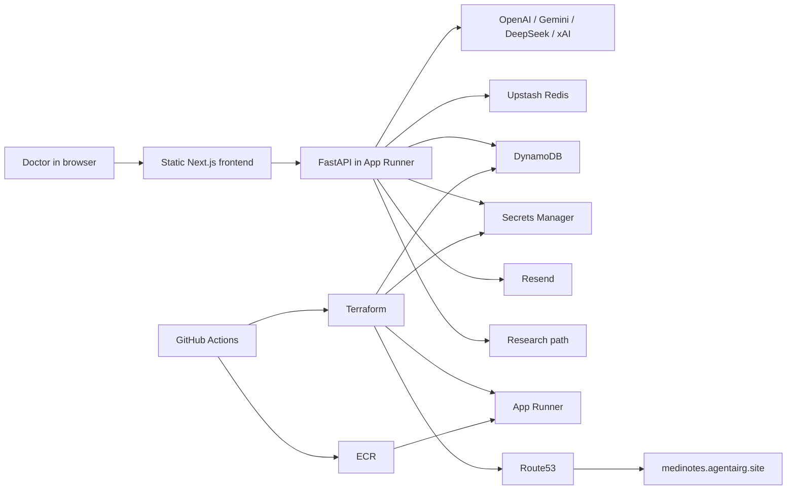
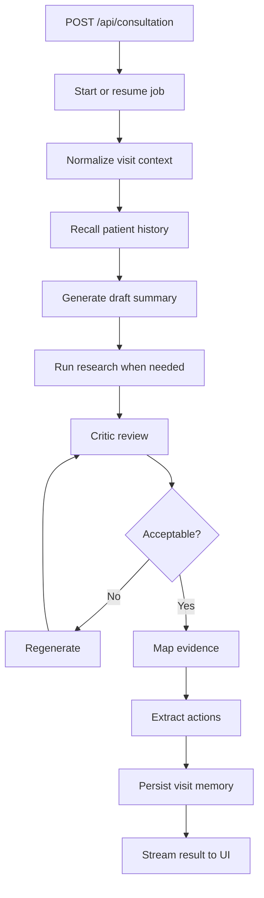
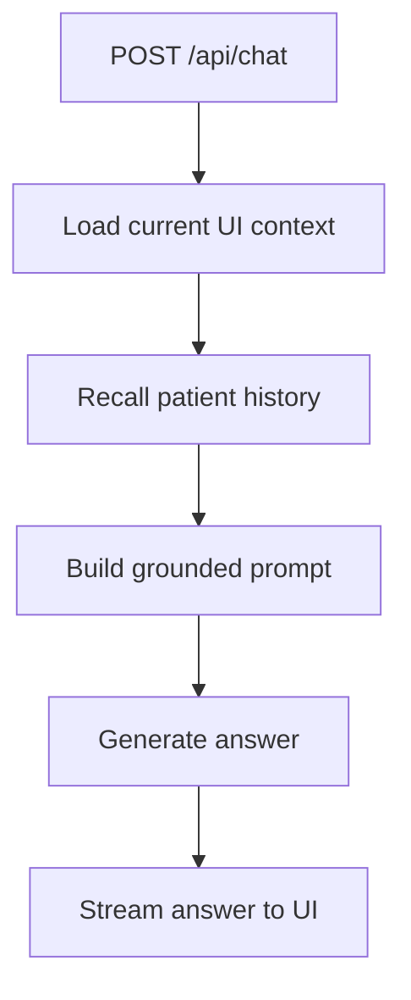

# MediNotes Architecture

`healthcare-saas-aws` is not just a web UI wrapped around a few model calls. It is a clinician-facing system that accepts messy consultation inputs, turns them into structured visit artifacts, preserves useful patient history across visits, and runs as a managed AWS application rather than a local prototype.

This document is the deep technical explanation of how that system works. It is the source of truth for the internal behavior of the application, the runtime boundaries between its components, the way data moves through the system, and the way AWS infrastructure and GitHub Actions support the running service.

`README.md` is the guided entry point. This file is the detailed explanation.

## Documentation Update Rule

Use this document when exact internal behavior changes. That includes:

- request and response behavior
- backend orchestration
- memory persistence behavior
- runtime configuration and secret delivery
- deploy and destroy mechanics
- GitHub Actions behavior
- infrastructure ownership boundaries

Update `README.md` only when the user-facing walkthrough or operator-facing entry guidance also changes. Make that decision during PR review, before merge, because push to `healthcare-saas-aws` is the automatic `prod` deploy trigger.

The PR checklist in [pull_request_template.md](/home/repos/healthcare-saas-aws/.github/pull_request_template.md) exists to force that decision before code lands on the auto-deploy branch.

## 1. What The System Is Trying To Do

MediNotes exists to solve a practical clinical problem: consultation input is rarely clean, complete, or uniform. A clinician may have typed notes, uploaded reports, images of prescriptions, dictated audio, and fragments of context from prior visits. The product’s job is to turn that into a usable visit record and make the useful parts retrievable later.

That means the application has to do more than generate text. It has to normalize input, decide what prior history matters, synthesize a structured answer, support review, preserve evidence, and store durable memory in a form that can be queried later by both the summary workflow and the assistant workflow.

The defining architectural property of the current system is separation of responsibility:

- the web application handles user interaction
- the backend orchestrates extraction, generation, review, and persistence
- DynamoDB holds long-term patient memory
- Upstash Redis holds resumable job and stream state
- Secrets Manager holds deployed runtime secrets
- Terraform owns infrastructure shape
- GitHub Actions owns CI/CD execution

That separation is the reason the app now survives redeploys, preserves patient memory across service restarts, and can be operated like a real AWS service instead of a single manually configured container.

## 2. What Actually Runs In Production

Production is a single App Runner service backed by a Docker image. That image contains two layers:

- a static frontend built from Next.js
- a FastAPI application that serves both API routes and the exported frontend assets

The important point is that production is not “Next.js server plus separate Python server.” The runtime entrypoint is FastAPI. During the image build, the frontend is exported to static assets and copied into the container. FastAPI serves those static files and exposes the `/api/*` endpoints from the same deployed service.

The current production stack uses these important identifiers:

- App Runner service: `consultation-app-service`
- App Runner default URL: `ymwpjvxcjn.ap-southeast-1.awsapprunner.com`
- custom domain: `medinotes.agentairg.site`
- ECR repository: `consultation-app`
- DynamoDB table: `medinotes-prod-memory`
- Secrets Manager namespace: `medinotes-prod/app/*`

Those names are explicit because production was adopted from an already-existing manual App Runner deployment and then brought under Terraform management. The stack is therefore partly “conventional” and partly “aligned to live adopted names.”

## 3. System Topology

At runtime, the doctor interacts with the frontend. The frontend submits consultation and chat requests to FastAPI. FastAPI orchestrates the application logic and reaches outward to model providers, Upstash, DynamoDB, Secrets Manager, and Resend.



The topology matters because each external dependency serves a distinct class of state. If those responsibilities blur, the system becomes much harder to reason about. The current design deliberately avoids that.

## 4. How A Consultation Moves Through The System

The summary workflow is the center of the application. A consultation begins when the clinician provides one or more inputs such as free-text notes, uploaded documents, audio, or prescription images. The backend does not treat those inputs as final truth. It first turns them into a normalized visit context that downstream agents can reason over.

The request then enters the summary pipeline. The backend starts or resumes a summary job, extracts the useful visit content, recalls prior patient history, generates a draft, performs external research when needed, runs a critic pass, and only after a usable result exists does it persist the durable visit memory. That sequence is intentional: draft output that fails review should not become part of the long-term patient record.



From the user’s perspective, this appears as one “generate summary” action. Architecturally, it is a coordinated sequence that mixes volatile operational state with durable patient state. That distinction is one of the most important ideas in the current system.

## 5. How The Assistant Uses The Same Memory

The assistant is not a separate toy chatbot bolted onto the side of the app. It works because it reads from the same durable patient-memory store used by the consultation workflow.

When the clinician opens the assistant and asks about a patient, the backend combines:

- current message history
- current summary state, when relevant
- recalled patient history from DynamoDB



This is why the assistant can answer questions about prior visits rather than only parroting what is currently visible in the browser. If durable patient memory is missing or wrong, both the patient-history views and the assistant degrade together, because they depend on the same underlying store.

## 6. Why The Backend Is Agentic

The backend is intentionally split into cooperating agents rather than a single large summary function. The reason is not style. It is because the work itself has separable stages with different responsibilities and failure modes.

The current major agents are:

- `summary_agent.py`
- `extraction_agent.py`
- `research_agent.py`
- `critic_agent.py`
- `evidence_agent.py`
- `memory_agent.py`
- `coordinator_agent.py`
- `chat_agent.py`
- `email_agent.py`

This division exists so that extraction, synthesis, review, evidence mapping, and persistence do not collapse into one opaque prompt-and-response block. The summary agent orchestrates; the other agents handle more focused tasks. That makes the system easier to reason about, easier to evolve, and less likely to store low-quality output as durable memory.

### 6.1 Summary Agent

The Summary Agent is the conductor of the consultation pipeline. It decides when to recall memory, when to invoke research, when to trigger critic review, when to regenerate, and when the result is mature enough to persist. It is the reason the app behaves like a workflow rather than a one-shot completion.

### 6.2 Extraction Agent

The Extraction Agent is responsible for turning varied raw inputs into usable text and metadata. That includes uploaded files, dictated audio, and prescription-like images. Without this layer, downstream summarization would be polluted by inconsistent or partially processed source material.

### 6.3 Research Agent

The Research Agent handles external retrieval such as clinical references, drug interaction checks, or guideline lookup. This keeps external evidence gathering separate from the main summarization loop and makes it easier to reason about where externally sourced assertions came from.

### 6.4 Critic Agent

The Critic Agent exists to reject bad output before it becomes durable state. Its job is to detect omissions, contradictions, hallucinations, and quality issues. This is what stops the system from treating the first generated draft as final truth.

### 6.5 Evidence Agent

The Evidence Agent maps final summary content back to source material. This makes the summary easier to inspect and supports the product’s goal of producing evidence-linked outputs rather than unsupported prose.

### 6.6 Memory Agent

The Memory Agent is the bridge between generation and longitudinal record. It is responsible for storing visit artifacts, recalling patient history, listing patients, listing visits, and supporting soft delete and restore. If the rest of the app is the “current consultation” engine, the Memory Agent is the “future reuse” engine.

### 6.7 Coordinator, Chat, And Email Agents

The Coordinator Agent extracts structured next actions from free text. The Chat Agent turns recalled context into grounded assistant responses. The Email Agent handles translation and final patient-email delivery through Resend. These are downstream capability layers built on top of the same extracted and persisted clinical context.

## 7. Persistence Is Split On Purpose

One of the biggest architectural changes in this repository is that persistence is no longer treated as one undifferentiated blob. Different types of state now live in different systems because they have different durability and retrieval needs.

### 7.1 DynamoDB: Long-Term Patient Memory

DynamoDB is the durable patient-memory store. It holds visit artifacts that must survive:

- container replacement
- App Runner restarts
- image redeploys
- future consultations

The system currently stores categories such as:

- `visit_summary`
- `visit_notes`
- `visit_evidence`

This store is used by the patient-history views, summary-time contextual recall, and assistant retrieval. If a piece of information is supposed to be part of the patient’s longitudinal record, DynamoDB is where it belongs.

### 7.2 Upstash Redis: Operational Job And Stream State

Upstash is not the patient-memory database. It stores short-lived execution state such as:

- summary job metadata
- event-stream buffers
- reconnect-safe streaming state
- deduplication metadata for repeated requests

This state is operational, not clinical. It exists to make the UX resilient and resumable, not to preserve patient history.

### 7.3 Secrets Manager: Runtime Secret Values

Secrets Manager stores the deployed runtime secrets. Terraform creates the secret shells, but not the values themselves. During deploy, the actual values are synchronized into AWS Secrets Manager, and App Runner resolves those ARNs at runtime.

This separation matters because it keeps real secret values out of Terraform state while still making the deployed service reproducible.

### 7.4 Route53: Durable DNS Ownership

Route53 owns the custom-domain DNS. This matters because App Runner targets can change when the service is recreated. If DNS is not Terraform-owned, destroy-and-recreate cycles can leave the custom domain pointing at dead infrastructure.

## 8. How Patient Memory Is Shaped In DynamoDB

The current memory implementation lives in [vector_store.py](/home/repos/healthcare-saas-aws/api/memory/vector_store.py). The system uses DynamoDB as the durable storage layer for records, embeddings, and metadata, while similarity ranking still happens in application code.

The table design uses:

- partition key: `pk`
- sort key: `sk`
- GSI: `doc_id-index`

Patient records are grouped under a patient partition. A typical key shape looks like:

- `pk = PATIENT#juan dela cruz`
- `sk = DOC#<doc_id>`

Each logical memory document carries fields such as:

- item type
- doc id
- dedupe key
- timestamp
- text
- embedding
- metadata
- optional payload

The dedupe key is derived from the encounter identity: patient name, visit date, document type, template id, and encounter id. That is what prevents repeated writes of the same visit from exploding into uncontrolled duplicates.

Retrieval works in two stages. First, the application loads candidate memory documents from DynamoDB. Then it scores them in application code with cosine similarity over embeddings, filtered by metadata where appropriate. This is a deliberate tradeoff: it keeps infrastructure simpler, but it means the system does not currently use a dedicated managed vector-search service.

## 9. Artifact Lifecycle

The system handles several classes of artifacts, and each class has a different lifecycle.

Consultation inputs such as typed notes, uploaded files, audio, and prescription images begin as request-time artifacts. They are transient until transformed into structured visit context.

Summary jobs create operational artifacts such as job IDs, status events, temporary generation state, and stream buffers. Those artifacts are useful for resumability and user experience, but they are not the long-term clinical record.

The summary pipeline produces generated artifacts such as summary text, evidence mappings, extracted actions, and email content. Only the clinically relevant parts of that output become durable visit-memory artifacts.

Once persisted in DynamoDB, those artifacts become longitudinal memory used by future summary generation, patient-history views, and assistant recall.

Deletion is currently soft delete, not immediate hard purge. That means records can be hidden from normal retrieval without immediately being destroyed. That behavior is important to understand because “deleted” in the UI does not currently mean “physically removed from all persistence.”

## 10. Runtime Configuration And Secrets

The deployed service needs both non-secret runtime variables and secret runtime values.

Non-secret values are attached directly to App Runner. These include things like:

- `NODE_ENV`
- `AWS_REGION`
- `DYNAMODB_TABLE_NAME`
- provider base URLs
- public Clerk frontend values
- `RESEND_FROM`

Secret values are resolved from Secrets Manager ARNs. These include:

- model API keys
- Clerk backend secrets
- Upstash URL and token
- Brave API key
- Resend API key

The important architectural point is that the app reads them all through environment variables at runtime, but the source of truth is not the same. Some values are plain runtime configuration. Others are resolved through Secrets Manager.

### 10.1 Volatile Runtime Facts

The explanation above should stay manual. The exact runtime inventory lives in [section 20.2](#202-runtime-configuration-inventory), where it can be maintained as a drift-prone factual appendix instead of breaking the narrative flow.

## 11. Infrastructure Ownership

Terraform is the infrastructure source of truth for the AWS resources the application needs to run.

Terraform currently owns:

- DynamoDB table
- ECR repository and lifecycle policy
- App Runner service
- App Runner autoscaling configuration
- App Runner runtime role
- App Runner ECR access role
- Secrets Manager secret shells
- Route53 record for the custom domain
- App Runner custom-domain association

Terraform intentionally does not own:

- the actual secret values
- Upstash infrastructure
- provider accounts such as OpenAI, Clerk, Resend, or Brave

This healthcare stack is simpler than the `ideagen` stack because it does not need RDS, private networking, or an App Runner VPC connector. The app’s durable backend is DynamoDB plus Secrets Manager, not a private relational database.

## 12. How Deploys Actually Work

The deploy path is built around GitHub Actions, Terraform, `scripts/deploy.sh`, ECR, and App Runner auto-deploy behavior.

For production, push to `healthcare-saas-aws` runs CI and then `Deploy / prod`. The deploy path does not just build an image and hope for the best. It first reconciles infrastructure and service configuration, then synchronizes runtime secrets into Secrets Manager, then pushes the new image to ECR, then waits for App Runner to finish the rollout and verifies health.

That order exists to guarantee that the service configuration is already correct before App Runner starts the new image. If the image is rolled out before the configuration and secret state are aligned, the service can come up against stale runtime assumptions.

The current automatic behavior is intentionally narrow:

- push to `healthcare-saas-aws` -> deploy `prod`
- `dev` is still supported, but manual-only
- destroy flows are manual-only

### 12.1 Volatile CI/CD Facts

The explanation of deploy behavior should stay manual. The exact branch and workflow mapping lives in [section 20.3](#203-cicd-branch-mapping), where it can be maintained as factual reference material.

## 13. GitHub Actions And Deployment Identity

The repository uses GitHub environments to scope deployment identity and secrets:

- `healthcare-dev`
- `healthcare-prod`

The current dedicated AWS role is:

- `github-actions-healthcare-deploy`
- `arn:aws:iam::348375262167:role/github-actions-healthcare-deploy`

Both healthcare GitHub environments currently use that same ARN. Isolation is still enforced because the OIDC trust policy restricts assumption by GitHub environment identity:

- `repo:rhyegacillos/agents-app:environment:healthcare-dev`
- `repo:rhyegacillos/agents-app:environment:healthcare-prod`

The role currently carries the permissions needed to manage the healthcare stack, including ECR, App Runner, Secrets Manager, DynamoDB, Route53, Terraform backend access, and Terraform-managed App Runner IAM role operations.

This arrangement is a tradeoff. It keeps role management simpler, but it provides less physical separation than distinct dev and prod roles. The current trust model makes it acceptable, but it is still a real design choice rather than a neutral default.

### 13.1 Volatile Workflow Facts

The architecture explanation should stay manual. The exact workflow file and job inventory lives in [section 20.4](#204-workflow-file-inventory), where it can be kept as factual reference material.

## 14. How Secrets Move Through The Deployment Path

The deployed secret path is:

1. the value exists in the GitHub environment
2. the deploy workflow injects it into the deploy step
3. `scripts/deploy.sh` writes it to AWS Secrets Manager
4. App Runner resolves the secret ARN at runtime
5. the app reads it as a normal environment variable

This means changing a GitHub secret by itself does not update the live service. A deploy must occur for the new value to be written into Secrets Manager and become part of the running service configuration.

## 15. Destroy Semantics

Destroy is handled through either:

- local wrapper: `scripts/destroy.sh`
- GitHub Actions manual workflow: `.github/workflows/destroy.yml`

The destroy path initializes backend and workspace, empties the ECR repository, and then runs `terraform destroy`. That ordering exists because AWS will refuse to delete a non-empty ECR repository.

The current hardening choices reflect real failure modes encountered during rollout:

- ECR is emptied before deletion
- Secrets Manager uses `recovery_window_in_days = 0`
- Route53 is Terraform-owned

Those choices make full recreate scenarios much more predictable than they were in the original manual setup.

## 16. Local Versus AWS Behavior

Local development is not process-identical to production.

In production, FastAPI is the application entrypoint and serves the exported frontend static assets itself. In local development, the repo currently supports two separate loops:

- `npm run dev`
  - starts the Next.js development server
- `uvicorn api.index:app --reload --port 8000`
  - starts the FastAPI backend

The repository does not currently define a local same-origin proxy or rewrite layer that makes those two processes behave exactly like the deployed App Runner container. That is why the docs distinguish frontend iteration, backend/API iteration, and the production-like containerized path.

Local memory testing uses DynamoDB Local. AWS runtime uses real DynamoDB and Secrets Manager through IAM-backed access. The deployed application should never depend on local disk for durable patient memory.

## 17. Constraints, Tradeoffs, And Gaps

The current architecture is materially better than the earlier manual stack, but it still has tradeoffs.

The biggest one is retrieval shape. DynamoDB is durable and operationally simple, but semantic ranking is still performed in Python after loading candidate records. That gives the team control and keeps infrastructure smaller, but it is less efficient than a dedicated vector-search backend at higher scale.

Another tradeoff is deployment identity. Using the same healthcare deploy role ARN for `healthcare-dev` and `healthcare-prod` simplifies role management, but it is still less separated than having dedicated environment-specific roles.

`dev` is also less exercised than `prod` because the normal automatic deploy path targets production only. That is intentional, but it means `dev` is not the most battle-tested path in normal day-to-day workflow.

Finally, not all dependencies are inside Terraform. Upstash remains external. That keeps the stack simpler, but it means not every persistence component is provisioned from the same infrastructure system.

## 18. Operational Verification

The architecture is only useful if operators can verify that reality still matches it.

Health check:

```bash
curl -fsS https://medinotes.agentairg.site/health
```

Check DynamoDB memory existence:

```bash
aws dynamodb describe-table --region ap-southeast-1 --table-name medinotes-prod-memory
aws dynamodb scan --region ap-southeast-1 --table-name medinotes-prod-memory --max-items 10
```

`describe-table` item counts can lag. `scan` is the better sanity check for actual records.

Check DNS:

```bash
dig medinotes.agentairg.site +short
curl -I https://medinotes.agentairg.site
```

Check Terraform ownership:

```bash
terraform -chdir=terraform workspace show
terraform -chdir=terraform state list
terraform -chdir=terraform plan -var-file=prod.tfvars
```

## 19. Where Other Docs Fit

This file is the master architecture reference. The other documents are narrower lenses:

- [README.md](/home/repos/healthcare-saas-aws/README.md)
  - guided map for users and operators
- [backend.md](/home/repos/healthcare-saas-aws/backend.md)
  - API and backend-agent behavior
- [deployment_runbook.md](/home/repos/healthcare-saas-aws/deployment_runbook.md)
  - operational deploy and destroy procedure
- [github_actions_runbook.md](/home/repos/healthcare-saas-aws/github_actions_runbook.md)
  - GitHub environments, workflow behavior, and IAM wiring
- [terraform/README.md](/home/repos/healthcare-saas-aws/terraform/README.md)
  - Terraform ownership and infrastructure mechanics

## 20. Volatile Technical Facts

The architecture explanation above should remain manual. The following fact surfaces are more drift-prone and are good candidates for generation or consistency checks:

### 20.1 API Route Inventory

<!-- BEGIN GENERATED: api-route-inventory -->
| Method | Path | Handler | Purpose |
| --- | --- | --- | --- |
| `POST` | `/api/consultation` | `consultation_summary` | start a resumable summary pipeline and stream events |
| `GET` | `/api/consultation` | `consultation_stream` | resume an existing summary job stream by `job_id` |
| `POST` | `/api/chat` | `chat_endpoint` | stream assistant responses grounded in patient context |
| `POST` | `/api/send-email` | `send_email_endpoint` | send translated or generated patient email |
| `GET` | `/api/patients` | `get_patients` | paginated patient list for history UI |
| `GET` | `/api/patient-history` | `get_patient_history` | retrieve visit history for one patient |
| `POST` | `/api/patient/rename` | `rename_patient` | rename all stored records for a patient |
| `POST` | `/api/patient/delete-entry` | `delete_patient_entry` | soft delete a stored visit artifact |
| `POST` | `/api/patient/restore-entry` | `restore_patient_entry` | restore a soft-deleted visit artifact |
| `GET` | `/api/subscription` | `subscription` | retrieve current billing/subscription plan via Clerk |
| `GET` | `/health` | `health_check` | runtime health endpoint for App Runner and operators |
| `GET` | `/` | `serve_root` | serve exported frontend index when static assets exist |
<!-- END GENERATED: api-route-inventory -->

### 20.2 Runtime Configuration Inventory

<!-- BEGIN GENERATED: runtime-config-inventory -->
Current non-secret App Runner runtime variables:

| Variable | Source | Purpose |
| --- | --- | --- |
| `NODE_ENV` | Terraform | runtime mode, fixed to `production` in App Runner |
| `AWS_REGION` | Terraform | region used by runtime AWS clients |
| `DYNAMODB_TABLE_NAME` | Terraform | target table for long-term patient memory |
| `GEMINI_API_URL` | Terraform input / GitHub environment | Gemini-compatible base URL |
| `DEEPSEEK_API_URL` | Terraform input / GitHub environment | DeepSeek base URL |
| `GROK_API_URL` | Terraform input / GitHub environment | xAI / Grok base URL |
| `NEXT_PUBLIC_CLERK_PUBLISHABLE_KEY` | Terraform input / GitHub environment | public Clerk frontend key |
| `NEXT_PUBLIC_CLERK_JWT_TEMPLATE` | Terraform input / GitHub environment | Clerk JWT template used by the frontend |
| `RESEND_FROM` | Terraform input / GitHub environment | default sender address |

Current Secrets Manager-backed runtime variables:

| Variable | Secret name pattern | Purpose |
| --- | --- | --- |
| `OPENAI_API_KEY` | `${project}-${environment}/app/OPENAI_API_KEY` | OpenAI generation and embeddings |
| `GEMINI_API_KEY` | `${project}-${environment}/app/GEMINI_API_KEY` | Gemini access |
| `DEEPSEEK_API_KEY` | `${project}-${environment}/app/DEEPSEEK_API_KEY` | DeepSeek access |
| `GROK_API_KEY` | `${project}-${environment}/app/GROK_API_KEY` | xAI / Grok access |
| `RESEND_API_KEY` | `${project}-${environment}/app/RESEND_API_KEY` | email delivery |
| `CLERK_SECRET_KEY` | `${project}-${environment}/app/CLERK_SECRET_KEY` | Clerk backend API access |
| `CLERK_JWKS_URL` | `${project}-${environment}/app/CLERK_JWKS_URL` | JWT verification keyset URL |
| `BRAVE_API_KEY` | `${project}-${environment}/app/BRAVE_API_KEY` | external research path |
| `UPSTASH_REDIS_REST_URL` | `${project}-${environment}/app/UPSTASH_REDIS_REST_URL` | resumable job / stream store |
| `UPSTASH_REDIS_REST_TOKEN` | `${project}-${environment}/app/UPSTASH_REDIS_REST_TOKEN` | resumable job / stream auth |

Current local-only memory variables:

| Variable | Local meaning |
| --- | --- |
| `DYNAMODB_TABLE_NAME` | local table name for memory testing |
| `DYNAMODB_ENDPOINT_URL` | local DynamoDB endpoint, currently `http://localhost:8001` |
| `AWS_REGION` | region for local boto3 session setup |
| `AWS_ACCESS_KEY_ID` / `AWS_SECRET_ACCESS_KEY` | dummy credentials accepted by DynamoDB Local |
<!-- END GENERATED: runtime-config-inventory -->

### 20.3 CI/CD Branch Mapping

<!-- BEGIN GENERATED: ci-cd-branch-mapping -->
| Event | Branch / input | Workflow path | Terraform target | GitHub environment | Effect |
| --- | --- | --- | --- | --- | --- |
| Pull request | any PR branch | `.github/workflows/ci.yml` | none | none | run validation only |
| Push | `healthcare-saas-aws` | `.github/workflows/ci.yml` -> reusable `.github/workflows/deploy.yml` | `prod` | `healthcare-prod` | auto deploy production |
| Manual dispatch | `deploy.yml` with `environment=dev` | `.github/workflows/deploy.yml` | `dev` | `healthcare-dev` unless overridden | manual deploy |
| Manual dispatch | `deploy.yml` with `environment=prod` | `.github/workflows/deploy.yml` | `prod` | `healthcare-prod` unless overridden | manual deploy |
| Manual dispatch | `destroy.yml` with `environment=dev` | `.github/workflows/destroy.yml` | `dev` | `healthcare-dev` | manual destroy |
| Manual dispatch | `destroy.yml` with `environment=prod` | `.github/workflows/destroy.yml` | `prod` | `healthcare-prod` | manual destroy |
<!-- END GENERATED: ci-cd-branch-mapping -->

### 20.4 Workflow File Inventory

<!-- BEGIN GENERATED: workflow-file-inventory -->
| Workflow file | Trigger | Major jobs | Notes |
| --- | --- | --- | --- |
| `.github/workflows/ci.yml` | `pull_request`, push to `healthcare-saas-aws` | `test`, `docker_build`, `deploy_prod` | `deploy_prod` reuses `deploy.yml` only on push to prod branch |
| `.github/workflows/deploy.yml` | `workflow_call`, `workflow_dispatch` | `deploy` | reusable deploy workflow for `dev` or `prod` |
| `.github/workflows/destroy.yml` | `workflow_dispatch` | `destroy`, `confirm_failed` | manual destroy, guarded by exact `DESTROY` confirmation |
<!-- END GENERATED: workflow-file-inventory -->

## 21. Architectural Conclusion

The most important thing to understand about the current MediNotes architecture is that it is now a layered application with explicit boundaries between generation, persistence, deployment, and operations.

Patient memory is durable and externalized. Operational stream state is separate from long-term clinical memory. Secrets are delivered through a managed runtime path. Infrastructure is declared, not manually remembered. Deployment identity is enforced through GitHub environments and AWS OIDC trust.

That separation of concerns is what makes the system reliable enough to preserve patient continuity across visits and operable enough to survive redeploys without losing its own state.
