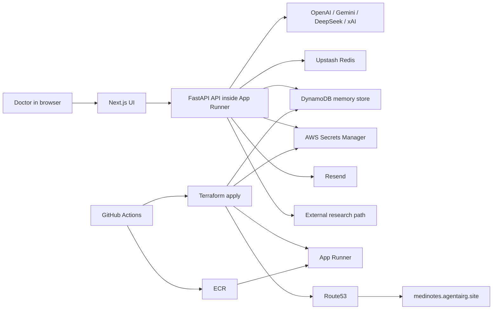
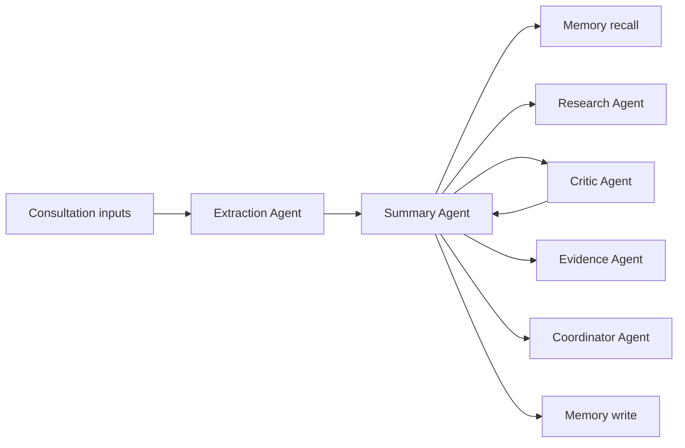
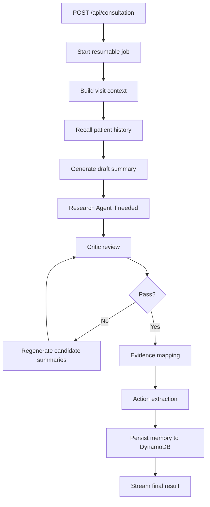
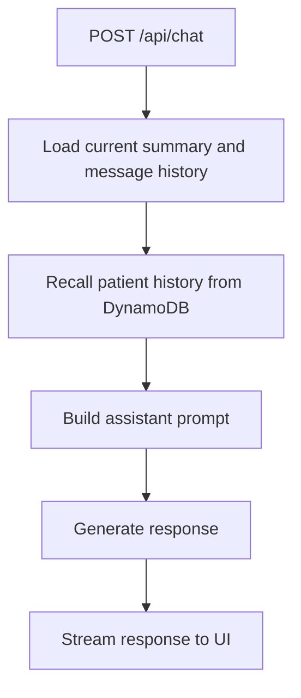

# MediNotes Architecture

This is the master architecture document for `healthcare-saas-aws`.

It is intended to be the single most complete reference for how the whole application works:

- product workflow
- backend agent orchestration
- persistence boundaries
- DynamoDB memory model
- Secrets Manager runtime model
- Terraform infrastructure ownership
- GitHub Actions deployment model
- local-versus-AWS behavior
- current production resource names
- deploy and destroy semantics

Specialized docs still exist for focused audiences, but this document should be sufficient if someone wants to understand the complete deployed system without jumping between multiple files.

## 1. System purpose

MediNotes is a clinician-facing documentation and patient-history system that transforms unstructured consultation inputs into structured visit artifacts and makes them retrievable across future visits.

The application is designed to handle:

- free-text consultation notes
- uploaded documents
- audio recordings
- prescription or handwritten images
- longitudinal patient history

It then produces:

- structured visit summaries
- extracted next actions
- evidence-linked summary support
- patient-facing email content
- assistant responses grounded in current and historical context

## 2. Whole-system view

### 2.1 Runtime application

The app is one deployable web service:

- frontend: Next.js
- backend/API: FastAPI
- runtime host: AWS App Runner

### 2.2 External runtime dependencies

The deployed runtime depends on:

- DynamoDB for long-term patient memory
- Secrets Manager for runtime secret values
- Upstash Redis for resumable jobs and SSE state
- ECR as the App Runner image source
- Route53 for custom-domain DNS
- model providers for generation, OCR, embeddings, and transcription
- Resend for email delivery
- Brave-backed research lookup path for clinical retrieval

### 2.3 Control-plane dependencies

The deployment and infrastructure control plane depends on:

- Terraform for infrastructure declaration
- GitHub Actions for CI/CD execution
- S3 and DynamoDB for Terraform backend state and locking

## 3. Current production topology

Production currently uses these important identifiers:

- App Runner service:
  - `consultation-app-service`
- App Runner default URL:
  - `ymwpjvxcjn.ap-southeast-1.awsapprunner.com`
- custom domain:
  - `medinotes.agentairg.site`
- ECR repository:
  - `consultation-app`
- DynamoDB table:
  - `medinotes-prod-memory`
- secret namespace:
  - `medinotes-prod/app/*`

This production environment was adopted from an existing manual App Runner deployment and then brought under Terraform management. That is why some production names are explicit overrides rather than generated `${project}-${environment}-...` defaults.

## 4. System topology



## 5. Primary architectural principles

The system is built around a few explicit design choices.

### 5.1 Generation is not the whole product

The system is not treated as “send notes to an LLM and render the answer.” It instead uses:

- staged extraction
- external research when needed
- critic review before persistence
- evidence grounding
- longitudinal context retrieval

### 5.2 Persistence is split by responsibility

The application deliberately uses different stores for different kinds of state:

- DynamoDB stores long-term patient memory
- Upstash Redis stores summary-job and streaming state
- Secrets Manager stores runtime secret values
- Terraform backend storage stores infrastructure state, not app data

### 5.3 The deployed container is stateless

The App Runner container should not be treated as durable storage. Important state must live outside the container. That is why:

- patient memory is not stored on local disk
- secrets are not expected to live only in the App Runner console
- DNS is managed through Terraform and Route53

### 5.4 Deployment identity is environment-scoped

GitHub Actions deployment identity is scoped through GitHub environments and AWS OIDC trust, not just repo-level shared secrets.

## 6. User-facing workflows and how they map to the system

### 6.1 Consultation workflow

The clinician starts by providing one or more inputs:

- typed notes
- uploaded PDFs, DOCX, TXT, or Markdown
- audio
- prescription or handwritten images

Those inputs are normalized into a unified visit context and passed through the summary pipeline.

### 6.2 Summary workflow

When **Generate Summary** is triggered, the backend:

1. starts or reuses a resumable job
2. extracts visit context
3. recalls prior patient memory
4. generates a draft
5. performs research if heuristics require it
6. runs critic review
7. regenerates if necessary
8. maps evidence
9. extracts actions
10. stores memory
11. streams the final output

### 6.3 Patient-history workflow

The patient-history workspace is backed by the same long-term memory store used for RAG. It provides:

- patient list browsing
- visit timeline browsing
- filtering by date and keyword
- soft delete and restore
- viewing of stored visit evidence

### 6.4 Assistant workflow

The MediNotes Assistant is grounded in:

- current message history
- current summary state
- recalled patient memory

It can therefore answer questions about prior visits, not only the current screen state.

### 6.5 Email workflow

The email path handles patient communication by:

- drafting email content
- translating when necessary
- sending via Resend

## 7. Agentic runtime architecture

The backend uses a hub-and-spoke agentic model.

### 7.1 Agent graph



### 7.2 Why this structure exists

This app needs a structure where:

- extraction is separate from summarization
- external research is separate from the main summarizer
- quality review happens before persistence
- evidence mapping happens after the final summary exists
- memory is both read before generation and written after generation

That is why the system is structured as cooperating specialized agents instead of a single “summary” function.

## 8. Agent inventory

### 8.1 Summary Agent

File:

- `api/agent/summary_agent.py`

Responsibilities:

- orchestrates the full consultation pipeline
- starts or reuses summary jobs
- injects extracted context and patient history
- routes to tool-backed research
- invokes critic review
- triggers evidence mapping
- triggers action extraction
- triggers memory persistence
- streams status and final output

### 8.2 Extraction Agent

File:

- `api/agent/extraction_agent.py`

Responsibilities:

- parses uploaded files
- transcribes audio
- interprets prescription images
- extracts doctor and patient metadata from source text

### 8.3 Research Agent

File:

- `api/agent/research_agent.py`

Responsibilities:

- drug interaction lookup
- guideline lookup
- external reference retrieval with source URLs

### 8.4 Critic Agent

File:

- `api/agent/critic_agent.py`

Responsibilities:

- score summary quality
- detect omissions, contradictions, hallucinations, and safety issues
- determine whether regeneration is required

### 8.5 Evidence Agent

File:

- `api/agent/evidence_agent.py`

Responsibilities:

- break the final summary into meaningful statements
- map those statements to source chunks
- return evidence snippets and citation structures

### 8.6 Memory Agent

File:

- `api/agent/memory_agent.py`

Responsibilities:

- persist visit memory through `remember_visit(...)`
- recall patient history through `recall_patient_history(...)`
- list patients
- list visits
- rename patient records
- soft delete and restore memory entries

### 8.7 Coordinator Agent

File:

- `api/agent/coordinator_agent.py`

Responsibilities:

- turn free-text next steps into structured action data

### 8.8 Chat Agent

File:

- `api/agent/chat_agent.py`

Responsibilities:

- build assistant prompts
- inject current and historical clinical context
- stream grounded assistant answers

### 8.9 Email Agent

File:

- `api/agent/email_agent.py`

Responsibilities:

- decide whether translation is needed
- translate when required
- send final email through Resend

## 9. Request-flow architecture

### 9.1 Summary generation sequence



### 9.2 Assistant chat sequence



### 9.3 Why persistence happens late in the summary flow

The summary pipeline stores memory only after the pipeline has produced a usable final artifact. This is intentional. Drafts that fail review should not become part of the durable patient timeline.

## 10. Persistence architecture

One of the most important design changes in the repo is that persistence is now treated as multiple separate domains rather than one blob of application state.

### 10.1 DynamoDB: long-term patient memory

DynamoDB stores visit data that must survive:

- redeploys
- App Runner instance replacement
- container restarts
- future consultations

Stored document categories currently include:

- `visit_summary`
- `visit_notes`
- `visit_evidence`

This store is used by:

- patient-history views
- assistant recall
- summary-generation contextual recall

### 10.2 Upstash Redis: job and stream state

Upstash Redis stores short-lived execution state:

- summary job metadata
- SSE event buffers
- reconnect-safe stream state
- deduplication metadata for repeated summary requests

This is operational state, not clinical longitudinal memory.

### 10.3 Secrets Manager: runtime secret values

Secrets Manager stores runtime values that must not live in Terraform state or source control.

Current examples:

- model API keys
- Clerk backend secrets
- Upstash token and URL
- Resend API key
- Brave API key

### 10.4 Route53: infrastructure-owned DNS

The custom domain is managed through Terraform so that service recreation does not leave DNS pointing at an outdated App Runner target.

## 11. DynamoDB memory model

The current implementation lives in:

- [vector_store.py](/home/repos/healthcare-saas-aws/api/memory/vector_store.py)

### 11.1 Physical schema

Current table design:

- prod table:
  - `medinotes-prod-memory`
- dev table:
  - `medinotes-dev-memory`
- partition key:
  - `pk`
- sort key:
  - `sk`
- GSI:
  - `doc_id-index`

### 11.2 Logical document structure

Each memory document currently includes:

- `pk`
- `sk`
- `item_type`
- `doc_id`
- `dedupe_key`
- `timestamp`
- `text`
- `embedding`
- `metadata`
- `payload`

### 11.3 Metadata fields used by the app

Common metadata fields include:

- `patient_name`
- `date`
- `type`
- `doc_id`
- `encounter_id`
- `template_id`
- `time`
- `saved_at`
- `deleted`

### 11.4 Key format

Patient documents are currently stored under patient partitions, for example:

- `pk = PATIENT#juan dela cruz`
- `sk = DOC#<doc_id>`

### 11.5 Dedupe behavior

The store deduplicates on the logical encounter tuple:

- patient name
- visit date
- document type
- template id
- encounter id

This means repeated writes for the same encounter update the existing logical record instead of generating uncontrolled duplicates.

### 11.6 Retrieval behavior

Current search behavior is:

1. embed the query
2. load candidate documents from DynamoDB
3. filter by metadata where relevant
4. score candidates in application code using cosine similarity
5. return the best matches

This means DynamoDB is the durable vector/document store, while ranking remains application-side.

## 12. Runtime configuration model

The deployed service uses two classes of runtime values.

### 12.1 Non-secret runtime variables

These are set directly on the App Runner service:

- `NODE_ENV`
- `AWS_REGION`
- `DYNAMODB_TABLE_NAME`
- `GEMINI_API_URL`
- `DEEPSEEK_API_URL`
- `GROK_API_URL`
- `NEXT_PUBLIC_CLERK_PUBLISHABLE_KEY`
- `NEXT_PUBLIC_CLERK_JWT_TEMPLATE`
- `RESEND_FROM`

### 12.2 Secret runtime variables

These are resolved from Secrets Manager ARNs:

- `OPENAI_API_KEY`
- `GEMINI_API_KEY`
- `DEEPSEEK_API_KEY`
- `GROK_API_KEY`
- `RESEND_API_KEY`
- `CLERK_SECRET_KEY`
- `CLERK_JWKS_URL`
- `BRAVE_API_KEY`
- `UPSTASH_REDIS_REST_URL`
- `UPSTASH_REDIS_REST_TOKEN`

### 12.3 Local-only memory configuration

For local DynamoDB Local testing:

- `DYNAMODB_ENDPOINT_URL=http://localhost:8001`

In AWS runtime:

- `DYNAMODB_ENDPOINT_URL` must be unset

## 13. Infrastructure architecture

### 13.1 What Terraform owns

Terraform currently owns:

- DynamoDB table
- ECR repository
- App Runner service
- App Runner autoscaling configuration
- App Runner runtime and ECR access roles
- Secrets Manager secret shells
- Route53 custom-domain record
- App Runner custom-domain association

### 13.2 What Terraform does not own

Terraform does not store:

- the actual secret values
- Upstash infrastructure
- provider accounts such as OpenAI, Clerk, or Resend

### 13.3 Why this stack is simpler than `ideagen`

This healthcare stack intentionally does not include:

- RDS
- VPC
- private subnets
- NAT gateway
- App Runner VPC connector

That is because the app’s current durable backend depends on DynamoDB and Secrets Manager, not a private relational database.

## 14. Deploy architecture

The deploy path is built around these components:

- GitHub Actions for CI/CD execution
- Terraform for infrastructure reconciliation
- `scripts/deploy.sh` for ordered deployment behavior
- ECR for image storage
- App Runner auto-deploy for image rollout after push

### 14.1 Current automatic deploy behavior

Current production push behavior:

- push to `healthcare-saas-aws`
  - runs `Test`
  - runs `Docker Build`
  - runs `Deploy / prod`

`dev` remains supported but manual-only.

### 14.2 Deploy order

The current deploy model is:

1. initialize backend and workspace
2. reconcile infrastructure and service configuration
3. sync runtime secrets to Secrets Manager
4. build and push image to ECR
5. let App Runner auto-deploy the new image
6. wait for `RUNNING`
7. verify `/health`

### 14.3 Why this order exists

This order ensures the service has the correct configuration and secret state before the new image rolls out.

## 15. Destroy architecture

Destroy is handled through:

- local wrapper:
  - `scripts/destroy.sh`
- GitHub Actions manual workflow:
  - `.github/workflows/destroy.yml`

### 15.1 Destroy order

Current destroy logic:

1. initialize backend and workspace
2. empty the ECR repository
3. run `terraform destroy`

### 15.2 Hardening choices

The destroy path has been hardened to address the real AWS failure modes encountered during rollout:

- ECR is emptied before deletion
- Secrets Manager uses `recovery_window_in_days = 0`
- Route53 is Terraform-owned rather than manually patched

## 16. GitHub Actions and deployment identity

The repo uses GitHub environments to scope deployment identity and secrets:

- `healthcare-dev`
- `healthcare-prod`

### 16.1 Current healthcare deploy role

Current dedicated role:

- `github-actions-healthcare-deploy`
- `arn:aws:iam::348375262167:role/github-actions-healthcare-deploy`

This same ARN is currently used by both healthcare GitHub environments.

### 16.2 Why the same ARN is still isolated

Isolation is enforced through OIDC trust conditions that restrict assumption by GitHub environment identity, not by requiring different dev/prod role names.

### 16.3 Current trust model

Allowed subjects:

- `repo:rhyegacillos/agents-app:environment:healthcare-dev`
- `repo:rhyegacillos/agents-app:environment:healthcare-prod`

### 16.4 Current managed policies on the role

- `AmazonEC2ContainerRegistryPowerUser`
- `AWSAppRunnerFullAccess`
- `SecretsManagerReadWrite`
- `AmazonDynamoDBFullAccess`
- `AmazonRoute53FullAccess`
- `AmazonS3FullAccess`
- `IAMReadOnlyAccess`

### 16.5 Inline IAM mutation policy

The role also carries an inline policy for Terraform-managed App Runner IAM role operations, including actions like:

- `iam:CreateRole`
- `iam:DeleteRole`
- `iam:AttachRolePolicy`
- `iam:DetachRolePolicy`
- `iam:PutRolePolicy`
- `iam:DeleteRolePolicy`
- `iam:GetRole`
- `iam:UpdateAssumeRolePolicy`
- `iam:PassRole`

## 17. Secrets flow across the deployment path

The current deployed secret path is:

1. value exists in GitHub environment secret
2. deploy workflow injects it into the deploy step
3. `scripts/deploy.sh` writes it into AWS Secrets Manager
4. App Runner resolves the ARN-backed secret at runtime
5. the app reads the variable normally

This is why changing a GitHub secret alone does not update production until a deploy runs.

## 18. Local-versus-AWS behavior

### 18.1 Local mode

Local development may use:

- `.env`
- `.env.local`
- DynamoDB Local

### 18.2 AWS mode

AWS deployment uses:

- real DynamoDB
- App Runner runtime IAM permissions
- Secrets Manager-backed secret resolution
- App Runner + ECR image rollout

The deployed app should not depend on local disk persistence for patient memory.

## 19. Operational verification

### 19.1 Health check

```bash
curl -fsS https://medinotes.agentairg.site/health
```

### 19.2 DynamoDB memory existence

```bash
aws dynamodb describe-table --region ap-southeast-1 --table-name medinotes-prod-memory
aws dynamodb scan --region ap-southeast-1 --table-name medinotes-prod-memory --max-items 10
```

Use `scan` to confirm actual records. `describe-table` item counts can lag.

### 19.3 DNS verification

```bash
dig medinotes.agentairg.site +short
curl -I https://medinotes.agentairg.site
```

### 19.4 Terraform state sanity

```bash
terraform -chdir=terraform workspace show
terraform -chdir=terraform state list
terraform -chdir=terraform plan -var-file=prod.tfvars
```

## 20. Most important architectural conclusion

This app is no longer “a web UI with some agent prompts.” It is now a deployed system with explicit ownership boundaries:

- application logic and agents
- durable patient memory
- operational stream state
- runtime secret delivery
- infrastructure as code
- CI/CD identity and rollout control

That separation is the defining characteristic of the current architecture and the reason the system can now preserve patient history, survive redeploys, and be operated in AWS as a real application rather than a prototype.
