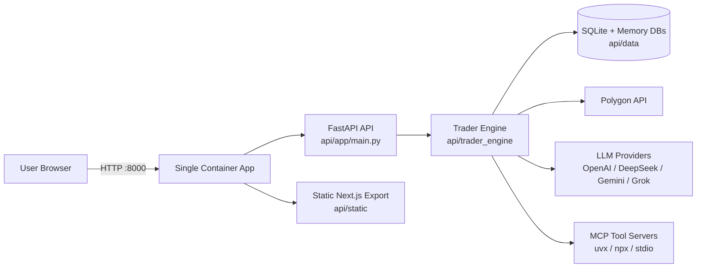
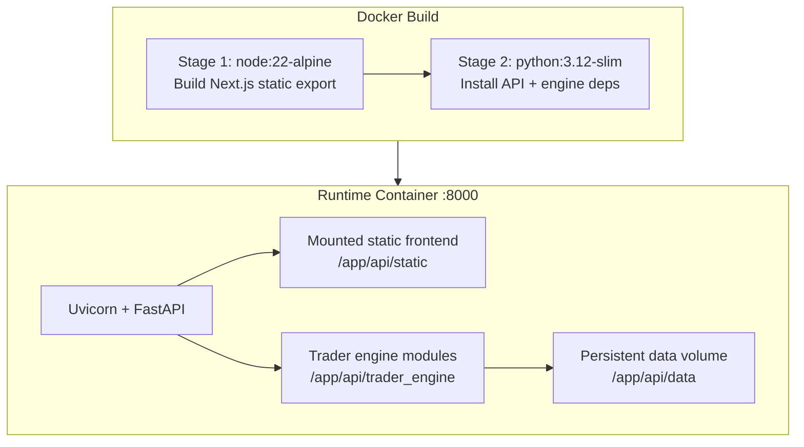
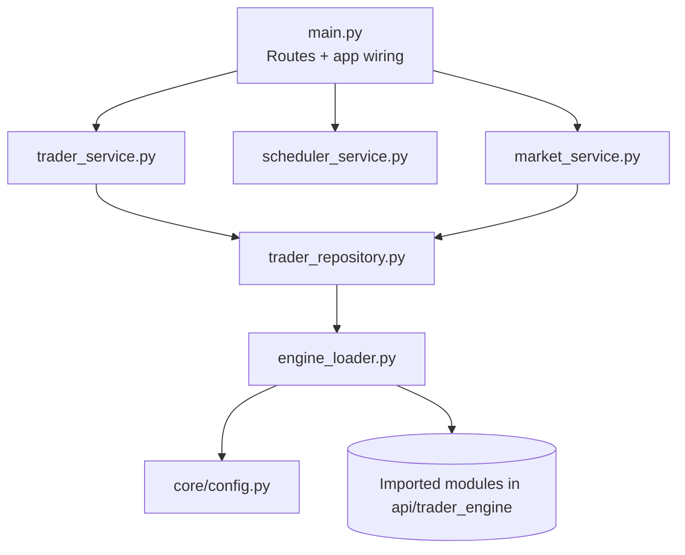
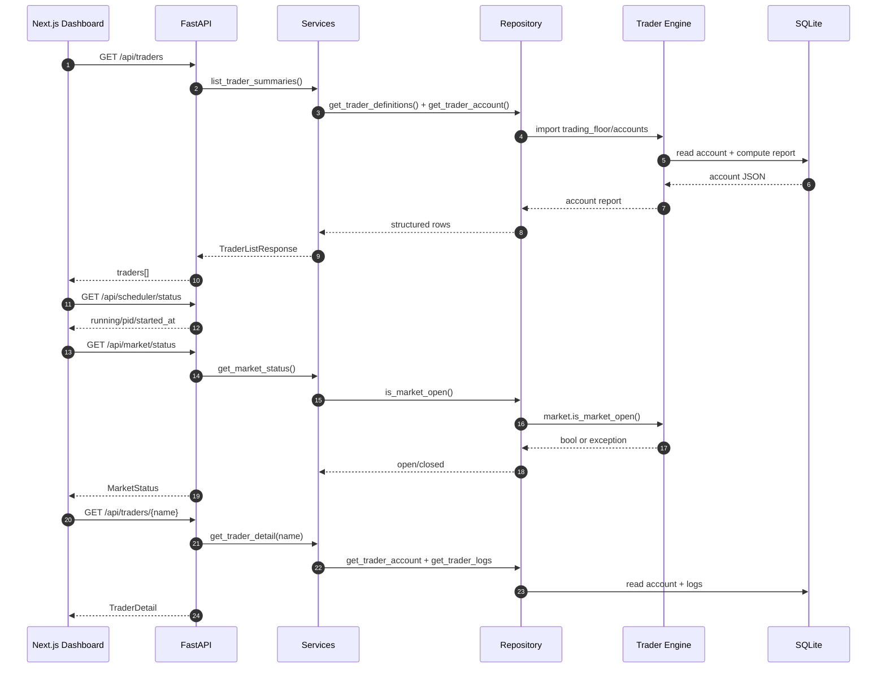
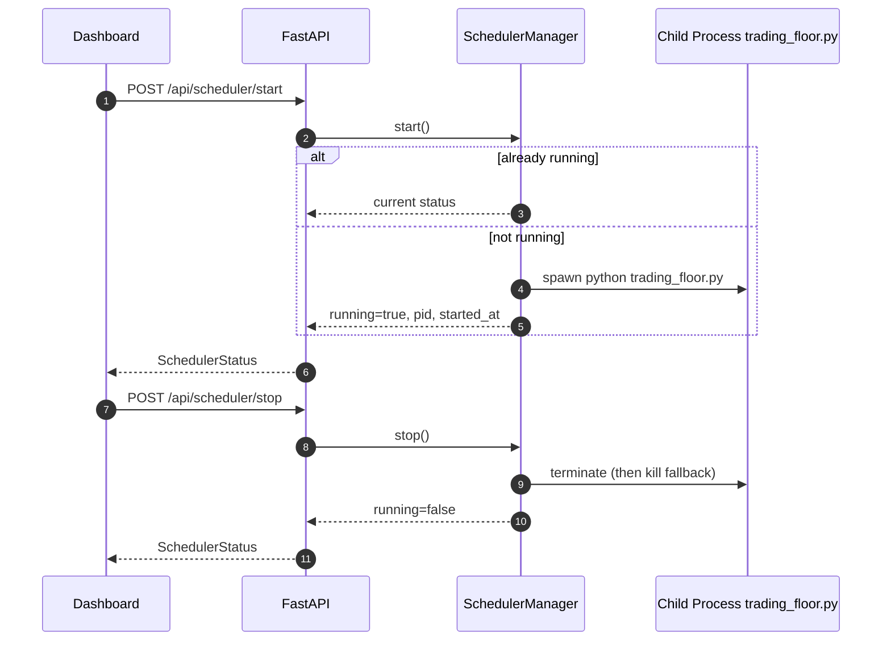
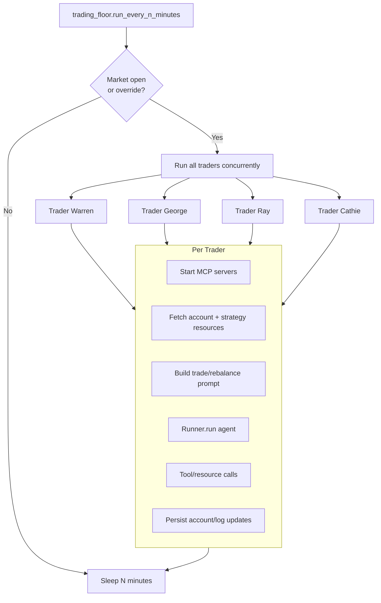
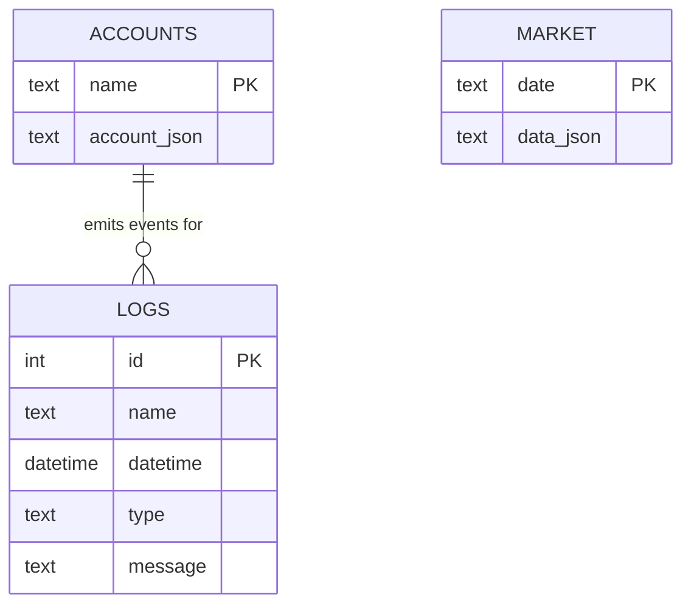
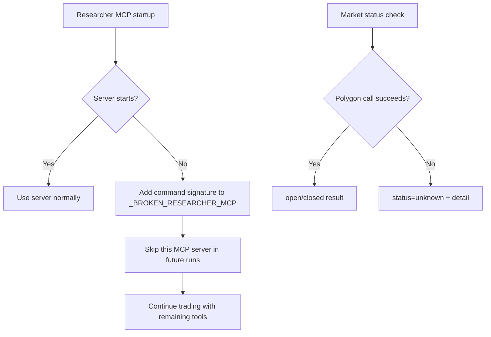

# Autonomous Trader Architecture Diagrams

This companion doc visualizes the architecture described in `ARCHITECTURE.md`.

## 1) System Context



## 2) Deployment Topology (Single Docker Image)



## 3) Backend Layering (`api/app`)



## 4) API Endpoint Map

```mermaid
flowchart LR
    subgraph API[FastAPI Endpoints]
      h[GET /health]
      t1[GET /api/traders]
      t2[GET /api/traders/{name}]
      t3[GET /api/traders/{name}/logs]
      s1[POST /api/scheduler/start]
      s2[POST /api/scheduler/stop]
      s3[GET /api/scheduler/status]
      m1[GET /api/market/status]
      r1[POST /api/reset]
    end

    t1 --> traderSvc[trader_service]
    t2 --> traderSvc
    t3 --> traderSvc
    r1 --> traderSvc

    s1 --> schedSvc[scheduler_service]
    s2 --> schedSvc
    s3 --> schedSvc

    m1 --> marketSvc[market_service]
    marketSvc --> traderRepo[trader_repository]

    traderSvc --> traderRepo
    traderRepo --> engine[api/trader_engine/*]
```

## 5) Dashboard Refresh Sequence



## 6) Scheduler Start/Stop Sequence



## 7) Trading Tick Internals



## 8) MCP Server Graph

```mermaid
flowchart LR
    trader[Trader Agent] --> tmcp[Trader MCP Server Set]
    trader --> rmcp[Researcher MCP Server Set]

    tmcp --> acc[accounts_server.py]
    tmcp --> mkt[market_server.py OR mcp_massive]

    rmcp --> fetch[mcp-server-fetch via uvx]
    rmcp --> brave[@modelcontextprotocol/server-brave-search via npx]
    rmcp --> memory[mcp-memory-libsql via npx]

    acc --> db[(accounts.db)]
    mkt --> poly[Polygon API]
    memory --> memdb[(api/data/memory/*.db)]
```

## 9) Data Model Overview



## 10) Frontend Component/Data Flow

```mermaid
flowchart TD
    page[web/app/page.tsx] --> apiClient[web/lib/api.ts]
    page --> chart[PortfolioLineChart]

    apiClient --> e1[/GET /api/traders/]
    apiClient --> e2[/GET /api/traders/{name}/]
    apiClient --> e3[/GET /api/scheduler/status/]
    apiClient --> e4[/GET /api/market/status/]
    apiClient --> e5[/POST /api/scheduler/start|stop/]
    apiClient --> e6[/POST /api/reset/]

    e2 --> chart
    chart --> marks[Buy/Sell markers]
    chart --> axes[Date X-axis + Amount Y-axis]
```

## 11) Failure Handling Paths



