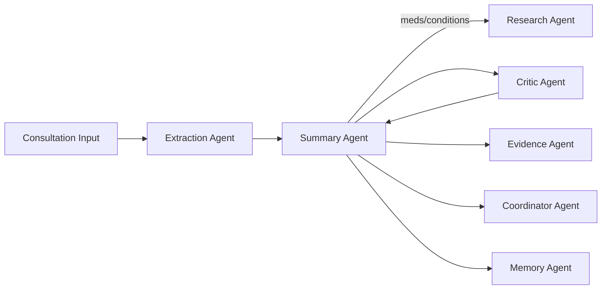
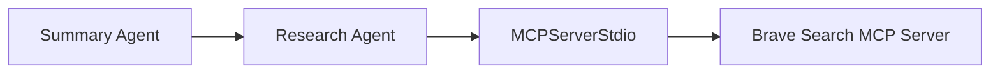
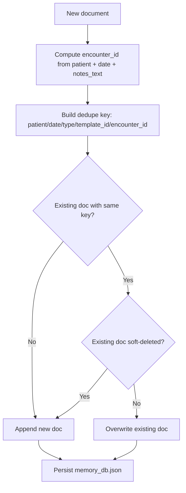
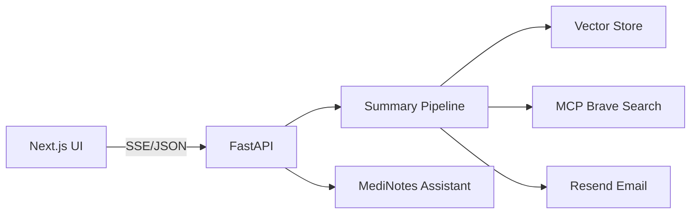
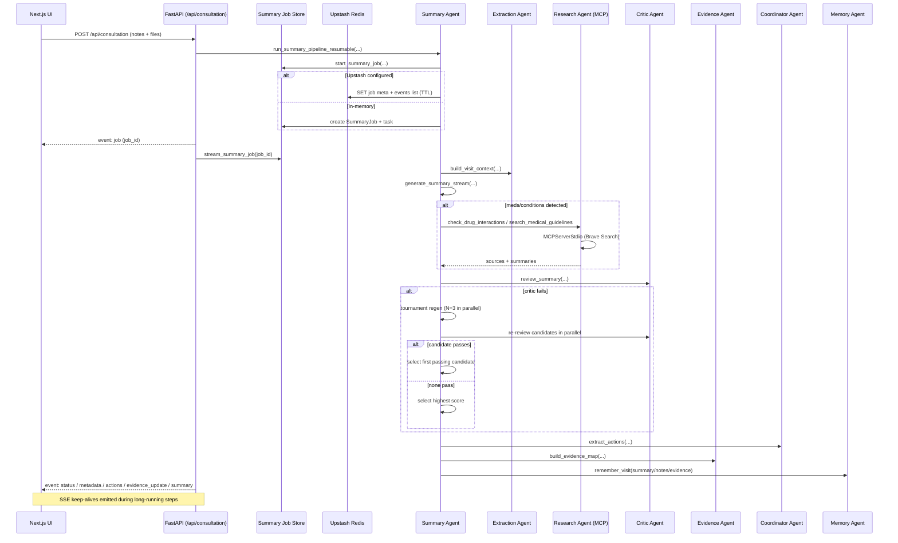
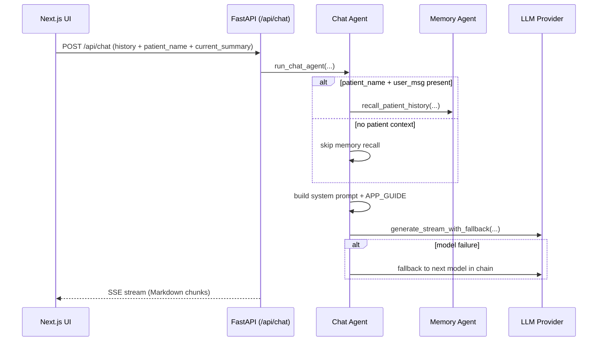

# MediNotes Architecture

This document describes the **current implemented architecture** of this repository: a single-container FastAPI + Next.js application with an agentic clinical summarization engine, long-term patient memory, evidence linking, and a MediNotes Assistant chat co-pilot.

---

## 0) Agentic Framework Architecture (Implemented)

This section describes the agentic runtime design used by the clinical pipeline in `api/agent/`, including the agent graph, tool topology, and function-level execution path.

### 0.1 Core Framework and Primitives

The implementation uses:

- **FastAPI** as the HTTP/API layer (`api/index.py`).
- **Next.js** as the UI (`pages/product.tsx`) with static export for deployment.
- **AsyncOpenAI** clients for LLM calls, with provider routing based on model name:
  - DeepSeek models use `DEEPSEEK_API_KEY`/`DEEPSEEK_API_URL` when configured.
  - Gemini models use `GEMINI_API_KEY`/`GEMINI_API_URL` when configured.
  - Other models use the default OpenAI client.
- **OpenAI Agents SDK** only for the Research Agent MCP runtime.
- **SSE streaming** for summary and chat responses (`StreamingResponse`).
- **Model fallback chains** via `generate_with_fallback(...)` and `generate_stream_with_fallback(...)`.
- **Resumable jobs** for summary streaming (in-memory or Upstash-backed).

**Model routing and fallback (implemented):**

- **Global fallback chain** (used when no explicit list is passed): `gpt-5-nano` → `gpt-4o-mini` → `gpt-3.5-turbo` (`api/agent/utils/__init__.py`).
- **Summary generation** uses `deepseek-chat` when available (via provider routing).
- **Critic** uses `gemini-2.5-flash` (`api/agent/critic_agent.py`).
- **Chat** uses `gemini-2.5-flash` then `gemini-2.5-flash-lite` (`api/agent/chat_agent.py`).
- **Doctor/patient info extraction** uses `gpt-5-nano` (`api/agent/extraction_agent.py`).
- **Prescription OCR** uses `OPENAI_VISION_MODEL` (default `gpt-4o-mini`).
- **Audio transcription** uses `whisper-1`.

### 0.2 Agent Topology

The system follows a hub-and-spoke architecture with a single orchestration entrypoint and multiple worker agents:

1. **Summary Agent** (`summary_agent.py`) - Orchestrator
2. **Extraction Agent** (`extraction_agent.py`) - File/audio/image parsing
3. **Research Agent** (`research_agent.py`) - External safety/guideline lookup via MCP
4. **Critic Agent** (`critic_agent.py`) - QA/reflection loop
5. **Evidence Agent** (`evidence_agent.py`) - Citation mapping and evidence snippets
6. **Coordinator Agent** (`coordinator_agent.py`) - Next-step extraction
7. **Memory Agent** (`memory_agent.py`) - RAG persistence and retrieval
8. **Email Agent** (`email_agent.py`) - Translation + send
9. **Chat Agent** (`chat_agent.py`) - MediNotes Assistant

Agent graph (summary pipeline):



### 0.3 MCP Tool Architecture (Research Agent)

The Research Agent uses MCP over stdio to access Brave Search:

- MCP server: `@brave/brave-search-mcp-server`
- Transport: stdio
- Client: `MCPServerStdio` from the Agents SDK

MCP keeps external data access separated from agent logic and supports provider portability. In this app, the MCP boundary ensures the Summary Agent does not call external tools directly; it delegates to the Research Agent which owns the tool stack.

Small MCP flow in this app:



### 0.4 Execution Lifecycle (Function-Level)

The concrete runtime path for one summary request:

1. **HTTP entrypoint**
   - `POST /api/consultation` in `api/index.py`.
   - Calls `summary_agent.run_summary_pipeline_resumable(...)`.

2. **Job initialization (resumable)**
   - `start_summary_job(...)` chooses Upstash-backed jobs when configured.
   - Otherwise uses in-memory `SummaryJob` and event list.
   - Job ID is streamed as `event: job` so the UI can reconnect.

3. **Pipeline startup**
   - `run_summary_pipeline(...)` builds the visit context:
     - Extracts text from uploaded files (PDF/DOCX/TXT/MD).
     - Transcribes audio via Whisper.
     - Extracts prescription images via vision model.
     - Extracts doctor and patient contact info via LLM.
     - Recalls patient history from the memory store (RAG).

4. **Initial summary generation**
   - `generate_summary_stream(...)` builds the system + user prompt.
   - Uses model routing (DeepSeek if configured) via `generate_with_fallback`.
   - If medication/condition heuristics trigger, tool calls are enabled:
     - `check_drug_interactions`
     - `search_medical_guidelines`
     - `extract_actions`

5. **Tool execution in parallel**
   - Tool calls are executed concurrently with `asyncio.gather`.
   - Research results (drug interactions, guidelines) are merged into context.
   - The prompt is updated and a post-tool generation run is executed.

6. **Finalize summary HTML**
   - Summary is normalized into strict 3-section HTML:
     - `summary` section
     - `next_steps` section
     - `patient_email` section

7. **Critic review and regeneration (if needed)**
   - `critic_agent.review_summary(...)` runs with Gemini for QA.
   - If review fails, a tournament regeneration (N=3) is run.
   - Best candidate is selected and revalidated.

8. **Coordinator extraction**
   - Next-step actions are extracted (if not already from tool call).

9. **Evidence mapping**
   - Evidence Agent chunks sources and maps summary sentences to sources.
   - Evidence map is emitted as `event: evidence_update`.

10. **Persistence**
    - Memory Agent stores:
      - `visit_summary`
      - `visit_notes`
      - `visit_evidence`
    - Stored in `data/memory_db.json` with embeddings.

11. **Streaming output**
    - SSE emits:
      - `status` events
      - `metadata`
      - `actions`
      - `evidence_update`
      - final `summary`

### 0.4.1 Tool-Call Gating and Parallelism

Tool calls are only enabled when heuristics detect likely medications or conditions:

- Medication hint regex: `MEDICATION_HINT_RE`
- Condition hint regex: `CONDITION_HINT_RE`

When triggered, the Summary Agent enables tools and executes them **in parallel** via `asyncio.gather`:

- `check_drug_interactions`
- `search_medical_guidelines`
- `extract_actions`

### 0.4.2 Critic Regeneration and Guardrails

If the Critic flags issues or hallucinations, the pipeline uses a **tournament regeneration**:

- **N=3** candidates generated in parallel using `REGEN_MODELS` (`deepseek-chat`).
- Each candidate is re‑reviewed by the Critic.
- The first passing candidate is selected; otherwise the highest score is chosen.

Critic issues are recorded to `data/critic_guardrails.json` and distilled into **format guardrails** for future runs (`api/agent/utils/guardrails.py`).

### 0.4.2.1 Guardrails Promotion Cycle (Expanded)

```mermaid
flowchart TD
    A[Critic issues] --> B[Count occurrences]
    B --> C{Count >= repeat_threshold?}
    C -- No --> D[Keep tracking]
    C -- Yes --> E[LLM rewrite to neutral format rule]
    E --> F{Rule valid?}
    F -- No --> D
    F -- Yes --> G[Append to guardrails (max 8)]
    G --> H[Persist data/critic_guardrails.json]
```

### 0.4.3 Evidence Map Contract

The Evidence Agent produces a `{chunks, citations}` map:

- **Chunks** are derived from Notes, Uploads, History, Research, and Guidelines.
- **Citations** link a summary sentence → one best chunk.
- Snippets are capped to **140 chars** and exclude URLs.
- The agent enforces that *Clinical Safety Note* and *Guideline Note* statements map to `Research` or `Guidelines` chunks.

### 0.4.3.1 Evidence Mapping Internals (Expanded)

```mermaid
flowchart TD
    A[Final HTML Summary] --> B[Strip HTML to text]
    B --> C[Split into sentences]
    C --> D[Filter headings + non-clinical]
    D --> E[Build sentence list]
    F[Context Sources] --> G[Chunk Notes/Uploads/History]
    F --> H[Chunk Research/Guidelines (priority)]
    G --> I[Merge + cap MAX_EVIDENCE_CHUNKS]
    H --> I
    E --> J[LLM mapping prompt]
    I --> J
    J --> K[LLM returns {sentence_id, chunk_id, snippet}]
    K --> L[Post-validate snippets + cap length]
    L --> M[Emit evidence_update]
    M --> N[Persist as visit_evidence]
```

### 0.4.4 SSE Event Schema

Resumable SSE events persisted by the job system:

- `job` (job id)
- `status` (progress text)
- `metadata` (doctor/patient details + prescription metadata)
- `actions` (coordinator output)
- `evidence_update` (evidence map)
- `summary` (final HTML)
- `error` (errors, when present)

### 0.5 Prompt and Decision Architecture

Key prompt design points:

- **Summary system prompt** enforces strict HTML output with three sections and safety constraints.
- **Tool usage** is conditionally enabled based on medication/condition heuristics.
- **Critic prompt** returns JSON with `score`, `issues`, `missing`, `hallucinations`.
- **Guardrails** record critic issues for stability and future prompt tuning.

### 0.6 State, Memory, and Persistence Boundaries

There are three persistence domains:

1. **Summary job store**
   - In-memory by default.
   - Optional Upstash Redis for resumable SSE across reconnects.

2. **Long-term memory (RAG)**
   - JSON vector store at `data/memory_db.json`.
   - Embeddings: `text-embedding-3-small`.
   - Doc types: `visit_summary`, `visit_notes`, `visit_evidence`.
   - Soft delete supported by metadata flag.
   - **Overwrite semantics**: records are deduped by `(patient_name, date, type, template_id, encounter_id)`.
     `encounter_id` is derived from `patient_name + date_of_visit + notes_text`.
     A new entry with the same keys **overwrites** the prior record unless the prior record is soft‑deleted.

### 0.6.1 RAG Overwrite/Dedup Flow (Expanded)



3. **Summary cache**
   - In-process LRU cache with a max of 10 entries.

### 0.7 Observability and Reliability

- Central logging via `get_logger(...)` and `logging` configuration.
- SSE keep-alive comments during long-running tasks.
- Model fallback chains to reduce single-model outages.
- Research caching in-memory with TTL to avoid repeated queries.

### 0.8 Fault Tolerance and Degradation Strategy

- Research Agent skips if MCP or keys are missing.
- Summary pipeline continues even if research fails (safety notes omitted).
- Chat memory recall failure returns a safe fallback message.
- Upstash is optional; in-memory jobs still function.

### 0.9 Control Plane Integration (FastAPI <-> Agent Runtime)

FastAPI is the control plane; the agent pipeline is the data plane:

- `POST /api/consultation`: start summary job and stream SSE.
- `GET /api/consultation?job_id=...`: reconnect to an existing stream.
- `POST /api/chat`: stream MediNotes Assistant output.
- `POST /api/send-email`: execute Email Agent.
- `GET /api/patients`: list known patients.
- `GET /api/patient-history`: patient history search/filter.
- `POST /api/patient/rename`: rename patient records.
- `POST /api/patient/delete-entry` / `restore-entry`: soft delete/restore.
- `GET /api/subscription`: subscription status for UI.
- `GET /health`: health check.

---

## 1) High-Level Overview

The system has three major parts:

1. **Web UI (Next.js export)**
   - Static export in `out/` served by FastAPI.
   - Main UI at `/product` for consultation and assistant.

2. **Backend API (FastAPI)**
   - Authenticated REST endpoints for summaries, chat, email, and RAG.
   - SSE streaming for real-time output.

3. **Agentic Pipeline**
   - Summary orchestration with research, critic, evidence, and memory.
   - Chat assistant grounded in patient history and app guide.

System-level flow:



### 1.1 Summary Request Top-Level Flow

1. User submits consultation notes and files.
2. API streams status updates during extraction and generation.
3. Summary HTML, actions, and evidence map are returned.
4. Memory store is updated for future RAG queries.

### 1.1.1 `/api/consultation` Sequence (Resumable SSE)



### 1.2 Chat Request Top-Level Flow

1. User sends a message in the MediNotes Assistant.
2. Assistant loads relevant patient history (RAG).
3. App guide reference is injected for app feature questions.
4. Response is streamed in Markdown.

### 1.2.1 `/api/chat` Sequence (Assistant)



---

## 2) Backend HTTP Architecture

Implemented in `api/index.py`:

- `POST /api/consultation` - start summary generation (SSE).
- `GET /api/consultation` - reconnect to resumable stream.
- `POST /api/chat` - MediNotes Assistant (SSE).
- `POST /api/send-email` - translation + send.
- `GET /api/patients` - list known patients (paginated).
- `GET /api/patient-history` - history query by date/query.
- `POST /api/patient/rename` - rename patient.
- `POST /api/patient/delete-entry` - soft delete.
- `POST /api/patient/restore-entry` - restore.
- `GET /api/subscription` - subscription info.
- `GET /health` - health check.

### 2.1 Authentication

- Clerk JWT verified against JWKS (`CLERK_JWKS_URL`).
- Tokens required for all API endpoints (403 on failure).
- Custom bearer validation uses `verify_aud=False` and `leeway=120` seconds to tolerate clock skew.

---

## 3) Summary Pipeline Details

### 3.1 Extraction

- **Documents**: PDF/DOCX/TXT/MD parsed into text.
- **Audio**: Whisper (`whisper-1`) for transcription.
- **Images**: Vision model for prescription OCR and English translation.
- **Doctor/Patient Info**: LLM extraction from source text.

### 3.2 Summary Generation

- Summary prompt includes notes, uploads, history, and research findings.
- Tool calls optionally fetch drug interactions and guidelines.
- Summary must be strict HTML with three sections.

### 3.3 Critic and Regeneration

- Critic returns JSON review.
- Failing summaries are regenerated via a tournament (N=3).
- Best candidate is selected and revalidated.

### 3.4 Evidence Linking

- Summary sentences are mapped to source chunks.
- Evidence map emitted to UI and saved to memory.

---

## 4) Chat Assistant Architecture

`chat_agent.py` provides two capabilities:

1. **Patient-specific clinical Q and A**
   - Grounded only in current summary and retrieved patient history.
   - Refuses any missing facts.

2. **MediNotes app support**
   - Answers how to use the product, fields, workflows, and limitations.
   - Uses `APP_GUIDE` injected in the system prompt.

All responses are formatted in Markdown.

---

## 5) Evidence-Linked Summaries

Evidence Agent (`evidence_agent.py`) links summary statements to source text:

- Sources: Notes, Uploads, History, Research, Guidelines.
- Each sentence maps to one best chunk with a short snippet.
- Evidence map is surfaced in the UI and stored with the visit.

---

## 6) Email Pipeline

Entry: `POST /api/send-email`

1. Email Agent receives: `to`, `subject`, `html`, `reply_to`, `clinic_name`, `language`.
2. If translation requested, `translate_email` tool runs.
3. `send_email_final` tool sends via Resend.

---

## 7) Frontend Architecture

- **Main page**: `pages/product.tsx`.
- **Panels**: consultation form, file uploads, summary output, evidence panel, email composer, patient history, MediNotes Assistant chat.
- **Streaming UI**: SSE events update summary, actions, metadata, and evidence in real time.

---

## 8) Deployment Topology

### 8.1 Single Container Build

- **Stage 1**: Node build for static Next.js export.
- **Stage 2**: Python runtime with FastAPI.
- Node/npm installed in runtime image for MCP servers (`npx`).

### 8.2 Runtime

- Port: `8000`.
- Static UI served from `/app/static` by FastAPI.
- Health check on `/health`.

### 8.3 AWS Deployment (ECR + App Runner)

This app is deployed via **ECR + App Runner** (see `README.md` for build/push):

1. **Authenticate Docker to ECR** using your AWS account + region.
2. **Build the image** for `linux/amd64`.
3. **Tag and push** to the ECR repository.
4. **App Runner service** pulls the ECR image and runs the container on port `8000`.
5. **Environment variables** are configured in App Runner (API keys, Clerk, Gemini, etc.).
6. **Health check** uses `/health`.

### 8.4 Custom Domain

The production custom domain is:

- `medinotes.agentairg.site`

App Runner handles TLS and domain association. DNS points the custom domain to the App Runner service domain (CNAME), enabling HTTPS on the public endpoint.

---

## 9) Environment Variables (Core)

- `OPENAI_API_KEY`
- `DEEPSEEK_API_KEY`, `DEEPSEEK_API_URL`
- `GEMINI_API_KEY`, `GEMINI_API_URL`
- `OPENAI_VISION_MODEL`
- `CLERK_JWKS_URL`, `CLERK_SECRET_KEY`
- `BRAVE_API_KEY` (Research MCP)
- `RESEND_API_KEY`, `RESEND_FROM`
- `UPSTASH_REDIS_REST_URL`, `UPSTASH_REDIS_REST_TOKEN` (optional)

---
