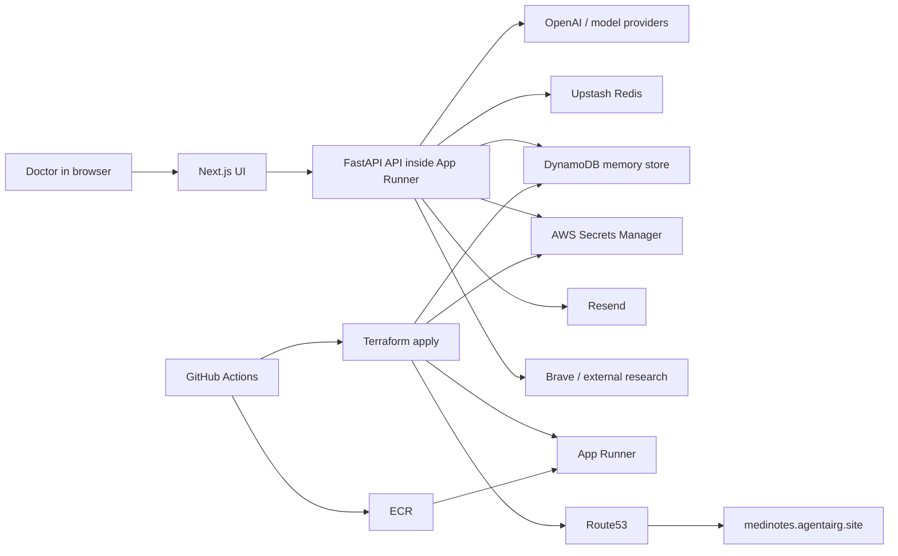
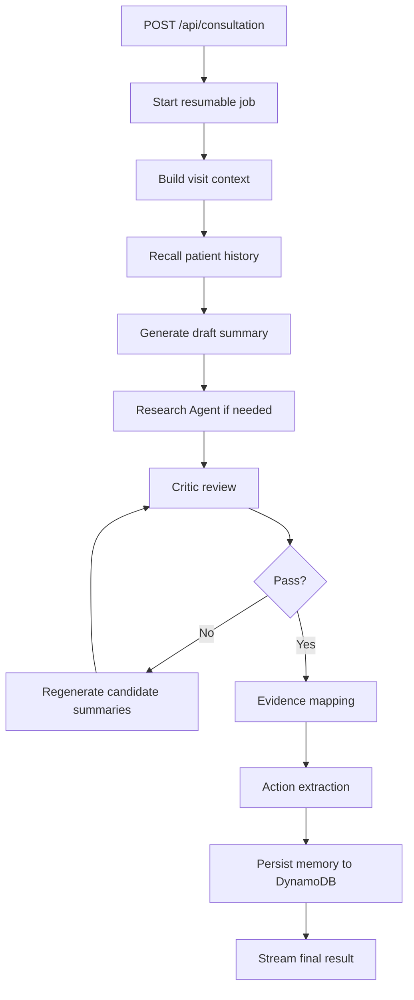
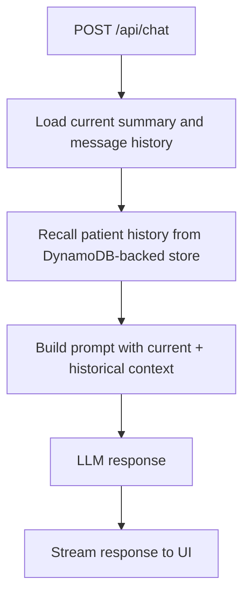

# MediNotes Architecture

This document describes the current implemented architecture of `healthcare-saas-aws` after the AWS platform rollout. It covers the runtime topology, agent graph, persistence boundaries, and the production deployment model now in use.

This is not a future-state document. It is intended to reflect the system that is now deployed and managed.

## 1. Architecture at a glance

The application is a single deployable web service:

- frontend: Next.js
- backend/API: FastAPI
- deployment target: AWS App Runner

The deployed runtime depends on four external data and infrastructure services:

- DynamoDB for long-term patient memory
- Secrets Manager for runtime secret values
- Upstash Redis for resumable jobs and streaming state
- ECR as the App Runner image source

Supporting platform services:

- Route53 for custom-domain DNS
- S3 and DynamoDB for Terraform remote state
- GitHub Actions for CI/CD and controlled deployment

## 2. Current production topology

Production currently runs with these important identifiers:

- App Runner service: `consultation-app-service`
- App Runner URL: `ymwpjvxcjn.ap-southeast-1.awsapprunner.com`
- custom domain: `medinotes.agentairg.site`
- ECR repository: `consultation-app`
- DynamoDB table: `medinotes-prod-memory`
- secret namespace: `medinotes-prod/app/*`

This production environment was adopted from an existing manual App Runner deployment and brought under Terraform management. That is why the production names do not all follow the generated `${project}-${environment}-...` default pattern.

## 3. System topology

## 4. Core architectural decision: persistence is split by responsibility

One of the most important evolutions in this repo is that “state” is no longer treated as one thing.

The application now uses different persistence systems for different responsibilities.

### 4.1 DynamoDB: longitudinal patient memory

DynamoDB stores patient memory documents that should outlive:

- App Runner instance replacement
- container restarts
- application image redeploys

Examples of what goes into DynamoDB:

- `visit_summary`
- `visit_notes`
- `visit_evidence`

This is the storage used by:

- patient-history endpoints
- assistant recall of prior clinical context
- cross-visit continuity during summary generation

### 4.2 Upstash Redis: job and stream state

Upstash Redis stores short-lived operational state:

- summary job metadata
- resumable SSE event streams
- reconnect-safe streaming buffers
- deduplication keys for repeated summary requests

Redis is not the long-term patient record store.

### 4.3 Secrets Manager: sensitive runtime configuration

Secrets Manager now holds runtime secret values that should not be stored in:

- Terraform state
- source control
- plaintext App Runner environment configuration as the desired steady-state model

Examples:

- model API keys
- Clerk backend secrets
- Upstash token
- Resend API key

### 4.4 Route53: infrastructure-owned DNS

The custom domain record is Terraform-managed so that a destroy/recreate or service adoption does not leave DNS pointing at an obsolete App Runner target.

## 5. Request-flow architecture

### 5.1 Summary generation flow

The summary pipeline is the main orchestrated path in the application.

### 5.2 Assistant chat flow

The assistant path is a separate request flow, but it depends on the same memory layer.

## 6. Agent topology

The runtime is built around a hub-and-spoke orchestration pattern.

### 6.1 Summary Agent

`summary_agent.py` is the orchestrator. It is responsible for:

- starting or reusing jobs
- collecting extraction results
- injecting patient history
- coordinating tool-backed research
- running critic review
- triggering evidence mapping
- persisting visit memory
- streaming status and final output

### 6.2 Extraction Agent

`extraction_agent.py` normalizes raw inputs:

- documents
- audio
- image-based prescriptions
- doctor/patient contact data

### 6.3 Research Agent

`research_agent.py` performs external retrieval for:

- drug interaction checks
- guideline lookups

It is intentionally separated from the Summary Agent so that external data access is not mixed directly into the primary summarization logic.

### 6.4 Critic Agent

`critic_agent.py` is the quality-control gate. It compares the generated summary against the actual source context and can force regeneration when quality or accuracy is insufficient.

### 6.5 Evidence Agent

`evidence_agent.py` maps summary statements back to supporting source text so the UI can show grounded evidence rather than free-floating claims.

### 6.6 Memory Agent

`memory_agent.py` owns long-term persistence and retrieval behavior. It is the entry point for:

- `remember_visit(...)`
- `recall_patient_history(...)`
- patient rename
- soft delete
- restore
- patient list and visit list helpers

### 6.7 Coordinator Agent

`coordinator_agent.py` extracts structured next actions from the generated summary.

### 6.8 Email Agent

`email_agent.py` handles translation and send behavior for patient emails via Resend.

### 6.9 Chat Agent

`chat_agent.py` powers the MediNotes Assistant and injects:

- conversation history
- patient memory
- current summary state

## 7. DynamoDB memory model

The current store implementation is in [vector_store.py](/home/repos/healthcare-saas-aws/api/memory/vector_store.py).

### 7.1 Physical schema

Current table design:

- table name by environment:
  - `medinotes-dev-memory`
  - `medinotes-prod-memory`
- partition key: `pk`
- sort key: `sk`
- GSI:
  - `doc_id-index`

### 7.2 Logical document shape

Each memory document currently contains:

- `pk`
- `sk`
- `item_type`
- `doc_id`
- `dedupe_key`
- `timestamp`
- `text`
- `embedding`
- `metadata`
- `payload`

The metadata is the application-level meaning of the record and commonly includes:

- `patient_name`
- `date`
- `type`
- `template_id`
- `encounter_id`
- `doc_id`
- `time`
- `saved_at`
- optional `deleted`

### 7.3 Dedupe and overwrite behavior

The store does not blindly append every write.

It deduplicates on:

- patient name
- visit date
- document type
- template id
- encounter id

That means multiple saves of the same logical encounter update the same memory document identity instead of creating unbounded duplicates.

### 7.4 Retrieval model

Semantic retrieval works by:

1. generating a query embedding with `text-embedding-3-small`
2. loading relevant candidate documents
3. filtering by metadata when appropriate
4. scoring with cosine similarity
5. returning the top-scoring results

Today, the app still performs scoring in application code. DynamoDB is the durable store for vectors and metadata, not a managed vector-search service.

## 8. Secrets and runtime environment model

App Runner receives two classes of configuration.

### 8.1 Non-secret runtime variables

These are set as ordinary environment variables in the App Runner service:

- `NODE_ENV`
- `AWS_REGION`
- `DYNAMODB_TABLE_NAME`
- `GEMINI_API_URL`
- `DEEPSEEK_API_URL`
- `GROK_API_URL`
- `NEXT_PUBLIC_CLERK_PUBLISHABLE_KEY`
- `NEXT_PUBLIC_CLERK_JWT_TEMPLATE`
- `RESEND_FROM`

### 8.2 Secret runtime variables

These are resolved by ARN from Secrets Manager:

- `OPENAI_API_KEY`
- `GEMINI_API_KEY`
- `DEEPSEEK_API_KEY`
- `GROK_API_KEY`
- `RESEND_API_KEY`
- `CLERK_SECRET_KEY`
- `CLERK_JWKS_URL`
- `BRAVE_API_KEY`
- `UPSTASH_REDIS_REST_URL`
- `UPSTASH_REDIS_REST_TOKEN`

This split is critical because it keeps secret values out of Terraform state while still letting Terraform describe the desired runtime shape.

## 9. Deploy architecture

The current deploy design is:

- Terraform owns infrastructure and DNS
- GitHub Actions owns CI/CD execution
- App Runner auto-deploy owns image rollout after ECR push
- `scripts/deploy.sh` owns the ordered local deployment procedure

### 9.1 Why the deploy order matters

The current deploy order was chosen to avoid race conditions:

1. ensure backend state exists
2. ensure Terraform workspace is selected
3. apply infrastructure and configuration first
4. sync secrets to Secrets Manager
5. build and push the image
6. let App Runner roll out the new image
7. wait for health

This prevents the common failure mode where an image deployment starts before the service configuration or secrets are in the desired state.

### 9.2 Production branch behavior

The repository now auto-deploys production only on push to:

- `healthcare-saas-aws`

`dev` remains supported, but only through manual workflow execution.

## 10. Destroy and recreate behavior

The Terraform destroy path has been hardened so it can tear down and later recreate the stack cleanly.

Important destroy behaviors now include:

- emptying ECR before repository deletion
- immediate Secrets Manager name reuse
- Terraform-owned Route53 cleanup
- clean remote-state-backed workspace behavior

This is what makes a full destroy/recreate cycle viable without the earlier problems of stuck secret names or stale DNS.

## 11. Local-vs-AWS boundary

The repo intentionally supports two modes for memory storage:

### Local

- DynamoDB Local
- `DYNAMODB_ENDPOINT_URL=http://localhost:8001`
- dummy AWS credentials are acceptable

### AWS

- real DynamoDB service
- `DYNAMODB_ENDPOINT_URL` must be unset
- App Runner runtime role grants access

This boundary is deliberate. Local development must stay easy, but production persistence must be durable and external to the container.

