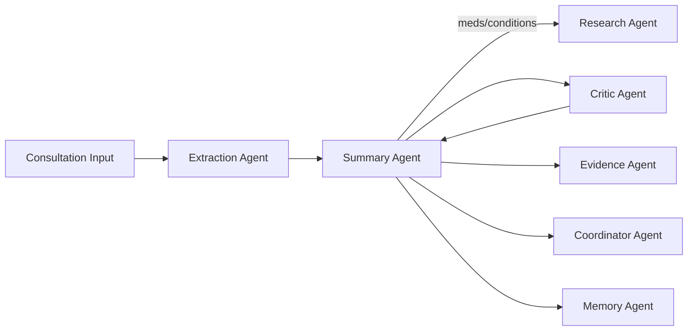

# MediNotes Capstone (AI/ML Engineer)

## Project Overview
MediNotes is an agentic clinical documentation platform that transforms unstructured clinical inputs into structured, verifiable visit summaries with safety checks, evidence linking, and longitudinal memory. The core contribution is a multi-agent architecture that integrates retrieval, external research, QA loops, and explainability into a production-grade pipeline.

---

## Problem
Clinical documentation is time-intensive and error-prone, especially when data is spread across handwritten prescriptions, audio recordings, and uploaded documents. Clinicians need fast, accurate, and auditable summaries without sacrificing safety or context continuity.

---

## Solution (Agentic System Design)

### 1) Multi-Agent Topology
A hub-and-spoke architecture orchestrates specialized agents:

- **Summary Agent (Orchestrator)**: builds prompts, calls tools, merges outputs, streams results.
- **Extraction Agent**: converts PDF/DOCX/TXT, audio (Whisper), and prescription images (vision model) into clean text.
- **Research Agent (MCP)**: external retrieval via Brave MCP for drug interactions and clinical guidelines.
- **Critic Agent**: QA loop for hallucinations, omissions, contradictions, safety gaps.
- **Evidence Agent**: grounds summary statements in source chunks for auditability.
- **Memory Agent (RAG)**: stores and retrieves longitudinal patient history.
- **Coordinator Agent**: extracts structured next steps.
- **Chat Agent**: scoped clinical Q&A + app usage guidance.

---

### 2) Orchestration Flow (Deterministic Pipeline)
1. **Context build**: multimodal extraction into a unified visit context.
2. **Initial generation**: strict 3-section HTML summary.
3. **Conditional tool routing**: research + action extraction in parallel when heuristics trigger.
4. **Critic review**: evaluation against source text + history + research.
5. **Regeneration**: tournament regen (N=3) if critic fails; best candidate selected.
6. **Evidence mapping**: summary sentences linked to source chunks.
7. **Persistence**: summary, notes, evidence stored in memory for RAG.
8. **Streaming output**: status, metadata, actions, evidence, summary via SSE.

---

### 3) Model Routing and Fallback
Multi-provider routing based on model name:

- **Summary generation**: `deepseek-chat` (OpenAI-compatible routing).
- **Critic**: `gemini-2.5-flash`.
- **Chat**: `gemini-2.5-flash` then `gemini-2.5-flash-lite`.
- **Doctor info extraction**: `gpt-5-nano`.
- **OCR (prescriptions)**: `OPENAI_VISION_MODEL` (default `gpt-4o-mini`).
- **Audio transcription**: `whisper-1`.

Global fallback chain: `gpt-5-nano` → `gpt-4o-mini` → `gpt-3.5-turbo`.

---

### 4) Retrieval + Grounding Strategy
- **RAG store**: DynamoDB-backed vector store with embeddings (`text-embedding-3-small`).
- **Doc types**: `visit_summary`, `visit_notes`, `visit_evidence`.
- **Dedup**: `(patient, date, type, template_id, encounter_id)` ensures stable overwrites.

---

### 5) Evidence-Linked Summaries (Explainability)
The Evidence Agent maps summary sentences to the best source chunk:

- Sources: Notes, Uploads, History, Research, Guidelines.
- One best chunk per sentence; snippet capped at 140 chars.
- Safety/guideline notes must map to Research/Guidelines.

This enforces **auditable, verifiable outputs** in a clinical domain.

---

### 6) QA / Critic Loop + Self-Improving Guardrails
The Critic Agent evaluates for:

- Hallucinations
- Missing facts
- Safety omissions
- Contradictions

If failing, the system runs **parallel regeneration** and re-reviews candidates.

Repeated issues are promoted into persistent **format guardrails** (`data/critic_guardrails.json`) and injected into future prompts, enabling incremental improvement without retraining.

---

## System Reliability
- SSE keep-alives during long-running steps.
- Resumable job IDs for reconnecting streams.
- Optional Upstash for multi-instance resilience.
- Research agent caches results with TTL to reduce repeat calls.

---

## Deployment
- Dockerized app (single container).
- **ECR + AWS App Runner** deployment.
- Custom domain: `medinotes.agentairg.site`.
- Health check: `/health`.

---

## Why This Capstone Is Strong (AI/ML Perspective)
- **Tool-assisted reasoning** via MCP.
- **QA-driven regeneration** for factual accuracy.
- **Explainability** through evidence mapping.
- **Long-term memory** integrated into clinical workflows.
- **Production-grade streaming** and resiliency.

This project demonstrates agentic design, grounded generation, and robust evaluation loops in a high-stakes domain.
