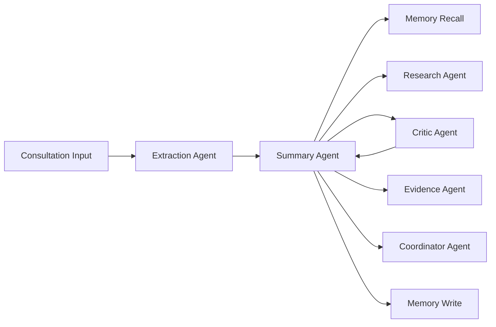

# MediNotes Capstone (AI/ML Engineer)

## Project Overview

MediNotes is an agentic clinical documentation platform that converts messy, multimodal consultation inputs into structured, reviewable visit summaries with longitudinal memory, quality review, and evidence grounding.

This capstone is not only a prompt-engineering exercise. The work spans:

- multi-agent orchestration
- grounded generation
- reflection and regeneration
- retrieval-augmented clinical context
- deployed AWS infrastructure for durable memory and runtime secret handling

The system is currently deployed on AWS and uses App Runner, ECR, DynamoDB, Secrets Manager, Route53, and GitHub Actions.

## Problem

Clinical documentation is slow, fragmented, and easy to get wrong when the source material arrives in multiple forms:

- handwritten notes
- audio
- uploaded records
- prior visit context

Doctors need summaries that are:

- fast
- structured
- auditable
- aware of prior patient history
- safer than a single-pass generation workflow

## Solution

MediNotes uses a hub-and-spoke agentic architecture in which one orchestrator coordinates multiple specialist agents.

### Agent topology

- Summary Agent: orchestration, prompt assembly, streaming, persistence trigger
- Extraction Agent: multimodal input normalization
- Research Agent: external retrieval for drug interactions and guidelines
- Critic Agent: quality scoring and regeneration feedback
- Evidence Agent: summary-to-source grounding
- Memory Agent: long-term patient memory and retrieval
- Coordinator Agent: structured next-action extraction
- Chat Agent: assistant grounded in current and historical context
- Email Agent: translation-aware patient communication routing

## Orchestration flow

The implemented workflow is:

1. build visit context from notes, uploads, audio, and prescription images
2. retrieve prior patient history from memory
3. generate a draft summary
4. call external research tools when heuristics detect medications or conditions
5. run a critic review against source material and historical context
6. regenerate if the draft fails quality review
7. map evidence to the final summary
8. extract structured next actions
9. persist summary, notes, and evidence for future retrieval
10. stream progress and final output to the UI

## Model and provider strategy

The system uses provider routing rather than relying on one model vendor for everything.

Current responsibilities include:

- summary generation: DeepSeek-compatible routing
- critic and chat: Gemini
- OCR and embeddings: OpenAI
- transcription: Whisper

This matters from an AI/ML engineering perspective because the system is designed around model-role fit and fallback behavior, not one-model-does-everything.

## Retrieval and memory design

One of the most important implementation changes was moving patient memory to DynamoDB.

Current long-term memory behavior:

- summaries, notes, and evidence are persisted as embedded documents
- documents are keyed by patient and deduped by encounter metadata
- the assistant and future consultations can retrieve that memory semantically

Why this matters:

- App Runner is stateless
- container-local files are not an acceptable long-term memory mechanism
- patient history must survive redeploys and infrastructure changes

This project therefore includes not only RAG logic, but production-grade persistence design for RAG memory.

## Explainability and quality control

Two parts of the system specifically target trustworthiness.

### Critic loop

The Critic Agent checks:

- hallucinations
- omissions
- contradictions
- safety gaps

If the draft is not good enough, the system regenerates rather than accepting the first answer.

### Evidence mapping

The Evidence Agent links important summary statements back to source snippets and external references. This gives the UI an audit trail instead of asking clinicians to trust a raw summary blindly.

## Infrastructure and deployment contribution

This capstone also includes a real production deployment model, not just local prototypes.

Current AWS stack:

- App Runner for application runtime
- ECR for image delivery
- DynamoDB for memory persistence
- Secrets Manager for runtime secrets
- Route53 for the custom domain
- S3 + DynamoDB for Terraform backend state and locking

Current production domain:

- `medinotes.agentairg.site`

Current CI/CD model:

- Terraform-managed AWS infrastructure
- GitHub Actions deploy workflow
- environment-scoped GitHub secrets and OIDC role assumption

This is an important part of the capstone because it demonstrates that the agentic system was carried through to operational deployment instead of stopping at notebook-level experimentation.

## Technical depth demonstrated

This project demonstrates:

- multi-agent system design
- retrieval-augmented generation with durable storage
- tool-assisted reasoning
- reflection and regeneration loops
- evidence-grounded output generation
- production deployment on AWS
- CI/CD integration with secure secret handling

## Why this is strong as an AI/ML capstone

The capstone is strong because it combines model orchestration with platform engineering.

It does not stop at:

- calling an LLM
- generating text
- showing a demo UI

It goes further into:

- controllable reasoning structure
- persistence boundaries
- failure handling
- deployment identity and secret management
- production viability in a high-stakes domain

That combination is what makes the project more representative of real AI/ML engineering work than a single-model prototype.

