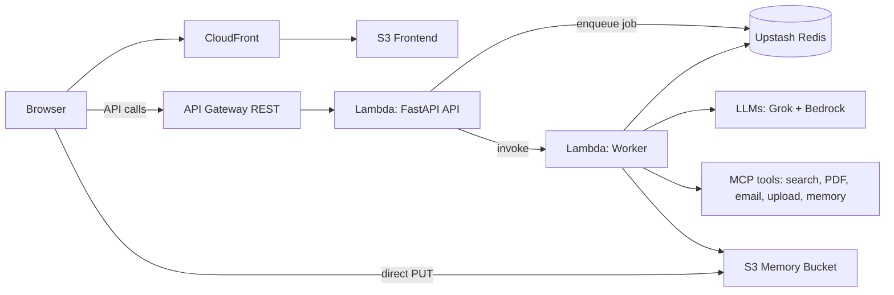

# Digital Assistant (Agentic AI) Capstone

This repository is a production-minded demo project showcasing an **agentic AI assistant** with tool use, memory, multi-model routing, and a serverless AWS deployment.

Use this doc as the top-level narrative for a job application. Deep technical references live in `ARCHITECTURE.md`, `OPERATIONS.md`, `DEPLOYMENT_TERRAFORM.md`, and `DEPLOYMENT_GITHUB_ACTIONS.md`.

---

## Elevator Pitch

**Digital Assistant** is a web app that runs an LLM-powered agent capable of:

- answering questions and maintaining conversation context
- calling tools (web search, file read, PDF export, email delivery)
- extracting and storing user/project “memory” with human approval
- running long tasks asynchronously to avoid API timeouts
- deploying cleanly via Terraform and GitHub Actions

It’s built to demonstrate real-world engineering concerns: reliability, observability, evals, CI/CD, and cost-aware architecture.

---

## What You Can Demo Live

In a single session, you can show:

1. **Agent chat**: multi-turn Q&A with consistent context.
2. **Web Search**: cite sources for “latest” questions.
3. **PDF Export**: generate a downloadable PDF artifact from a response.
4. **Email Delivery**: send the generated PDF via email (Resend).
5. **File Upload + Summary**: upload a PDF/DOCX/TXT and ask for a summary.
6. **Memory Tab**: approve/deny candidate memories and see them shape future responses.
7. **Reliability**: long-running tool chains executed via a background worker (no 30s API Gateway timeouts).

---

## Architecture Overview

High-level flow:

Core design choices:

- **Serverless backend**: AWS Lambda (container image) behind API Gateway.
- **Async execution**: API returns quickly with a `job_id`; a worker completes tool-heavy tasks.
- **Tooling via MCP**: tools run as subprocess-backed MCP servers, enabling modular tool expansion.
- **Multi-model routing**: choose the best model per task type (tool-heavy vs plain Q&A).
- **Durable state**: S3 (memory + uploads/downloads) and Upstash Redis (job status).

---

## Why Terraform (And What It Proves)

This project uses **Terraform** to provision the entire AWS stack as code, which matters for a capstone because it demonstrates:

- **Reproducibility**: dev/prod are created from the same configuration, not manual console clicks.
- **Reviewability**: infra changes are code-reviewed like application changes.
- **Drift control**: Terraform continuously reconciles desired state vs real state.
- **Operational clarity**: the resource graph (S3, CloudFront, API Gateway, Lambda, ECR, IAM) is explicit and documented.
- **Safe rollout patterns**: consistent parameterization (timeouts, memory, throttles, model IDs) by environment.

In short: it’s not “a chat demo running on my laptop”, it’s a deployment-ready system.

---

## Key Features (What Makes This “Agentic”)

## Agentic Flow (Framework and Components)

The agent runtime is built around a **tool-using agent loop** with a background worker.

Agentic pattern that applies (plain-English):

- **Router + ReAct-style tool use**: the system routes a request to the best provider for the job, then the agent iterates between deciding tool calls and synthesizing the final answer from tool results.
- **Async execution for long tool chains**: the full agent run happens in a worker (job queue pattern) so tool-heavy workflows are not constrained by synchronous HTTP timeouts.
- **Human-in-the-loop memory**: the agent proposes durable memories; the user approves/rejects; approved memories influence future behavior.

Framework pieces (backend):

- **FastAPI**: API surface (`/chat`, `/jobs`, `/memory`, `/uploads*`).
- **openai-agents**: agent runner/orchestration (`Agent`, `Runner`).
- **MCP (Model Context Protocol)**: tool servers executed via stdio subprocesses.
- **Async job orchestration**: API enqueues a job and returns quickly; worker runs the agent loop to completion.

Key components of the agentic loop:

- **Router**: chooses model/provider based on intent (tool-heavy vs plain Q&A).
- **Planner/executor**: the agent decides which tools to call (search, PDF, email, file read, memory extraction).
- **Tool runtime**: MCP servers execute side effects and return structured results.
- **Memory layer**: candidate extraction (LLM) + human approval + TTL + dedupe.
- **Validator**: optional LLM compliance check against approved memory, with a single corrective retry.

### Tool Integration (MCP)

The agent can call tools to do real work:

- Web search (Brave)
- PDF generation and download link creation
- Email sending (Resend)
- Uploaded file reading (S3-backed)
- Memory extraction (LLM-based candidate generation)

Each tool has a schema and is executed by the worker, not the UI.

### Memory With Human Approval

The agent proposes “memory candidates” extracted from conversation (preferences, durable project constraints).

- Candidates appear in the Memory tab for approval/rejection.
- Approved memory is injected into the agent’s system prompt.
- Items expire by TTL to reduce staleness.
- Deduping reduces spam and repeated suggestions.

### Background Work to Avoid Timeouts

Tool chains can take longer than API Gateway’s common limits. This app avoids user-visible 504s by:

- `POST /chat` returns `202` with a `job_id`
- UI polls `GET /jobs/{job_id}`
- worker executes the full tool chain and writes the final answer back to job status + storage

### Multi-Model Strategy (Cost/Quality/Reliability)

The app supports:

- **Grok** for tool-heavy tasks (search/email/file/PDF workflows).
- **Bedrock** for plain Q&A.

This isolates tool-call fragility to the most reliable path for the tool workload.

---

## Production Hardening

### Observability

- Structured logs with `trace_id` and `job_id`.
- CloudWatch logs for API + worker.
- Clear operator workflow documented in `OPERATIONS.md`.

### Failure Modes and Guardrails

- Timeouts and retries around tool execution.
- Instruction-level constraints: “do not claim you emailed unless tool succeeded”, “do not fabricate links”.
- Safe fallbacks when tools fail (explain and offer alternatives).

### Evaluation and Regression Testing

There is a lightweight eval harness with a golden set (CI-safe) to catch regressions:

- `backend/evals/`
- run locally or in GitHub Actions post-deploy

---

## Deployment (AWS)

Infrastructure is defined in Terraform (in the `terraform/` folder):

- S3 frontend bucket + CloudFront distribution
- S3 memory bucket (private)
- ECR repository for Lambda container images
- Lambda API + Lambda worker
- API Gateway REST API + CORS + throttling
- Optional custom domain (Route53 + ACM)

Notable implementation detail:

- **Direct-to-S3 browser uploads** via `POST /uploads/presign` to avoid binary corruption through API Gateway/Lambda.

See:

- `DEPLOYMENT_TERRAFORM.md`
- `DEPLOYMENT_GITHUB_ACTIONS.md`

---

## What “Serverless” Means Here

In this capstone, “serverless” means there are **no long-lived servers/VMs** that you provision, patch, or scale manually. Compute and edge delivery scale on demand, and you pay per use.

AWS services used to make it serverless:

- **AWS Lambda (API + Worker)**: runs the backend and background jobs without managing instances.
- **API Gateway (REST API)**: HTTP entrypoint and routing to Lambda.
- **Amazon S3**: durable object storage for uploads/downloads and conversation state.
- **CloudFront**: CDN for the frontend, globally distributed without running a web server.
- **ECR**: container image registry for Lambda deployment artifacts.
- **IAM**: least-privilege roles/policies for runtime access (S3, Lambda invoke, etc.).
- **Amazon Bedrock**: managed model runtime for LLM inference (no model hosting/serving infrastructure to manage).
- Optional: **Route53 + ACM** for custom domain + TLS.

Operationally, scaling is handled by AWS:

- traffic spikes increase Lambda concurrency automatically (within configured limits)
- CloudFront caches and serves static assets at the edge
- S3 scales storage and request throughput

---

## Local Development

Typical workflow:

- Run backend locally (FastAPI)
- Run frontend locally (Next.js)
- Point frontend to `NEXT_PUBLIC_API_URL=http://localhost:8000`

Uploads have two paths:

- Local dev can fall back to `POST /uploads`.
- Deployed mode uses `POST /uploads/presign` and browser `PUT` directly to S3.

---

## Security Notes (Honest Constraints for a Demo)

This project is a demo of agentic systems engineering, not a complete auth product:

- “User identity” is currently driven by `user_id` in the client.
- If you want true multi-tenant isolation, add authentication and server-side authorization checks.
- Never store secrets as memory; memory extraction prompt forbids it.

---

## What I’d Build Next (Roadmap-Friendly)

If you want to extend the demo toward a more enterprise-ready agent:

1. Add auth (your provider) and server-side access control.
2. Add a proper RAG pipeline (vector store + citations + freshness checks).
3. Add deeper eval coverage and CI gates (tool-call correctness, latency budgets).
4. Add stronger tool-call tracing (per tool timing, failure classification).
5. Add artifact management (PDF history, email history, and revocation/expiry UX).

See `ROADMAP.md` for the evolving list.
