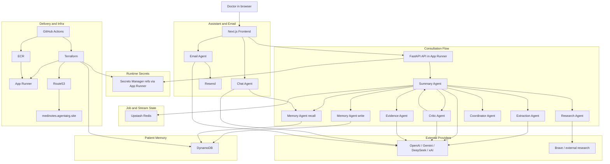

```mermaid
graph TD
    U[Doctor in browser] --> FE[Next.js Frontend]
    FE --> API[FastAPI API in App Runner]

    subgraph Consultation Flow
        API --> SJ[Summary Agent]
        SJ --> EX[Extraction Agent]
        SJ --> MR[Memory Agent recall]
        SJ --> RS[Research Agent]
        SJ --> CR[Critic Agent]
        CR --> SJ
        SJ --> EV[Evidence Agent]
        SJ --> CO[Coordinator Agent]
        SJ --> MW[Memory Agent write]
    end

    subgraph Patient Memory
        MW --> DDB[DynamoDB]
        MR --> DDB
    end

    subgraph Job and Stream State
        SJ --> UR[Upstash Redis]
    end

    subgraph Runtime Secrets
        API --> SM[Secrets Manager refs via App Runner]
    end

    subgraph Assistant and Email
        FE --> CH[Chat Agent]
        CH --> MR
        FE --> EM[Email Agent]
        EM --> RE[Resend]
    end

    subgraph External Providers
        EX --> LLM[OpenAI / Gemini / DeepSeek / xAI]
        SJ --> LLM
        CR --> LLM
        EV --> LLM
        CH --> LLM
        EM --> LLM
        RS --> BR[Brave / external research]
    end

    subgraph Delivery and Infra
        GH[GitHub Actions] --> TF[Terraform]
        GH --> ECR[ECR]
        TF --> AR[App Runner]
        TF --> DDB
        TF --> SM
        TF --> R53[Route53]
        ECR --> AR
        R53 --> DNS[medinotes.agentairg.site]
    end
```

